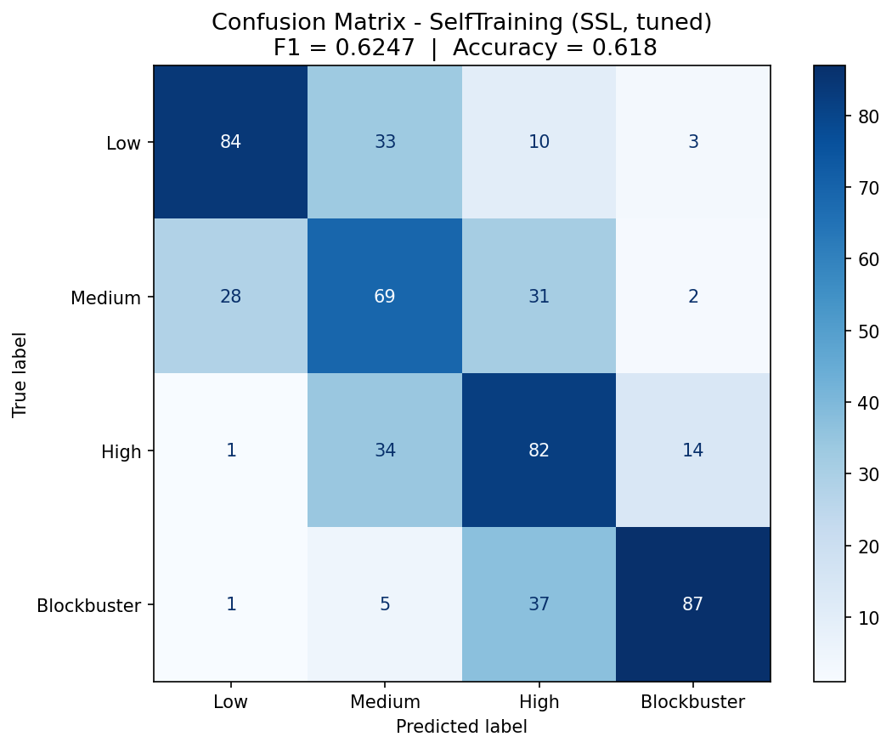

# The Next Blockbuster
Predicting Movie Success Using Pre-Release Data

Group 1: Laura Manzanos Zuriarrain, Maria Jose Beletanga, Emmanuel Okerein, Hank Shao, Ibukun Adeleye

App link: https://tmdbmoviesblockbuster.streamlit.app/

This repository implements an end-to-end data science and ML workflow to estimate movie outcomes before release using TMDB-derived metadata.

Primary decision support goals:
1. Predict expected movie popularity.
2. Predict revenue tier (Low, Medium, High, Blockbuster) with semi-supervised learning.
3. Support pre-release what-if decisions in a Streamlit app.

**Project Summary**
This project builds a pre-release decision-support pipeline using TMDB data (2010–2025). It engineers leakage-safe features, benchmarks supervised regression models for popularity, and applies semi-supervised learning to improve revenue-tier prediction with limited labels. The best-performing models are exported and used in a Streamlit UI to provide interpretable signals for greenlighting, casting, budgeting, and release timing.

---

**Context and Motivation**
- 80% of films do not have strong ROI despite high production costs (Forbes, 2019).
- This project helps production teams identify pre-release signals that drive popularity and revenue.

**Who Can Use This**
1. Studio Executive: budget and greenlight decisions.
2. Casting Director: cast shortlisting with ROI signals.
3. Independent Producer: reduce high-cost casting risk.
4. Production Data Analyst: scenario testing and decision support.

**Data Source**
- The Movie Database (TMDB) official API, 2010–2025.
- Entities: Movies, top-billed cast, directors.
- TMDB popularity as a proxy for audience interest.

**End-to-End Process**
1. Build a clean and enriched dataset with pre-release features.
2. Train and evaluate supervised models for popularity prediction.
3. Train and evaluate semi-supervised models for revenue-tier prediction.
4. Compare model performance with robust metrics.
5. Export best-performing models for integration into a decision-support app.

---

**Repository Structure**
```text
INSY 674 FinalProject/
├── README.md
├── PROJECT_STATUS_REPORT.md
├── EDA/
│   └── EDA.ipynb
├── notebooks/
│   ├── DataExtraction.ipynb
│   └── FeatureEngineering.ipynb
├── data/
│   ├── movies_2010_2025.csv
│   ├── data_features_master.csv
│   ├── data_supervised_popularity.csv
│   ├── data_supervised_revenue.csv
│   ├── data_ssl_revenue.csv
│   └── ssl_model_comparison.csv
├── models/
│   ├── PopularityModelComparison.ipynb
│   ├── SemiSupervisedModels_Final.ipynb
│   ├── export_best_models.py
│   ├── popularity_best_model.pkl
│   ├── ssl_best_model.pkl
│   ├── ssl_scaler.pkl
│   └── model_metadata.pkl
├── app/
│   ├── app_final.py
├── docs/
│   └── figures/
└── requirements.txt
```

---

**Data Science Lifecycle**

**5.1 Framing the Problem**
Business problem:
1. Studios need pre-release guidance on likely movie performance.
2. Casting, timing, and marketing choices are expensive and high-risk.

ML framing:
1. Regression task: predict `popularity`.
2. Semi-supervised classification: predict revenue tier (`y_ssl`).

Decision framing:
1. If predicted popularity is high but revenue confidence is low, prioritize risk mitigation (budget control, release strategy).
2. If both popularity and revenue outlook are strong, prioritize marketing scale-up.

---

**5.2 Data Acquisition**
Main source:
1. TMDB API (movies, cast, crew, keywords, metadata).

Notebook:
1. `notebooks/DataExtraction.ipynb`

Output:
1. `data/movies_2010_2025.csv`

Scope:
1. Movies from 2010 to 2025.
2. Talent attributes (director + top cast), language, genres, release metadata, budget/revenue/popularity fields.

---

**5.3 Data Exploration**
Notebook:
1. `EDA/EDA.ipynb`

EDA summary:

1) Data overview
1. Total movies: 9290
2. Labeled rows (revenue known): 2604
3. Total features (modeling set): 52

2) Raw features
- **Categorical:** Title, Release date, Original language, Status, Overview, Genres, Keywords, Director name, Director department, Actor(1–5) name, Actor(1–5) character
- **Numerical:** Runtime, Popularity, Vote average, Vote count, Budget, Revenue, Director ID, Director gender, Director popularity, Actor(1–5) ID, Actor(1–5) gender, Cast pop mean, Cast pop max

3) Missing values
- `runtime`: 457
- `vote_average`: 1,642
- `vote_count`: 1,640
- `budget`: 6,527
- `revenue`: 6,686
- `cast_pop_mean`: 222
- `cast_pop_max`: 222
- `director_gender`: 2,285
- `actor1`: 225
- `actor2`: 384
- `actor3`: 681
- `actor4`: 1,036
- `actor5`: 1,479
- `genres`: 489
- `keywords`: 3,238

4) Distribution of log target variables
Revenue


Popularity


5) Correlation map


6) Genres and talent ranking
Genres


Talent ranking rationale:
- Directors ranked by TMDB popularity validate `director_popularity` as a real pre-release signal.
- Actor popularity and appearance frequency capture distinct signals (star power vs prolificacy).

---

**5.4 Data Preparation**
Notebook:
1. `notebooks/FeatureEngineering.ipynb`

Guiding principles:
1. Target-agnostic master dataset: all features + raw targets kept together.
2. Zero correction: budget and revenue = 0 treated as missing, not true $0.
3. No data leakage: post-release metrics excluded from feature matrices.
4. Semi-supervised ready: unlabeled rows kept as `y = -1`.
5. Revenue tiers: quantile-based bins from labeled data only.

Feature categories:
1. Content: genre multi-hot encoding, keyword count, language flags.
2. Talent: cast & director popularity, star power, gender ratios.
3. Production: budget (log-transformed), runtime, overview signals.
4. Temporal: release month, year, quarter, summer/holiday flags.

Key engineered features:
1. `star_count`: number of actors above 75th-percentile popularity.
2. `cast_popularity_std`: spread of top-5 actor popularities.
3. `cast_gender_ratio`: percent female in top-5 billed cast.
4. `genre_*` (19 binary): multi-hot genre encoding.
5. `is_summer_release`, `is_holiday_release`: seasonal blockbuster flags.
6. `log_budget`: log1p-transformed budget (missing treated as unknown, not $0).

Generated datasets:
1. `data/data_features_master.csv`
2. `data/data_supervised_popularity.csv`
3. `data/data_supervised_revenue.csv`
4. `data/data_ssl_revenue.csv`

---

**5.5 Modeling**
Popularity notebook:
1. `models/PopularityModelComparison.ipynb`

`PopularityModelComparison.ipynb` benchmarks a progression of baseline and advanced regression models (Dummy, Linear/Ridge, tree ensembles, and boosting methods including XGBoost/LightGBM) to predict movie popularity from pre-release features. Model quality is assessed with an 80/20 holdout strategy plus cross-validation using RMSE, MAE, and R2, and includes an ablation between raw-target training and `log1p(popularity)` training with back-transformed predictions for fair comparison. Interpretation is built into the notebook through feature-importance diagnostics and a SHAP analysis block for the selected final model, so performance is tied directly to the strongest pre-release drivers of predicted popularity.

Regression models:
1. Dummy, Linear Regression, RidgeCV.
2. Random Forest, Extra Trees, Gradient Boosting, HistGradientBoosting.
3. XGBoost, LightGBM (availability-dependent).

Revenue-tier notebook:
2. `models/SemiSupervisedModels_Final.ipynb`

Note: All SSL results reported below are from `models/SemiSupervisedModels_Final.ipynb`.


Semi-supervised models:
1. Self Training with tuned Random Forest base estimator.
2. Label Spreading (KNN graph).
3. Label Propagation (KNN graph).

> **Note:** Before training the SSL models, supervised baselines were run first (Random Forest and Gradient Boosting, both base and tuned via RandomizedSearchCV) to establish a performance benchmark and select the best base estimator for Self-Training. Random Forest was chosen as the base estimator because it achieved the highest Macro F1 among the supervised models, making it the strongest candidate to benefit from pseudo-label expansion in the SSL step.

---

**5.6 Model Evaluation**
Evaluation setup (popularity):
1. Train/holdout split (80/20 on labeled data only).
2. Cross-validation + repeated CV stability checks.
3. Metrics: RMSE, MAE, R2, plus diagnostics in notebook.
4. Ablation: raw target vs `log1p(popularity)` with back-transform (`expm1`) for comparable scale.

Evaluation setup (revenue tier):
1. **Data split:** Only the labeled subset (~2,600 movies with known revenue) was split into **60% train / 20% validation / 20% test** using stratified sampling to preserve class balance across all three sets. The remaining ~6,600 unlabeled rows (revenue unknown) were kept entirely separate and never used for evaluation.
2. **Preprocessing discipline:** The scaler (StandardScaler) was fitted exclusively on the labeled training set and then applied — without refitting — to the validation set, the test set, and the unlabeled pool. This prevents data leakage from validation or test distributions into the feature scaling.
3. **Supervised baselines:** Random Forest and Gradient Boosting (base and tuned) were trained on the labeled train set and evaluated on the validation set to establish a performance benchmark.
4. **SSL training (Self-Training):** The model was first trained on the labeled train set, then used to assign pseudo-labels to the unlabeled pool where prediction confidence exceeded a threshold (0.7 for tuned, 0.9 for base). The model was retrained on the combined labeled train + pseudo-labeled data. Validation Macro F1 was used to select the best configuration.
5. **Test set integrity:** The test set was held out completely and evaluated only once, after the best model was selected via validation. This ensures the reported test metrics are unbiased estimates of generalization performance.
6. **Metrics:** Macro F1 (primary), accuracy, macro precision, macro recall, and confusion matrix diagnostics.

---

**5.7 Model Selection**
Selection logic implemented in exporter:
1. `models/export_best_models.py`

Current exported models used by app:
1. Popularity model: Gradient Boosting with `log1p` target transform.
2. Revenue-tier model: best available SSL model from `SemiSupervisedModels_Final`.

Exported artifacts:
1. `models/popularity_best_model.pkl`
2. `models/ssl_best_model.pkl`
3. `models/ssl_scaler.pkl`
4. `models/model_metadata.pkl`

---

**5.8 Model Fine-Tuning**
In `models/PopularityModelComparison.ipynb`:
1. Hyperparameter tuning blocks exist.
2. Final model section includes repeated CV and targeted fine-tuning for the selected best log-target model.
3. SHAP explainability block added for selected final model.

Cross-validation and fine tuning:
1. CV used in model comparison (KFold, 3 folds) with CV_RMSE.
2. Repeated CV (5x2) stability check on the selected final log-target model.
3. RandomizedSearchCV used for XGBoost.

---

**5.9 Solution Presentation**

**Context**
The solution is a decision-support pipeline for pre-release movie planning.

**Hypothesis**
Predictive hypotheses:
1. H1: Pre-release talent, content, timing, and production signals are predictive of popularity.
2. H2: Semi-supervised learning improves revenue-tier prediction when labeled revenue is limited.

Causal hypothesis (budget treatment):
1. H3: Budget-related treatment has positive effect on popularity under overlap/ignorability assumptions.

Null hypotheses:
1. H0 (predictive): models do not outperform baseline predictors materially.
2. H0 (causal): average treatment effect (ATE) is zero.

Outcomes and error types:
1. Regression errors: under/overprediction of popularity.
2. Classification errors: false optimism (predict high tier when low) and false pessimism.

 

**Data**
Data sources and transformations are documented in:
1. `notebooks/DataExtraction.ipynb`
2. `notebooks/FeatureEngineering.ipynb`
3. EDA section above (before/after quality profile)

**Model**
Type:
1. Supervised regression for popularity.
2. Semi-supervised classification for revenue tier.

Modelling Approach:
1. Multi-model benchmarking.
2. Leakage-safe features.
3. Target transform ablation.
4. Final model retraining and export for serving.

Model Evaluation:
1. Train/validation/holdout strategy with CV checks.
2. Metrics aligned to task and business interpretability.

**Results (from notebooks in `models/`)**
Popularity prediction (regression):
- Best raw-target model: XGBoost.
- Best final model: Gradient Boosting with `log1p(popularity)`.

Holdout metrics (original popularity scale):
- **Best raw target — XGBoost:** RMSE 4.1853 · MAE 1.6265 · R² 0.3142
- **Best log1p target (final) — Gradient Boosting:** RMSE 3.5067 · MAE 1.4196 · R² 0.5186

Revenue tier prediction (semi-supervised):
- Best model: SelfTraining (SSL) with tuned Random Forest base estimator.
- Primary metric: Macro F1 on held-out labeled test set (selected by validation Macro F1).

Comparison (held-out labeled test set):
- **SelfTraining (SSL, tuned)** — Accuracy: 0.6180 · Macro F1: 0.6247 · Precision: 0.6399 · Recall: 0.6180 *(Pseudo-labeled: 5,968 samples; threshold=0.7)*
- **RandomForest (supervised, base)** — Accuracy: 0.6161 · Macro F1: 0.6172 · Precision: 0.6228 · Recall: 0.6161 *(Default hyperparameters)*
- **RandomForest (supervised, tuned)** — Accuracy: 0.6065 · Macro F1: 0.6064 · Precision: 0.6143 · Recall: 0.6065 *(RandomizedSearchCV on labeled train)*
- **GradientBoosting (supervised, base)** — Accuracy: 0.6027 · Macro F1: 0.6032 · Precision: 0.6061 · Recall: 0.6028 *(Default hyperparameters)*
- **GradientBoosting (supervised, tuned)** — Accuracy: 0.6027 · Macro F1: 0.6024 · Precision: 0.6035 · Recall: 0.6027 *(RandomizedSearchCV on labeled train)*
- **SelfTraining (SSL, base)** — Accuracy: 0.5931 · Macro F1: 0.5909 · Precision: 0.5976 · Recall: 0.5931 *(Pseudo-labeled: 5,054 samples; threshold=0.9)*
- **LabelSpreading (SSL, tuned)** — Accuracy: 0.5470 · Macro F1: 0.5420 · Precision: 0.5415 · Recall: 0.5472 *(kernel=knn, n_neighbors=30, no PCA)*
- **LabelPropagation (SSL, tuned)** — Accuracy: 0.5278 · Macro F1: 0.5277 · Precision: 0.5283 · Recall: 0.5280 *(kernel=knn, n_neighbors=20, no PCA)*
- **LabelPropagation (SSL, base)** — Accuracy: 0.5029 · Macro F1: 0.5011 · Precision: 0.5000 · Recall: 0.5031 *(kernel=knn, n_neighbors=10, no PCA)*

**Interpretation:** The best-performing model was Self-Training (SSL, tuned) with a Macro F1 of 0.6247. This confirms that incorporating pseudo-labeled data improved performance over purely supervised models trained on labeled samples alone — the tuned Self-Training approach outperformed both Random Forest and Gradient Boosting baselines, demonstrating that leveraging unlabeled data added measurable predictive value.

Random Forest (base) ranked second and performed competitively, confirming that tree-based models remain strong baselines for structured tabular data — and explaining why it was selected as the base estimator for Self-Training.

Graph-based SSL methods (Label Propagation and Label Spreading) underperformed relative to the other approaches. This is likely due to the high dimensionality of the feature space: graph-based methods rely on meaningful neighborhood structures, which degrade in high-dimensional spaces. Dimensionality reduction such as PCA — not applied in these runs — is often necessary for these methods to work effectively.

Although a Macro F1 of 0.6247 may not appear high in absolute terms, the model was trained using only ~28% labeled data (≈2,600 out of 9,290 movies). Additionally, the labeled subset consists of movies that chose to report revenue, which likely skews toward certain production types and reduces representativeness — making the classification task inherently harder.

Given these constraints, the results demonstrate that semi-supervised learning can meaningfully outperform purely supervised approaches under limited-label conditions, highlighting the practical value of leveraging unlabeled data when annotation is incomplete, costly, or unevenly distributed.

**Explainability of Results**
Explainability included in popularity notebook:
1. Global feature importance plots.
2. SHAP summary plots (final selected model).

**Important Visualizations**
Popularity distribution


Model comparison snapshot


Residual diagnostics


Target transform ablation (raw vs log1p)


Final model SHAP summary


Best SSL confusion matrix


**Threats to Validity**

Data & Distribution
- TMDB may not represent all markets or distribution channels.
- Revenue missingness may be systematic, affecting SSL assumptions.
- Temporal shifts may reduce future generalization.

Modeling & Evaluation
- Popularity and revenue distributions are skewed.
- Model ranking depends on validation strategy.

Leakage & Feature Risk
- Latent post-release proxies may remain despite filtering.

Interpretation & Deployment
- Results reflect associations, not causal effects.
- Production deployment requires monitoring and drift control.

---

**5.10 Launching, Monitoring and Maintenance**
Launch:
1. Export models via `python models/export_best_models.py`.
2. Run app via `streamlit run app/app_final.py`.
3. Deploy on Streamlit Cloud with `requirements.txt` and `runtime.txt`.

Monitoring recommendations:
1. Data drift: monitor feature distributions vs training baseline.
2. Prediction drift: monitor percentile shifts in predicted popularity and revenue-tier frequencies.
3. Performance drift: periodically backtest on newly released movies.
4. Reliability: log model load/version metadata and prediction errors.

Maintenance plan:
1. Scheduled retraining cadence (e.g., quarterly or semi-annually).
2. Trigger retraining on drift thresholds.
3. Keep dependency versions pinned for artifact compatibility.
4. Keep notebook-to-export parity checks in CI.

---

**App Overview**
Main app file:
1. `app/app_final.py`

Current app outputs:
1. Predicted popularity with percentile context.
2. Revenue outlook with confidence.
3. Actor/director popularity chart.
4. TMDB known-for movie panels (with fallback to dataset summaries).

---

**Key Files**
1. `notebooks/DataExtraction.ipynb`: TMDB ingestion.\n2. `notebooks/FeatureEngineering.ipynb`: feature pipeline.\n3. `models/PopularityModelComparison.ipynb`: supervised modeling.\n4. `models/SemiSupervisedModels_Final.ipynb`: SSL modeling (60/20/20 train/val/test).\n5. `models/export_best_models.py`: model export for app usage.

---

**Executive Summary**
This project builds a pre-release decision-support system for movie success using TMDB data (2010–2025). It engineers leakage-safe features, benchmarks supervised regression models for popularity, and applies semi-supervised learning to improve revenue-tier prediction where labels are scarce. The final models (Gradient Boosting with `log1p(popularity)` and tuned Self-Training for revenue tiers) outperform baselines and are exported into a Streamlit UI for practical use. The work delivers actionable business value by guiding greenlighting, casting, budgeting, and release-timing decisions while outlining risks and next steps for production monitoring.

**Conclusion**
This project demonstrates that **pre-release metadata can meaningfully predict movie outcomes**, even under incomplete revenue labels. The supervised popularity model materially improves over baseline error, and the semi-supervised Self‑Training model delivers the strongest macro‑F1 for revenue tiers. These results provide **actionable, interpretable signals** that can support greenlighting, casting, and release‑strategy decisions, while acknowledging the need for continued monitoring, temporal robustness, and drift control in production.

Business Insight
- Release timing, budget-related proxies, and talent popularity are consistently strong predictors.
- Results provide interpretable signals for greenlighting, marketing, and release strategy decisions.

Business Value Relevance
- **Greenlighting:** rank projects by expected popularity and revenue tier to prioritize investment.
- **Budget planning:** use sensitivity on budget-related proxies and timing to shape ROI-focused scenarios.
- **Casting strategy:** quantify talent effects using cast/director popularity signals.
- **Marketing and release timing:** identify seasons and release windows that correlate with stronger outcomes.

Next Steps
- Improve temporal robustness.
- Incorporate more pre-release variables such as marketing intensity, distribution scope, and social signals.
- Add temporal CV as required model-selection criterion.
- Add uncertainty intervals and drift monitoring in production.

**Lessons Learned**
- Semi-supervised learning adds value when labels are scarce.
- Feature engineering matters more than model complexity alone.
- AI is a tool, not a replacement for reasoning.
