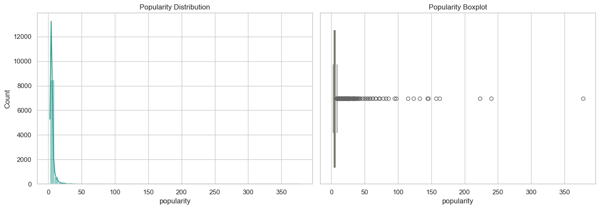
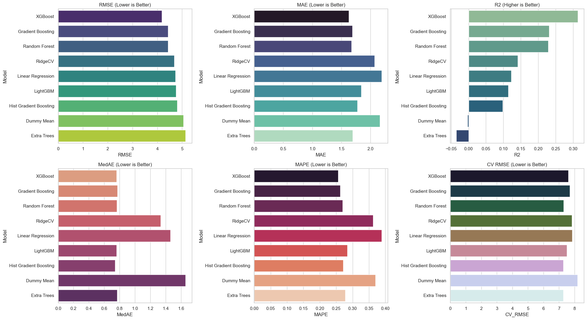
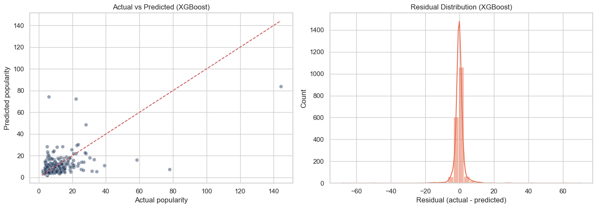
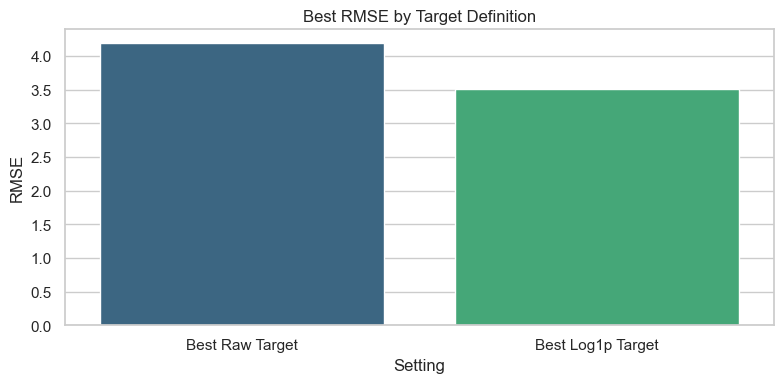
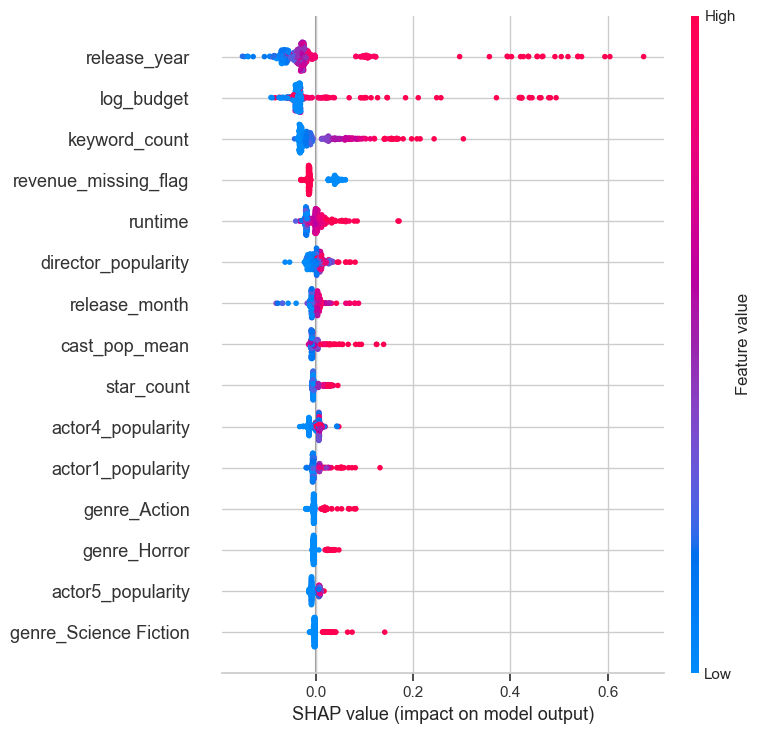

# TMDB Movie Success Prediction Project

This repository implements an end-to-end data science and ML workflow to estimate movie outcomes before release using TMDB-derived metadata.

Primary decision support goals:
1. Predict expected movie popularity.
2. Predict revenue tier (Low, Medium, High, Blockbuster) with semi-supervised learning.
3. Support pre-release what-if decisions in a Streamlit app.

**Repository Structure**
```text
INSY 674 FinalProject/
├── README.md
├── PROJECT_STATUS_REPORT.md
├── EDA/
│   └── EDA.ipynb
├── notebooks/
│   ├── DataExtraction.ipynb
│   └── FeatureEngineering.ipynb
├── data/
│   ├── movies_2010_2025.csv
│   ├── data_features_master.csv
│   ├── data_supervised_popularity.csv
│   ├── data_supervised_revenue.csv
│   ├── data_ssl_revenue.csv
│   └── ssl_model_comparison.csv
├── models/
│   ├── PopularityModelComparison.ipynb
│   ├── SemiSupervisedModels.ipynb
│   ├── SemiSupervisedModels_V2.ipynb
│   ├── export_best_models.py
│   ├── popularity_best_model.pkl
│   ├── ssl_best_model.pkl
│   ├── ssl_scaler.pkl
│   └── model_metadata.pkl
├── app/
│   ├── app_final.py
│   └── app_mockup.py
├── docs/
│   └── figures/
└── requirements.txt
```

---

**Data Science Lifecycle**

**5.1 Framing the Problem**
Business problem:
1. Studios need pre-release guidance on likely movie performance.
2. Casting, timing, and marketing choices are expensive and high-risk.

ML framing:
1. Regression task: predict `popularity`.
2. Semi-supervised classification: predict revenue tier (`y_ssl`).

Decision framing:
1. If predicted popularity is high but revenue confidence is low, prioritize risk mitigation (budget control, release strategy).
2. If both popularity and revenue outlook are strong, prioritize marketing scale-up.

---

**5.2 Data Acquisition**
Main source:
1. TMDB API (movies, cast, crew, keywords, metadata).

Notebook:
1. `notebooks/DataExtraction.ipynb`

Output:
1. `data/movies_2010_2025.csv`

Scope:
1. Movies from 2010 to 2025.
2. Talent attributes (director + top cast), language, genres, release metadata, budget/revenue/popularity fields.

---

**5.3 Data Exploration**
Notebook:
1. `EDA/EDA.ipynb`

EDA summary:

1) Data overview
1. Total movies: 9290
2. Labeled rows (revenue known): 2604
3. Total features (modeling set): 52

2) Raw features
| Groups | Categorical variables | Numerical variables |
|---|---|---|
| Feature name | Title, Release date, Original language, Status, overview, Genres, Keywords, Director name, Director department, Actor(1-5) name, Actor(1-5) character | Runtime, Popularity, Vote average, Vote count, Budget, Revenue, Director id, Director gender, Director popularity, Actor(1-5) id, Actor(1-5) gender, Cast pop mean, Cast pop max |

3) Missing values
| Feature name | Missing values |
|---|---:|
| runtime | 457 |
| vote_average | 1642 |
| vote_count | 1640 |
| budget | 6527 |
| revenue | 6686 |
| cast_pop_mean | 222 |
| cast_pop_max | 222 |
| director_gender | 2285 |
| actor1 missing | 225 |
| actor2 missing | 384 |
| actor3 missing | 681 |
| actor4 missing | 1036 |
| actor5 missing | 1479 |
| genres | 489 |
| keywords | 3238 |

4) Distribution of log target variables
Revenue


Popularity


5) Correlation map


6) Genres and talent ranking
Genres


Top directors by popularity (sample from EDA):
| Rank | Director | Popularity |
|---|---|---:|
| 1 | Jackie Chan | 20.8778 |
| 2 | Tom Hanks | 15.8630 |
| 3 | Ben Affleck | 12.3544 |
| 4 | Angelina Jolie | 10.9173 |
| 5 | Sylvester Stallone | 10.5039 |

Top actors by popularity (sample from EDA):
| Rank | Actor | Popularity |
|---|---|---:|
| 1 | Kayden Kross | 224.1500 |
| 2 | Evelyn Claire | 145.2190 |
| 3 | Chanel Preston | 88.1540 |
| 4 | Akiho Yoshizawa | 85.4980 |
| 5 | Rosa Caracciolo | 75.3990 |

---

**5.4 Data Preparation**
Notebook:
1. `notebooks/FeatureEngineering.ipynb`

Preparation strategy:
1. Parse and standardize genres/languages.
2. Build cast and director aggregate features.
3. Add release timing features (`release_month`, `release_quarter`, seasonal flags).
4. Add missingness indicators for budget/revenue and safe budget transforms (`has_budget`, `log_budget`).
5. Build text-derived proxies (`keyword_count`, `has_overview`, `overview_length`).
6. Enforce leakage-safe feature sets for pre-release prediction.

Generated datasets:
1. `data/data_features_master.csv`
2. `data/data_supervised_popularity.csv`
3. `data/data_supervised_revenue.csv`
4. `data/data_ssl_revenue.csv`

---

**5.5 Modeling**
Popularity notebook:
1. `models/PopularityModelComparison.ipynb`

Revenue-tier notebook:
1. `models/SemiSupervisedModels_V2.ipynb`

Model families used:
1. Regression: Dummy, Linear, Ridge, Random Forest, Extra Trees, Gradient Boosting, Hist Gradient Boosting, XGBoost, LightGBM (availability-dependent).
2. Semi-supervised classification: supervised baselines + SSL approaches on partially labeled target.

---

**5.6 Model Evaluation**
Evaluation setup (popularity):
1. Train/holdout split (80/20).
2. Cross-validation + repeated CV stability checks.
3. Metrics: RMSE, MAE, R2 (plus additional diagnostics in notebook).
4. Ablation: raw target vs `log1p(popularity)` with back-transform (`expm1`) for comparable scale.

Evaluation setup (revenue tier):
1. Class metrics with focus on macro quality (Macro F1).
2. Confusion matrix diagnostics.
3. Selection among SSL candidates by performance and robustness.

---

**5.7 Model Selection**
Selection logic implemented in exporter:
1. `models/export_best_models.py`

Current exported models used by app:
1. Popularity model: Gradient Boosting with `log1p` target transform.
2. Revenue-tier model: best available SSL model from `SemiSupervisedModels_V2` artifacts.

Exported artifacts:
1. `models/popularity_best_model.pkl`
2. `models/ssl_best_model.pkl`
3. `models/ssl_scaler.pkl`
4. `models/model_metadata.pkl`

---

**5.8 Model Fine-Tuning**
In `models/PopularityModelComparison.ipynb`:
1. Hyperparameter tuning blocks exist.
2. Final model section includes repeated CV and targeted fine-tuning for the selected best log-target model.
3. SHAP explainability block added for selected final model.

---

**5.9 Solution Presentation**

**Context**
The solution is a decision-support pipeline for pre-release movie planning.

**Hypothesis**
Predictive hypotheses:
1. H1: Pre-release talent, content, timing, and production signals are predictive of popularity.
2. H2: Semi-supervised learning improves revenue-tier prediction when labeled revenue is limited.

Causal hypothesis (budget treatment):
1. H3: Budget-related treatment has positive effect on popularity under overlap/ignorability assumptions.

Null hypotheses:
1. H0 (predictive): models do not outperform baseline predictors materially.
2. H0 (causal): average treatment effect (ATE) is zero.

Outcomes and error types:
1. Regression errors: under/overprediction of popularity.
2. Classification errors: false optimism (predict high tier when low) and false pessimism.

Statistical communication:
1. Causal section reports uncertainty via confidence intervals (DR estimate).
2. P-values are not the primary model-selection criterion; predictive metrics and robust CV are primary.
3. Multiple testing / p-hacking mitigation: holdout discipline, repeated CV, and explicit ablations.

**Data**
Data sources and transformations are documented in:
1. `notebooks/DataExtraction.ipynb`
2. `notebooks/FeatureEngineering.ipynb`
3. EDA section above (before/after quality profile)

**Model**
Type:
1. Supervised regression for popularity.
2. Semi-supervised classification for revenue tier.

Modelling Approach:
1. Multi-model benchmarking.
2. Leakage-safe features.
3. Target transform ablation.
4. Final model retraining and export for serving.

Model Evaluation:
1. Train/validation/holdout strategy with CV checks.
2. Metrics aligned to task and business interpretability.

**Results**
Popularity prediction (regression):
- Best raw-target model: XGBoost.
- Best final model: Gradient Boosting with `log1p(popularity)`.

Holdout metrics (original popularity scale):
| Setting | Model | RMSE | MAE | R2 |
|---|---|---:|---:|---:|
| Best raw target | XGBoost | 4.1853 | 1.6265 | 0.3142 |
| Best log1p target (final) | Gradient Boosting | 3.5067 | 1.4196 | 0.5186 |

Revenue tier prediction (semi-supervised):
- Best model: SelfTraining (SSL) with tuned RandomForest base estimator.
- Primary metric: Macro F1 on held-out labeled test set.

Comparison (held-out labeled test set):
| Model | Accuracy | Macro F1 | Notes |
|---|---:|---:|---|
| SelfTraining (SSL, tuned) | 0.6238 | 0.6296 | Pseudo-labeled: 5974 samples; threshold=0.7 |
| RandomForest (supervised, tuned) | 0.6046 | 0.6048 | Supervised baseline |
| GradientBoosting (supervised, tuned) | 0.6027 | 0.6024 | Supervised baseline |
| LabelSpreading (SSL, tuned) | 0.5470 | 0.5420 | Graph SSL |
| LabelPropagation (SSL, tuned) | 0.5278 | 0.5277 | Graph SSL |

**Explainability of Results**
Explainability included in popularity notebook:
1. Global feature importance plots.
2. SHAP summary plots (final selected model).

**Important Graphs**
Popularity distribution


Model comparison snapshot


Residual diagnostics


Target transform ablation (raw vs log1p)


Final model SHAP summary


Best SSL confusion matrix


**Threats to Validity (Slide 37)**

Data & Distribution
- TMDB may not represent all markets or distribution channels.
- Revenue missingness may be systematic, affecting SSL assumptions.
- Temporal shifts may reduce future generalization.

Modeling & Evaluation
- Popularity and revenue distributions are skewed.
- Model ranking depends on validation strategy.

Leakage & Feature Risk
- Latent post-release proxies may remain despite filtering.

Interpretation & Deployment
- Results reflect associations, not causal effects.
- Production deployment requires monitoring and drift control.

**Conclusion (Slide 38)**
- Pre-release metadata contains meaningful predictive signal for both popularity and revenue tier.
- Supervised models significantly outperform baseline error for popularity prediction.
- Semi-supervised Self Training achieved the best F1 for revenue tiers, improving over the best supervised model.
- Leveraging unlabeled data added measurable value when pseudo-labeling was carefully controlled.

Business Insight
- Release timing, budget-related proxies, and talent popularity are consistently strong predictors.
- Results provide interpretable signals for greenlighting, marketing, and release strategy decisions.

Next Steps
- Improve temporal robustness.
- Incorporate more pre-release variables such as marketing intensity, distribution scope, and social signals.
- Add temporal CV as required model-selection criterion.
- Add uncertainty intervals and drift monitoring in production.

**Lessons Learned (Slide 39)**
- Semi-supervised learning adds value when labels are scarce.
- Feature engineering matters more than model complexity alone.
- AI is a tool, not a replacement for reasoning.

---

**5.10 Launching, Monitoring and Maintenance**
Launch:
1. Export models via `python models/export_best_models.py`.
2. Run app via `streamlit run app/app_final.py`.
3. Deploy on Streamlit Cloud with `requirements.txt` and `runtime.txt`.

Monitoring recommendations:
1. Data drift: monitor feature distributions vs training baseline.
2. Prediction drift: monitor percentile shifts in predicted popularity and revenue-tier frequencies.
3. Performance drift: periodically backtest on newly released movies.
4. Reliability: log model load/version metadata and prediction errors.

Maintenance plan:
1. Scheduled retraining cadence (e.g., quarterly or semi-annually).
2. Trigger retraining on drift thresholds.
3. Keep dependency versions pinned for artifact compatibility.
4. Keep notebook-to-export parity checks in CI.

---

**App Overview**
Main app file:
1. `app/app_final.py`

Current app outputs:
1. Predicted popularity with percentile context.
2. Revenue outlook with confidence.
3. Actor/director popularity chart.
4. TMDB known-for movie panels (with fallback to dataset summaries).
