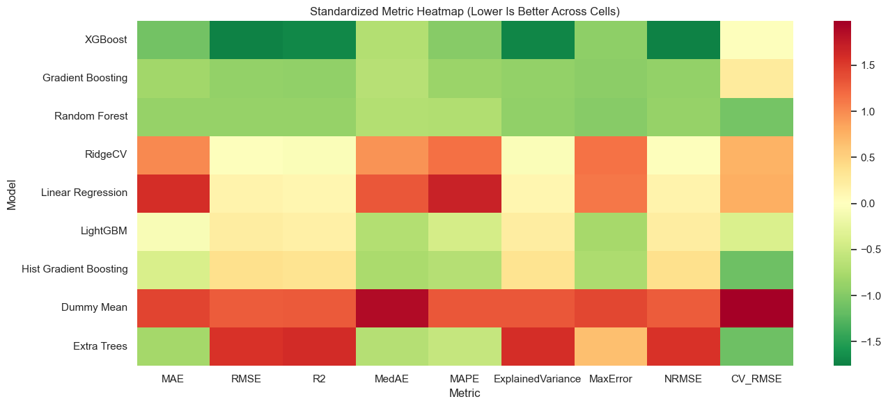
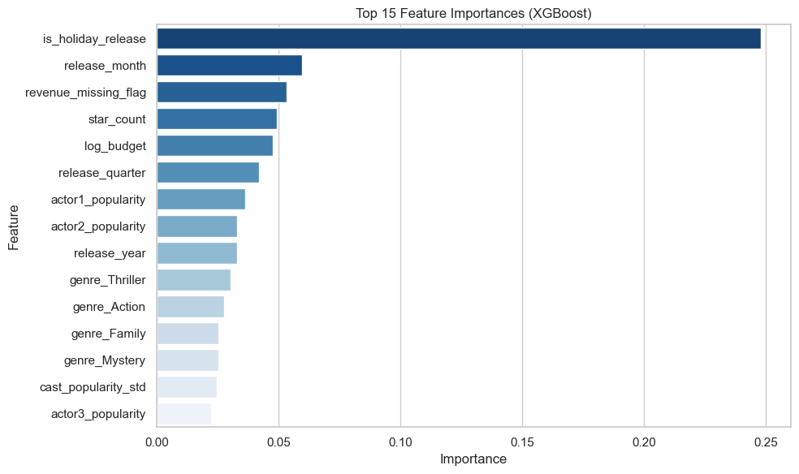
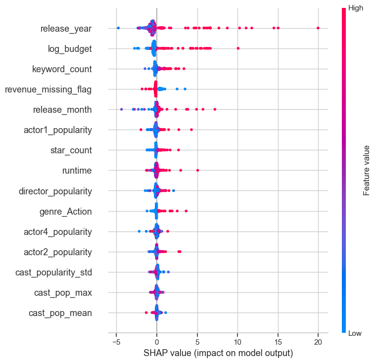
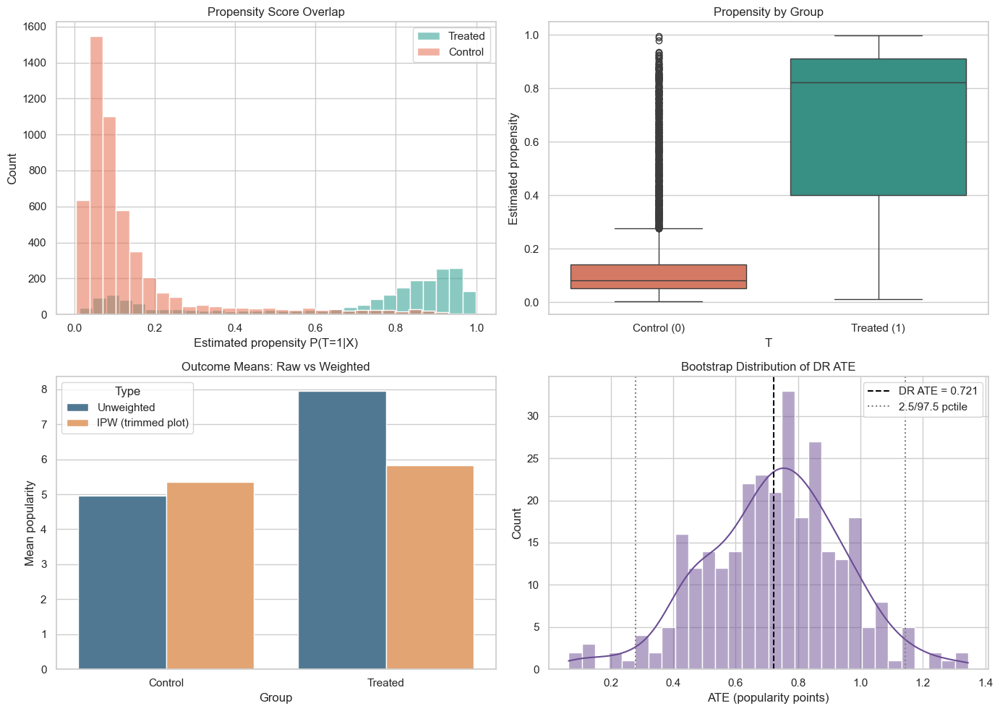
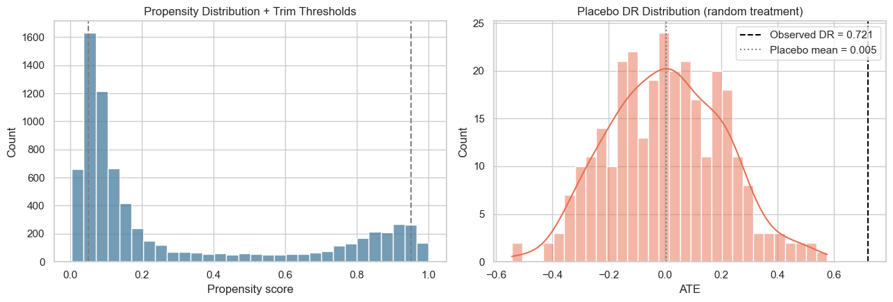

# Popularity Prediction Model Comparison

This notebook trains and compares multiple models to predict movie **popularity**.
It includes baseline, linear, ensemble, and advanced gradient-boosting models.

## Objectives
- Build a reproducible supervised regression pipeline.
- Compare simple and complex models under the same split/metrics.
- Evaluate performance with both holdout and cross-validation.
- Visualize results and interpret the best model.


## 1. Imports and Environment Checks

We import standard ML libraries and then check optional availability of:
- **XGBoost** (`xgboost`)
- **LightGBM** (`lightgbm`)

If not installed, the notebook skips those models automatically.

Additional evaluation metrics included in this version:
- `MedAE` (median absolute error)
- `MAPE` (mean absolute percentage error)
- `ExplainedVariance`
- `MaxError`


```python

import time
import importlib.util
import numpy as np
import pandas as pd
import seaborn as sns
import matplotlib.pyplot as plt

from sklearn.model_selection import train_test_split, KFold, cross_val_score
from sklearn.pipeline import Pipeline
from sklearn.preprocessing import StandardScaler
from sklearn.metrics import (
    mean_absolute_error,
    mean_squared_error,
    r2_score,
    median_absolute_error,
    mean_absolute_percentage_error,
    explained_variance_score,
    max_error,
)

from sklearn.dummy import DummyRegressor
from sklearn.linear_model import LinearRegression, RidgeCV
from sklearn.ensemble import RandomForestRegressor, ExtraTreesRegressor, GradientBoostingRegressor, HistGradientBoostingRegressor

RANDOM_STATE = 42
sns.set_theme(style='whitegrid')

HAS_XGBOOST = importlib.util.find_spec('xgboost') is not None
HAS_LIGHTGBM = importlib.util.find_spec('lightgbm') is not None

if HAS_XGBOOST:
    from xgboost import XGBRegressor
if HAS_LIGHTGBM:
    from lightgbm import LGBMRegressor

print('xgboost available:', HAS_XGBOOST)
print('lightgbm available:', HAS_LIGHTGBM)

```

    xgboost available: True
    lightgbm available: True


## 2. Load the Engineered Supervised Dataset

Input file: `../data/data_supervised_popularity.csv`
- Features: engineered pre-release variables
- Target: `popularity`


```python

df = pd.read_csv('../data/data_supervised_popularity.csv')
print('Shape:', df.shape)
print('Columns:', len(df.columns))
df.head(3)

```

    Shape: (9290, 53)
    Columns: 53


<div>
<style scoped>
    .dataframe tbody tr th:only-of-type {
        vertical-align: middle;
    }

    .dataframe tbody tr th {
        vertical-align: top;
    }

    .dataframe thead th {
        text-align: right;
    }
</style>
<table border="1" class="dataframe">
  <thead>
    <tr style="text-align: right;">
      <th></th>
      <th>runtime</th>
      <th>director_popularity</th>
      <th>actor1_popularity</th>
      <th>actor2_popularity</th>
      <th>actor3_popularity</th>
      <th>actor4_popularity</th>
      <th>actor5_popularity</th>
      <th>cast_pop_mean</th>
      <th>cast_pop_max</th>
      <th>release_month</th>
      <th>...</th>
      <th>lang_de</th>
      <th>lang_other</th>
      <th>is_english</th>
      <th>revenue_missing_flag</th>
      <th>budget_missing_flag</th>
      <th>has_budget</th>
      <th>log_budget</th>
      <th>has_overview</th>
      <th>overview_length</th>
      <th>popularity</th>
    </tr>
  </thead>
  <tbody>
    <tr>
      <th>0</th>
      <td>148</td>
      <td>8.2813</td>
      <td>12.2774</td>
      <td>5.6445</td>
      <td>4.5824</td>
      <td>9.6156</td>
      <td>4.8289</td>
      <td>7.38976</td>
      <td>12.2774</td>
      <td>7.0</td>
      <td>...</td>
      <td>0</td>
      <td>0</td>
      <td>1</td>
      <td>0</td>
      <td>0</td>
      <td>1</td>
      <td>18.890684</td>
      <td>1</td>
      <td>280</td>
      <td>32.8952</td>
    </tr>
    <tr>
      <th>1</th>
      <td>100</td>
      <td>5.1258</td>
      <td>2.1981</td>
      <td>1.9780</td>
      <td>1.8252</td>
      <td>4.9563</td>
      <td>2.1777</td>
      <td>2.62706</td>
      <td>4.9563</td>
      <td>11.0</td>
      <td>...</td>
      <td>0</td>
      <td>0</td>
      <td>1</td>
      <td>0</td>
      <td>0</td>
      <td>1</td>
      <td>19.376192</td>
      <td>1</td>
      <td>286</td>
      <td>19.8760</td>
    </tr>
    <tr>
      <th>2</th>
      <td>124</td>
      <td>4.0024</td>
      <td>9.2587</td>
      <td>5.5278</td>
      <td>3.4058</td>
      <td>17.8153</td>
      <td>4.4974</td>
      <td>8.10100</td>
      <td>17.8153</td>
      <td>4.0</td>
      <td>...</td>
      <td>0</td>
      <td>0</td>
      <td>1</td>
      <td>0</td>
      <td>0</td>
      <td>1</td>
      <td>19.113828</td>
      <td>1</td>
      <td>372</td>
      <td>13.7900</td>
    </tr>
  </tbody>
</table>
<p>3 rows × 53 columns</p>
</div>


```python
print('Top missing counts:')
print(df.isna().sum().sort_values(ascending=False).head(10))

print()
print('Target describe:')
print(df['popularity'].describe())

```

    Top missing counts:
    runtime                  0
    genre_History            0
    genre_Music              0
    genre_Mystery            0
    genre_Romance            0
    genre_Science Fiction    0
    genre_TV Movie           0
    genre_Thriller           0
    genre_War                0
    genre_Western            0
    dtype: int64
    
    Target describe:
    count    9290.000000
    mean        5.788687
    std         7.689172
    min         2.414700
    25%         3.885000
    50%         4.501300
    75%         5.628275
    max       378.004500
    Name: popularity, dtype: float64


## 3. Explore the Target Distribution

Popularity is typically right-skewed, so this plot helps contextualize error metrics.


```python

fig, axes = plt.subplots(1, 2, figsize=(14, 5))

sns.histplot(df['popularity'], bins=60, kde=True, ax=axes[0], color='#2a9d8f')
axes[0].set_title('Popularity Distribution')
axes[0].set_xlabel('popularity')

sns.boxplot(x=df['popularity'], ax=axes[1], color='#e9c46a')
axes[1].set_title('Popularity Boxplot')
axes[1].set_xlabel('popularity')

plt.tight_layout()
plt.show()

```


    

    


## 4. Train/Test Split

We keep 20% as a final holdout test set.


```python

X = df.drop(columns=['popularity'])
y = df['popularity']

X_train, X_test, y_train, y_test = train_test_split(
    X, y, test_size=0.2, random_state=RANDOM_STATE
)

print('X_train:', X_train.shape)
print('X_test: ', X_test.shape)

```

    X_train: (7432, 52)
    X_test:  (1858, 52)


## 5. Define Model Set

Models included:
- Baseline: `DummyRegressor`
- Linear: `LinearRegression`, `RidgeCV`
- Tree Ensembles: `RandomForest`, `ExtraTrees`, `GradientBoosting`, `HistGradientBoosting`
- Advanced Boosters: `XGBoost`, `LightGBM` (if installed)


```python

models = {
    'Dummy Mean': Pipeline([
        ('model', DummyRegressor(strategy='mean'))
    ]),
    'Linear Regression': Pipeline([
        ('scaler', StandardScaler()),
        ('model', LinearRegression())
    ]),
    'RidgeCV': Pipeline([
        ('scaler', StandardScaler()),
        ('model', RidgeCV(alphas=np.logspace(-3, 3, 13)))
    ]),
    'Random Forest': Pipeline([
        ('model', RandomForestRegressor(
            n_estimators=400,
            random_state=RANDOM_STATE,
            n_jobs=-1
        ))
    ]),
    'Extra Trees': Pipeline([
        ('model', ExtraTreesRegressor(
            n_estimators=500,
            random_state=RANDOM_STATE,
            n_jobs=-1
        ))
    ]),
    'Gradient Boosting': Pipeline([
        ('model', GradientBoostingRegressor(random_state=RANDOM_STATE))
    ]),
    'Hist Gradient Boosting': Pipeline([
        ('model', HistGradientBoostingRegressor(random_state=RANDOM_STATE))
    ])
}

if HAS_XGBOOST:
    models['XGBoost'] = Pipeline([
        ('model', XGBRegressor(
            n_estimators=500,
            learning_rate=0.05,
            max_depth=6,
            subsample=0.85,
            colsample_bytree=0.85,
            objective='reg:squarederror',
            random_state=RANDOM_STATE,
            n_jobs=-1
        ))
    ])

if HAS_LIGHTGBM:
    models['LightGBM'] = Pipeline([
        ('model', LGBMRegressor(
            n_estimators=500,
            learning_rate=0.05,
            num_leaves=31,
            subsample=0.85,
            colsample_bytree=0.85,
            random_state=RANDOM_STATE,
            n_jobs=-1
        ))
    ])

print('Models to run:')
for m in models:
    print('-', m)

```

    Models to run:
    - Dummy Mean
    - Linear Regression
    - RidgeCV
    - Random Forest
    - Extra Trees
    - Gradient Boosting
    - Hist Gradient Boosting
    - XGBoost
    - LightGBM


## 6. Train, Cross-Validate, and Score

Metrics:
- **MAE**: average absolute error
- **RMSE**: penalizes larger errors
- **R2**: explained variance relative to mean baseline
- **MedAE**: robust typical absolute error
- **MAPE**: relative percentage error
- **ExplainedVariance**: variance captured by predictions
- **MaxError**: worst-case absolute error
- **CV_RMSE**: 3-fold mean RMSE on training split
- **FitTimeSec**: training time for complexity/performance tradeoff


```python

results = []
fitted_models = {}
test_predictions = {}

cv = KFold(n_splits=3, shuffle=True, random_state=RANDOM_STATE)

y_range = max(y_test.max() - y_test.min(), 1e-9)

for name, model in models.items():
    start = time.time()
    model.fit(X_train, y_train)
    fit_time = time.time() - start

    y_pred = model.predict(X_test)

    mae = mean_absolute_error(y_test, y_pred)
    rmse = np.sqrt(mean_squared_error(y_test, y_pred))
    r2 = r2_score(y_test, y_pred)
    medae = median_absolute_error(y_test, y_pred)
    mape = mean_absolute_percentage_error(y_test, y_pred)
    exp_var = explained_variance_score(y_test, y_pred)
    mx_err = max_error(y_test, y_pred)
    nrmse = rmse / y_range

    cv_rmse = -cross_val_score(
        model, X_train, y_train,
        cv=cv,
        scoring='neg_root_mean_squared_error',
        n_jobs=-1
    ).mean()

    results.append({
        'Model': name,
        'MAE': mae,
        'RMSE': rmse,
        'R2': r2,
        'MedAE': medae,
        'MAPE': mape,
        'ExplainedVariance': exp_var,
        'MaxError': mx_err,
        'NRMSE': nrmse,
        'CV_RMSE': cv_rmse,
        'FitTimeSec': fit_time
    })

    fitted_models[name] = model
    test_predictions[name] = y_pred

results_df = pd.DataFrame(results).sort_values('RMSE').reset_index(drop=True)

# Rank-based composite for easier multi-metric comparison
rank_lower_better = ['MAE', 'RMSE', 'MedAE', 'MAPE', 'MaxError', 'NRMSE', 'CV_RMSE', 'FitTimeSec']
rank_higher_better = ['R2', 'ExplainedVariance']

for col in rank_lower_better:
    results_df[f'Rank_{col}'] = results_df[col].rank(method='min', ascending=True)
for col in rank_higher_better:
    results_df[f'Rank_{col}'] = results_df[col].rank(method='min', ascending=False)

rank_cols = [c for c in results_df.columns if c.startswith('Rank_')]
results_df['AvgRank'] = results_df[rank_cols].mean(axis=1)
results_df = results_df.sort_values(['RMSE', 'AvgRank']).reset_index(drop=True)

results_df

```

    [LightGBM] [Warning] Found whitespace in feature_names, replace with underlines
    [LightGBM] [Info] Auto-choosing row-wise multi-threading, the overhead of testing was 0.001934 seconds.
    You can set `force_row_wise=true` to remove the overhead.
    And if memory is not enough, you can set `force_col_wise=true`.
    [LightGBM] [Info] Total Bins 3146
    [LightGBM] [Info] Number of data points in the train set: 7432, number of used features: 52
    [LightGBM] [Info] Start training from score 5.842702
    [LightGBM] [Warning] Found whitespace in feature_names, replace with underlines
    [LightGBM] [Warning] Found whitespace in feature_names, replace with underlines
    [LightGBM] [Info] Auto-choosing row-wise multi-threading, the overhead of testing was 0.002758 seconds.
    You can set `force_row_wise=true` to remove the overhead.
    And if memory is not enough, you can set `force_col_wise=true`.
    [LightGBM] [Info] Total Bins 3125
    [LightGBM] [Info] Number of data points in the train set: 4954, number of used features: 52
    [LightGBM] [Info] Auto-choosing row-wise multi-threading, the overhead of testing was 0.003233 seconds.
    You can set `force_row_wise=true` to remove the overhead.
    And if memory is not enough, you can set `force_col_wise=true`.
    [LightGBM] [Info] Total Bins 3132
    [LightGBM] [Info] Number of data points in the train set: 4955, number of used features: 52
    [LightGBM] [Info] Start training from score 5.894696
    [LightGBM] [Info] Start training from score 5.775725
    [LightGBM] [Warning] Found whitespace in feature_names, replace with underlines
    [LightGBM] [Info] Auto-choosing row-wise multi-threading, the overhead of testing was 0.004389 seconds.
    You can set `force_row_wise=true` to remove the overhead.
    And if memory is not enough, you can set `force_col_wise=true`.
    [LightGBM] [Info] Total Bins 3130
    [LightGBM] [Info] Number of data points in the train set: 4955, number of used features: 52
    [LightGBM] [Info] Start training from score 5.857696


<div>
<style scoped>
    .dataframe tbody tr th:only-of-type {
        vertical-align: middle;
    }

    .dataframe tbody tr th {
        vertical-align: top;
    }

    .dataframe thead th {
        text-align: right;
    }
</style>
<table border="1" class="dataframe">
  <thead>
    <tr style="text-align: right;">
      <th></th>
      <th>Model</th>
      <th>MAE</th>
      <th>RMSE</th>
      <th>R2</th>
      <th>MedAE</th>
      <th>MAPE</th>
      <th>ExplainedVariance</th>
      <th>MaxError</th>
      <th>NRMSE</th>
      <th>CV_RMSE</th>
      <th>...</th>
      <th>Rank_RMSE</th>
      <th>Rank_MedAE</th>
      <th>Rank_MAPE</th>
      <th>Rank_MaxError</th>
      <th>Rank_NRMSE</th>
      <th>Rank_CV_RMSE</th>
      <th>Rank_FitTimeSec</th>
      <th>Rank_R2</th>
      <th>Rank_ExplainedVariance</th>
      <th>AvgRank</th>
    </tr>
  </thead>
  <tbody>
    <tr>
      <th>0</th>
      <td>XGBoost</td>
      <td>1.626463</td>
      <td>4.185346</td>
      <td>0.314174</td>
      <td>0.759325</td>
      <td>0.256156</td>
      <td>3.154477e-01</td>
      <td>70.477079</td>
      <td>0.029496</td>
      <td>7.614286</td>
      <td>...</td>
      <td>1.0</td>
      <td>2.0</td>
      <td>1.0</td>
      <td>3.0</td>
      <td>1.0</td>
      <td>5.0</td>
      <td>5.0</td>
      <td>1.0</td>
      <td>1.0</td>
      <td>2.1</td>
    </tr>
    <tr>
      <th>1</th>
      <td>Gradient Boosting</td>
      <td>1.685983</td>
      <td>4.431288</td>
      <td>0.231204</td>
      <td>0.771642</td>
      <td>0.262510</td>
      <td>2.321372e-01</td>
      <td>70.068337</td>
      <td>0.031229</td>
      <td>7.699749</td>
      <td>...</td>
      <td>2.0</td>
      <td>6.0</td>
      <td>2.0</td>
      <td>2.0</td>
      <td>2.0</td>
      <td>6.0</td>
      <td>7.0</td>
      <td>2.0</td>
      <td>3.0</td>
      <td>3.5</td>
    </tr>
    <tr>
      <th>2</th>
      <td>Random Forest</td>
      <td>1.672186</td>
      <td>4.439115</td>
      <td>0.228486</td>
      <td>0.763136</td>
      <td>0.269342</td>
      <td>2.328539e-01</td>
      <td>68.982040</td>
      <td>0.031285</td>
      <td>7.301699</td>
      <td>...</td>
      <td>3.0</td>
      <td>4.0</td>
      <td>3.0</td>
      <td>1.0</td>
      <td>3.0</td>
      <td>3.0</td>
      <td>9.0</td>
      <td>3.0</td>
      <td>2.0</td>
      <td>3.3</td>
    </tr>
    <tr>
      <th>3</th>
      <td>RidgeCV</td>
      <td>2.067456</td>
      <td>4.683050</td>
      <td>0.141364</td>
      <td>1.335009</td>
      <td>0.362587</td>
      <td>1.432700e-01</td>
      <td>130.308302</td>
      <td>0.033004</td>
      <td>7.841485</td>
      <td>...</td>
      <td>4.0</td>
      <td>7.0</td>
      <td>7.0</td>
      <td>8.0</td>
      <td>4.0</td>
      <td>7.0</td>
      <td>3.0</td>
      <td>4.0</td>
      <td>4.0</td>
      <td>5.5</td>
    </tr>
    <tr>
      <th>4</th>
      <td>Linear Regression</td>
      <td>2.190431</td>
      <td>4.732834</td>
      <td>0.123012</td>
      <td>1.460261</td>
      <td>0.388597</td>
      <td>1.245312e-01</td>
      <td>129.618872</td>
      <td>0.033355</td>
      <td>7.849961</td>
      <td>...</td>
      <td>5.0</td>
      <td>8.0</td>
      <td>9.0</td>
      <td>7.0</td>
      <td>5.0</td>
      <td>8.0</td>
      <td>2.0</td>
      <td>5.0</td>
      <td>5.0</td>
      <td>6.3</td>
    </tr>
    <tr>
      <th>5</th>
      <td>LightGBM</td>
      <td>1.839230</td>
      <td>4.756288</td>
      <td>0.114298</td>
      <td>0.760354</td>
      <td>0.283805</td>
      <td>1.144391e-01</td>
      <td>75.015338</td>
      <td>0.033520</td>
      <td>7.510146</td>
      <td>...</td>
      <td>6.0</td>
      <td>3.0</td>
      <td>6.0</td>
      <td>4.0</td>
      <td>6.0</td>
      <td>4.0</td>
      <td>4.0</td>
      <td>6.0</td>
      <td>6.0</td>
      <td>5.1</td>
    </tr>
    <tr>
      <th>6</th>
      <td>Hist Gradient Boosting</td>
      <td>1.772528</td>
      <td>4.800057</td>
      <td>0.097922</td>
      <td>0.741571</td>
      <td>0.271376</td>
      <td>9.961133e-02</td>
      <td>76.260340</td>
      <td>0.033828</td>
      <td>7.290314</td>
      <td>...</td>
      <td>7.0</td>
      <td>1.0</td>
      <td>4.0</td>
      <td>5.0</td>
      <td>7.0</td>
      <td>1.0</td>
      <td>6.0</td>
      <td>7.0</td>
      <td>7.0</td>
      <td>5.0</td>
    </tr>
    <tr>
      <th>7</th>
      <td>Dummy Mean</td>
      <td>2.158683</td>
      <td>5.061085</td>
      <td>-0.002856</td>
      <td>1.657452</td>
      <td>0.370166</td>
      <td>-2.220446e-16</td>
      <td>138.467998</td>
      <td>0.035668</td>
      <td>8.206709</td>
      <td>...</td>
      <td>8.0</td>
      <td>9.0</td>
      <td>8.0</td>
      <td>9.0</td>
      <td>8.0</td>
      <td>9.0</td>
      <td>1.0</td>
      <td>8.0</td>
      <td>8.0</td>
      <td>7.6</td>
    </tr>
    <tr>
      <th>8</th>
      <td>Extra Trees</td>
      <td>1.690371</td>
      <td>5.141636</td>
      <td>-0.035032</td>
      <td>0.768522</td>
      <td>0.277719</td>
      <td>-2.953899e-02</td>
      <td>116.218597</td>
      <td>0.036236</td>
      <td>7.290559</td>
      <td>...</td>
      <td>9.0</td>
      <td>5.0</td>
      <td>5.0</td>
      <td>6.0</td>
      <td>9.0</td>
      <td>2.0</td>
      <td>8.0</td>
      <td>9.0</td>
      <td>9.0</td>
      <td>6.6</td>
    </tr>
  </tbody>
</table>
<p>9 rows × 22 columns</p>
</div>


## 7. Metrics Comparison Table and Visual Comparison

First, we create a compact table to compare all model metrics side-by-side.
Then we visualize core metrics with bar charts and a standardized heatmap.


```python
# Side-by-side metric comparison table for all models
metric_cols = ['MAE', 'RMSE', 'R2', 'MedAE', 'MAPE', 'ExplainedVariance', 'MaxError', 'NRMSE', 'CV_RMSE', 'FitTimeSec', 'AvgRank']
comparison_table = results_df[['Model'] + metric_cols].copy()

format_map = {
    'MAE': '{:.3f}',
    'RMSE': '{:.3f}',
    'R2': '{:.4f}',
    'MedAE': '{:.3f}',
    'MAPE': '{:.4f}',
    'ExplainedVariance': '{:.4f}',
    'MaxError': '{:.3f}',
    'NRMSE': '{:.4f}',
    'CV_RMSE': '{:.3f}',
    'FitTimeSec': '{:.3f}',
    'AvgRank': '{:.2f}'
}

display(comparison_table.style.format(format_map))

fig, axes = plt.subplots(2, 3, figsize=(20, 11))

sns.barplot(data=results_df, x='RMSE', y='Model', ax=axes[0, 0], palette='viridis')
axes[0, 0].set_title('RMSE (Lower is Better)')

sns.barplot(data=results_df, x='MAE', y='Model', ax=axes[0, 1], palette='mako')
axes[0, 1].set_title('MAE (Lower is Better)')

sns.barplot(data=results_df, x='R2', y='Model', ax=axes[0, 2], palette='crest')
axes[0, 2].set_title('R2 (Higher is Better)')

sns.barplot(data=results_df, x='MedAE', y='Model', ax=axes[1, 0], palette='flare')
axes[1, 0].set_title('MedAE (Lower is Better)')

sns.barplot(data=results_df, x='MAPE', y='Model', ax=axes[1, 1], palette='rocket')
axes[1, 1].set_title('MAPE (Lower is Better)')

sns.barplot(data=results_df, x='CV_RMSE', y='Model', ax=axes[1, 2], palette='cubehelix')
axes[1, 2].set_title('CV RMSE (Lower is Better)')

plt.tight_layout()
plt.show()

# Heatmap on z-scored metrics (invert higher-is-better so all cells follow lower-is-better visual convention)
heat = results_df[['Model'] + metric_cols[:-2]].set_index('Model').copy()
heat['R2'] = -heat['R2']
heat['ExplainedVariance'] = -heat['ExplainedVariance']
heat_z = (heat - heat.mean()) / heat.std(ddof=0)

plt.figure(figsize=(14, 6))
sns.heatmap(heat_z, cmap='RdYlGn_r', center=0, annot=False)
plt.title('Standardized Metric Heatmap (Lower Is Better Across Cells)')
plt.xlabel('Metric')
plt.ylabel('Model')
plt.tight_layout()
plt.show()

```


<style type="text/css">
</style>
<table id="T_dc925">
  <thead>
    <tr>
      <th class="blank level0" >&nbsp;</th>
      <th id="T_dc925_level0_col0" class="col_heading level0 col0" >Model</th>
      <th id="T_dc925_level0_col1" class="col_heading level0 col1" >MAE</th>
      <th id="T_dc925_level0_col2" class="col_heading level0 col2" >RMSE</th>
      <th id="T_dc925_level0_col3" class="col_heading level0 col3" >R2</th>
      <th id="T_dc925_level0_col4" class="col_heading level0 col4" >MedAE</th>
      <th id="T_dc925_level0_col5" class="col_heading level0 col5" >MAPE</th>
      <th id="T_dc925_level0_col6" class="col_heading level0 col6" >ExplainedVariance</th>
      <th id="T_dc925_level0_col7" class="col_heading level0 col7" >MaxError</th>
      <th id="T_dc925_level0_col8" class="col_heading level0 col8" >NRMSE</th>
      <th id="T_dc925_level0_col9" class="col_heading level0 col9" >CV_RMSE</th>
      <th id="T_dc925_level0_col10" class="col_heading level0 col10" >FitTimeSec</th>
      <th id="T_dc925_level0_col11" class="col_heading level0 col11" >AvgRank</th>
    </tr>
  </thead>
  <tbody>
    <tr>
      <th id="T_dc925_level0_row0" class="row_heading level0 row0" >0</th>
      <td id="T_dc925_row0_col0" class="data row0 col0" >XGBoost</td>
      <td id="T_dc925_row0_col1" class="data row0 col1" >1.626</td>
      <td id="T_dc925_row0_col2" class="data row0 col2" >4.185</td>
      <td id="T_dc925_row0_col3" class="data row0 col3" >0.3142</td>
      <td id="T_dc925_row0_col4" class="data row0 col4" >0.759</td>
      <td id="T_dc925_row0_col5" class="data row0 col5" >0.2562</td>
      <td id="T_dc925_row0_col6" class="data row0 col6" >0.3154</td>
      <td id="T_dc925_row0_col7" class="data row0 col7" >70.477</td>
      <td id="T_dc925_row0_col8" class="data row0 col8" >0.0295</td>
      <td id="T_dc925_row0_col9" class="data row0 col9" >7.614</td>
      <td id="T_dc925_row0_col10" class="data row0 col10" >0.718</td>
      <td id="T_dc925_row0_col11" class="data row0 col11" >2.10</td>
    </tr>
    <tr>
      <th id="T_dc925_level0_row1" class="row_heading level0 row1" >1</th>
      <td id="T_dc925_row1_col0" class="data row1 col0" >Gradient Boosting</td>
      <td id="T_dc925_row1_col1" class="data row1 col1" >1.686</td>
      <td id="T_dc925_row1_col2" class="data row1 col2" >4.431</td>
      <td id="T_dc925_row1_col3" class="data row1 col3" >0.2312</td>
      <td id="T_dc925_row1_col4" class="data row1 col4" >0.772</td>
      <td id="T_dc925_row1_col5" class="data row1 col5" >0.2625</td>
      <td id="T_dc925_row1_col6" class="data row1 col6" >0.2321</td>
      <td id="T_dc925_row1_col7" class="data row1 col7" >70.068</td>
      <td id="T_dc925_row1_col8" class="data row1 col8" >0.0312</td>
      <td id="T_dc925_row1_col9" class="data row1 col9" >7.700</td>
      <td id="T_dc925_row1_col10" class="data row1 col10" >2.634</td>
      <td id="T_dc925_row1_col11" class="data row1 col11" >3.50</td>
    </tr>
    <tr>
      <th id="T_dc925_level0_row2" class="row_heading level0 row2" >2</th>
      <td id="T_dc925_row2_col0" class="data row2 col0" >Random Forest</td>
      <td id="T_dc925_row2_col1" class="data row2 col1" >1.672</td>
      <td id="T_dc925_row2_col2" class="data row2 col2" >4.439</td>
      <td id="T_dc925_row2_col3" class="data row2 col3" >0.2285</td>
      <td id="T_dc925_row2_col4" class="data row2 col4" >0.763</td>
      <td id="T_dc925_row2_col5" class="data row2 col5" >0.2693</td>
      <td id="T_dc925_row2_col6" class="data row2 col6" >0.2329</td>
      <td id="T_dc925_row2_col7" class="data row2 col7" >68.982</td>
      <td id="T_dc925_row2_col8" class="data row2 col8" >0.0313</td>
      <td id="T_dc925_row2_col9" class="data row2 col9" >7.302</td>
      <td id="T_dc925_row2_col10" class="data row2 col10" >7.316</td>
      <td id="T_dc925_row2_col11" class="data row2 col11" >3.30</td>
    </tr>
    <tr>
      <th id="T_dc925_level0_row3" class="row_heading level0 row3" >3</th>
      <td id="T_dc925_row3_col0" class="data row3 col0" >RidgeCV</td>
      <td id="T_dc925_row3_col1" class="data row3 col1" >2.067</td>
      <td id="T_dc925_row3_col2" class="data row3 col2" >4.683</td>
      <td id="T_dc925_row3_col3" class="data row3 col3" >0.1414</td>
      <td id="T_dc925_row3_col4" class="data row3 col4" >1.335</td>
      <td id="T_dc925_row3_col5" class="data row3 col5" >0.3626</td>
      <td id="T_dc925_row3_col6" class="data row3 col6" >0.1433</td>
      <td id="T_dc925_row3_col7" class="data row3 col7" >130.308</td>
      <td id="T_dc925_row3_col8" class="data row3 col8" >0.0330</td>
      <td id="T_dc925_row3_col9" class="data row3 col9" >7.841</td>
      <td id="T_dc925_row3_col10" class="data row3 col10" >0.457</td>
      <td id="T_dc925_row3_col11" class="data row3 col11" >5.50</td>
    </tr>
    <tr>
      <th id="T_dc925_level0_row4" class="row_heading level0 row4" >4</th>
      <td id="T_dc925_row4_col0" class="data row4 col0" >Linear Regression</td>
      <td id="T_dc925_row4_col1" class="data row4 col1" >2.190</td>
      <td id="T_dc925_row4_col2" class="data row4 col2" >4.733</td>
      <td id="T_dc925_row4_col3" class="data row4 col3" >0.1230</td>
      <td id="T_dc925_row4_col4" class="data row4 col4" >1.460</td>
      <td id="T_dc925_row4_col5" class="data row4 col5" >0.3886</td>
      <td id="T_dc925_row4_col6" class="data row4 col6" >0.1245</td>
      <td id="T_dc925_row4_col7" class="data row4 col7" >129.619</td>
      <td id="T_dc925_row4_col8" class="data row4 col8" >0.0334</td>
      <td id="T_dc925_row4_col9" class="data row4 col9" >7.850</td>
      <td id="T_dc925_row4_col10" class="data row4 col10" >0.032</td>
      <td id="T_dc925_row4_col11" class="data row4 col11" >6.30</td>
    </tr>
    <tr>
      <th id="T_dc925_level0_row5" class="row_heading level0 row5" >5</th>
      <td id="T_dc925_row5_col0" class="data row5 col0" >LightGBM</td>
      <td id="T_dc925_row5_col1" class="data row5 col1" >1.839</td>
      <td id="T_dc925_row5_col2" class="data row5 col2" >4.756</td>
      <td id="T_dc925_row5_col3" class="data row5 col3" >0.1143</td>
      <td id="T_dc925_row5_col4" class="data row5 col4" >0.760</td>
      <td id="T_dc925_row5_col5" class="data row5 col5" >0.2838</td>
      <td id="T_dc925_row5_col6" class="data row5 col6" >0.1144</td>
      <td id="T_dc925_row5_col7" class="data row5 col7" >75.015</td>
      <td id="T_dc925_row5_col8" class="data row5 col8" >0.0335</td>
      <td id="T_dc925_row5_col9" class="data row5 col9" >7.510</td>
      <td id="T_dc925_row5_col10" class="data row5 col10" >0.710</td>
      <td id="T_dc925_row5_col11" class="data row5 col11" >5.10</td>
    </tr>
    <tr>
      <th id="T_dc925_level0_row6" class="row_heading level0 row6" >6</th>
      <td id="T_dc925_row6_col0" class="data row6 col0" >Hist Gradient Boosting</td>
      <td id="T_dc925_row6_col1" class="data row6 col1" >1.773</td>
      <td id="T_dc925_row6_col2" class="data row6 col2" >4.800</td>
      <td id="T_dc925_row6_col3" class="data row6 col3" >0.0979</td>
      <td id="T_dc925_row6_col4" class="data row6 col4" >0.742</td>
      <td id="T_dc925_row6_col5" class="data row6 col5" >0.2714</td>
      <td id="T_dc925_row6_col6" class="data row6 col6" >0.0996</td>
      <td id="T_dc925_row6_col7" class="data row6 col7" >76.260</td>
      <td id="T_dc925_row6_col8" class="data row6 col8" >0.0338</td>
      <td id="T_dc925_row6_col9" class="data row6 col9" >7.290</td>
      <td id="T_dc925_row6_col10" class="data row6 col10" >0.780</td>
      <td id="T_dc925_row6_col11" class="data row6 col11" >5.00</td>
    </tr>
    <tr>
      <th id="T_dc925_level0_row7" class="row_heading level0 row7" >7</th>
      <td id="T_dc925_row7_col0" class="data row7 col0" >Dummy Mean</td>
      <td id="T_dc925_row7_col1" class="data row7 col1" >2.159</td>
      <td id="T_dc925_row7_col2" class="data row7 col2" >5.061</td>
      <td id="T_dc925_row7_col3" class="data row7 col3" >-0.0029</td>
      <td id="T_dc925_row7_col4" class="data row7 col4" >1.657</td>
      <td id="T_dc925_row7_col5" class="data row7 col5" >0.3702</td>
      <td id="T_dc925_row7_col6" class="data row7 col6" >-0.0000</td>
      <td id="T_dc925_row7_col7" class="data row7 col7" >138.468</td>
      <td id="T_dc925_row7_col8" class="data row7 col8" >0.0357</td>
      <td id="T_dc925_row7_col9" class="data row7 col9" >8.207</td>
      <td id="T_dc925_row7_col10" class="data row7 col10" >0.015</td>
      <td id="T_dc925_row7_col11" class="data row7 col11" >7.60</td>
    </tr>
    <tr>
      <th id="T_dc925_level0_row8" class="row_heading level0 row8" >8</th>
      <td id="T_dc925_row8_col0" class="data row8 col0" >Extra Trees</td>
      <td id="T_dc925_row8_col1" class="data row8 col1" >1.690</td>
      <td id="T_dc925_row8_col2" class="data row8 col2" >5.142</td>
      <td id="T_dc925_row8_col3" class="data row8 col3" >-0.0350</td>
      <td id="T_dc925_row8_col4" class="data row8 col4" >0.769</td>
      <td id="T_dc925_row8_col5" class="data row8 col5" >0.2777</td>
      <td id="T_dc925_row8_col6" class="data row8 col6" >-0.0295</td>
      <td id="T_dc925_row8_col7" class="data row8 col7" >116.219</td>
      <td id="T_dc925_row8_col8" class="data row8 col8" >0.0362</td>
      <td id="T_dc925_row8_col9" class="data row8 col9" >7.291</td>
      <td id="T_dc925_row8_col10" class="data row8 col10" >4.660</td>
      <td id="T_dc925_row8_col11" class="data row8 col11" >6.60</td>
    </tr>
  </tbody>
</table>


    /var/folders/2f/cfhs34m12qx_yvc1ptsr2jyc0000gn/T/ipykernel_38608/3023679878.py:23: FutureWarning: 
    
    Passing `palette` without assigning `hue` is deprecated and will be removed in v0.14.0. Assign the `y` variable to `hue` and set `legend=False` for the same effect.
    
      sns.barplot(data=results_df, x='RMSE', y='Model', ax=axes[0, 0], palette='viridis')
    /var/folders/2f/cfhs34m12qx_yvc1ptsr2jyc0000gn/T/ipykernel_38608/3023679878.py:26: FutureWarning: 
    
    Passing `palette` without assigning `hue` is deprecated and will be removed in v0.14.0. Assign the `y` variable to `hue` and set `legend=False` for the same effect.
    
      sns.barplot(data=results_df, x='MAE', y='Model', ax=axes[0, 1], palette='mako')
    /var/folders/2f/cfhs34m12qx_yvc1ptsr2jyc0000gn/T/ipykernel_38608/3023679878.py:29: FutureWarning: 
    
    Passing `palette` without assigning `hue` is deprecated and will be removed in v0.14.0. Assign the `y` variable to `hue` and set `legend=False` for the same effect.
    
      sns.barplot(data=results_df, x='R2', y='Model', ax=axes[0, 2], palette='crest')
    /var/folders/2f/cfhs34m12qx_yvc1ptsr2jyc0000gn/T/ipykernel_38608/3023679878.py:32: FutureWarning: 
    
    Passing `palette` without assigning `hue` is deprecated and will be removed in v0.14.0. Assign the `y` variable to `hue` and set `legend=False` for the same effect.
    
      sns.barplot(data=results_df, x='MedAE', y='Model', ax=axes[1, 0], palette='flare')
    /var/folders/2f/cfhs34m12qx_yvc1ptsr2jyc0000gn/T/ipykernel_38608/3023679878.py:35: FutureWarning: 
    
    Passing `palette` without assigning `hue` is deprecated and will be removed in v0.14.0. Assign the `y` variable to `hue` and set `legend=False` for the same effect.
    
      sns.barplot(data=results_df, x='MAPE', y='Model', ax=axes[1, 1], palette='rocket')
    /var/folders/2f/cfhs34m12qx_yvc1ptsr2jyc0000gn/T/ipykernel_38608/3023679878.py:38: FutureWarning: 
    
    Passing `palette` without assigning `hue` is deprecated and will be removed in v0.14.0. Assign the `y` variable to `hue` and set `legend=False` for the same effect.
    
      sns.barplot(data=results_df, x='CV_RMSE', y='Model', ax=axes[1, 2], palette='cubehelix')


    

    


    

    


## 8. Best Model Diagnostics

We pick the model with lowest holdout RMSE.
Then inspect calibration (actual vs predicted) and residual shape.


```python

best_model_name = results_df.iloc[0]['Model']
best_model = fitted_models[best_model_name]
y_pred_best = test_predictions[best_model_name]
residuals = y_test - y_pred_best

print('Best model by RMSE:', best_model_name)

```

    Best model by RMSE: XGBoost


```python

fig, axes = plt.subplots(1, 2, figsize=(14, 5))

sns.scatterplot(x=y_test, y=y_pred_best, alpha=0.45, ax=axes[0], color='#1d3557')
lims = [min(y_test.min(), y_pred_best.min()), max(y_test.max(), y_pred_best.max())]
axes[0].plot(lims, lims, 'r--', linewidth=1.3)
axes[0].set_title(f'Actual vs Predicted ({best_model_name})')
axes[0].set_xlabel('Actual popularity')
axes[0].set_ylabel('Predicted popularity')

sns.histplot(residuals, bins=45, kde=True, ax=axes[1], color='#e76f51')
axes[1].set_title(f'Residual Distribution ({best_model_name})')
axes[1].set_xlabel('Residual (actual - predicted)')

plt.tight_layout()
plt.show()

```


    

    


## 9. Model Interpretation

- For tree-based models: plot top feature importances.
- For linear models: plot largest absolute coefficients.


```python

estimator = best_model.named_steps['model']
feature_names = X_train.columns

if hasattr(estimator, 'feature_importances_'):
    imp = pd.Series(estimator.feature_importances_, index=feature_names)
    top = imp.sort_values(ascending=False).head(15)

    plt.figure(figsize=(10, 6))
    sns.barplot(x=top.values, y=top.index, palette='Blues_r')
    plt.title(f'Top 15 Feature Importances ({best_model_name})')
    plt.xlabel('Importance')
    plt.ylabel('Feature')
    plt.tight_layout()
    plt.show()

elif hasattr(estimator, 'coef_'):
    coef = pd.Series(np.ravel(estimator.coef_), index=feature_names)
    top_idx = coef.abs().sort_values(ascending=False).head(15).index
    top_coef = coef.loc[top_idx].sort_values()

    plt.figure(figsize=(10, 6))
    sns.barplot(x=top_coef.values, y=top_coef.index, palette='coolwarm')
    plt.title(f'Top 15 Coefficients ({best_model_name})')
    plt.xlabel('Coefficient')
    plt.ylabel('Feature')
    plt.tight_layout()
    plt.show()

else:
    print('No direct importances/coefficients available for this estimator.')

```

    /var/folders/2f/cfhs34m12qx_yvc1ptsr2jyc0000gn/T/ipykernel_38608/1419952097.py:9: FutureWarning: 
    
    Passing `palette` without assigning `hue` is deprecated and will be removed in v0.14.0. Assign the `y` variable to `hue` and set `legend=False` for the same effect.
    
      sns.barplot(x=top.values, y=top.index, palette='Blues_r')


    

    


## 10. Summary and Next Steps
Compared baseline, linear, ensemble, and boosting models on the same pre-release feature set and evaluation protocol.
Raw-target holdout best was XGBoost (RMSE 4.185, MAE 1.626, R² 0.314), outperforming the dummy baseline.
Cross-validation showed ranking sensitivity, so robustness checks were necessary beyond a single split.
Fine-tuning improved XGBoost modestly (RMSE 4.149, R² 0.326).
The largest gain came from target transformation: Gradient Boosting + log1p(popularity) achieved best overall performance (RMSE 3.507, MAE 1.420, R² 0.519).


## 11. Robustness: Stronger CV + SHAP

This section adds:
- Repeated cross-validation on top holdout candidates for more stable ranking
- SHAP-based explainability for the best tree model (if `shap` is installed)


```python
from sklearn.model_selection import RepeatedKFold, cross_validate

# Re-evaluate top models under repeated CV for stability (beyond single split)
TOP_N = min(3, len(results_df))
top_models = results_df['Model'].head(TOP_N).tolist()

rkfold = RepeatedKFold(n_splits=5, n_repeats=2, random_state=RANDOM_STATE)
scoring = {
    'rmse': 'neg_root_mean_squared_error',
    'mae': 'neg_mean_absolute_error',
    'r2': 'r2',
}

cv_rows = []
for name in top_models:
    model = models[name]
    scores = cross_validate(
        model,
        X_train,
        y_train,
        cv=rkfold,
        scoring=scoring,
        n_jobs=-1,
        return_train_score=False,
    )

    rmse_vals = -scores['test_rmse']
    mae_vals = -scores['test_mae']
    r2_vals = scores['test_r2']

    cv_rows.append({
        'Model': name,
        'CV_RMSE_Mean': rmse_vals.mean(),
        'CV_RMSE_Std': rmse_vals.std(ddof=0),
        'CV_MAE_Mean': mae_vals.mean(),
        'CV_MAE_Std': mae_vals.std(ddof=0),
        'CV_R2_Mean': r2_vals.mean(),
        'CV_R2_Std': r2_vals.std(ddof=0),
    })

robust_cv_df = pd.DataFrame(cv_rows).sort_values('CV_RMSE_Mean').reset_index(drop=True)
print('Repeated CV (5x2) on top holdout models:')
display(robust_cv_df.style.format({
    'CV_RMSE_Mean': '{:.3f}', 'CV_RMSE_Std': '{:.3f}',
    'CV_MAE_Mean': '{:.3f}', 'CV_MAE_Std': '{:.3f}',
    'CV_R2_Mean': '{:.4f}', 'CV_R2_Std': '{:.4f}',
}))


```

    Repeated CV (5x2) on top holdout models:


<style type="text/css">
</style>
<table id="T_f1abc">
  <thead>
    <tr>
      <th class="blank level0" >&nbsp;</th>
      <th id="T_f1abc_level0_col0" class="col_heading level0 col0" >Model</th>
      <th id="T_f1abc_level0_col1" class="col_heading level0 col1" >CV_RMSE_Mean</th>
      <th id="T_f1abc_level0_col2" class="col_heading level0 col2" >CV_RMSE_Std</th>
      <th id="T_f1abc_level0_col3" class="col_heading level0 col3" >CV_MAE_Mean</th>
      <th id="T_f1abc_level0_col4" class="col_heading level0 col4" >CV_MAE_Std</th>
      <th id="T_f1abc_level0_col5" class="col_heading level0 col5" >CV_R2_Mean</th>
      <th id="T_f1abc_level0_col6" class="col_heading level0 col6" >CV_R2_Std</th>
    </tr>
  </thead>
  <tbody>
    <tr>
      <th id="T_f1abc_level0_row0" class="row_heading level0 row0" >0</th>
      <td id="T_f1abc_row0_col0" class="data row0 col0" >Random Forest</td>
      <td id="T_f1abc_row0_col1" class="data row0 col1" >7.165</td>
      <td id="T_f1abc_row0_col2" class="data row0 col2" >1.898</td>
      <td id="T_f1abc_row0_col3" class="data row0 col3" >1.842</td>
      <td id="T_f1abc_row0_col4" class="data row0 col4" >0.153</td>
      <td id="T_f1abc_row0_col5" class="data row0 col5" >0.1581</td>
      <td id="T_f1abc_row0_col6" class="data row0 col6" >0.2064</td>
    </tr>
    <tr>
      <th id="T_f1abc_level0_row1" class="row_heading level0 row1" >1</th>
      <td id="T_f1abc_row1_col0" class="data row1 col0" >Gradient Boosting</td>
      <td id="T_f1abc_row1_col1" class="data row1 col1" >7.312</td>
      <td id="T_f1abc_row1_col2" class="data row1 col2" >2.054</td>
      <td id="T_f1abc_row1_col3" class="data row1 col3" >1.824</td>
      <td id="T_f1abc_row1_col4" class="data row1 col4" >0.174</td>
      <td id="T_f1abc_row1_col5" class="data row1 col5" >0.0799</td>
      <td id="T_f1abc_row1_col6" class="data row1 col6" >0.4493</td>
    </tr>
    <tr>
      <th id="T_f1abc_level0_row2" class="row_heading level0 row2" >2</th>
      <td id="T_f1abc_row2_col0" class="data row2 col0" >XGBoost</td>
      <td id="T_f1abc_row2_col1" class="data row2 col1" >7.630</td>
      <td id="T_f1abc_row2_col2" class="data row2 col2" >2.184</td>
      <td id="T_f1abc_row2_col3" class="data row2 col3" >1.863</td>
      <td id="T_f1abc_row2_col4" class="data row2 col4" >0.206</td>
      <td id="T_f1abc_row2_col5" class="data row2 col5" >-0.0202</td>
      <td id="T_f1abc_row2_col6" class="data row2 col6" >0.5064</td>
    </tr>
  </tbody>
</table>


```python
# SHAP explainability with XGBoost-safe path + generic fallback
try:
    import shap
    HAS_SHAP = True
except Exception:
    HAS_SHAP = False

estimator = best_model.named_steps['model']

if not HAS_SHAP:
    print('SHAP not installed. Install with: pip install shap')
elif not hasattr(estimator, 'predict'):
    print('Best estimator not compatible with SHAP explainers.')
else:
    X_shap = X_train.sample(min(400, len(X_train)), random_state=RANDOM_STATE).copy()

    def _show_top_importance(values, X_ref, title='Top SHAP Features'):
        arr = np.abs(np.asarray(values))
        if arr.ndim == 3:  # multiclass
            arr = arr.mean(axis=0)
        mean_abs = arr.mean(axis=0)
        imp_df = (
            pd.DataFrame({'Feature': X_ref.columns, 'MeanAbsSHAP': mean_abs})
            .sort_values('MeanAbsSHAP', ascending=False)
            .head(15)
            .reset_index(drop=True)
        )
        print(title)
        display(imp_df.style.format({'MeanAbsSHAP': '{:.5f}'}))

    print(f'SHAP summary for best model: {best_model_name}')

    # 1) XGBoost best model: use native pred_contribs to avoid SHAP parser bug
    if best_model_name == 'XGBoost':
        try:
            import xgboost as xgb
            booster = estimator.get_booster()
            dmat = xgb.DMatrix(X_shap, feature_names=list(X_shap.columns))
            contrib = booster.predict(dmat, pred_contribs=True)  # includes bias term in last col
            shap_values = contrib[:, :-1]

            shap.summary_plot(shap_values, X_shap, max_display=15)
            _show_top_importance(shap_values, X_shap, title='Top SHAP Features (XGBoost native contribs)')

        except Exception as e:
            print(f'Native XGBoost SHAP path failed ({type(e).__name__}: {e}). Falling back to model-agnostic SHAP...')
            bg = X_train.sample(min(100, len(X_train)), random_state=RANDOM_STATE).copy()
            explainer = shap.Explainer(lambda X: estimator.predict(pd.DataFrame(X, columns=X_shap.columns)), bg)
            sv = explainer(X_shap)
            shap.plots.beeswarm(sv, max_display=15)
            _show_top_importance(sv.values, X_shap, title='Top SHAP Features (agnostic fallback)')

    # 2) Other tree models
    elif best_model_name in ['Random Forest', 'Extra Trees', 'Gradient Boosting', 'Hist Gradient Boosting', 'LightGBM']:
        try:
            explainer = shap.TreeExplainer(estimator)
            shap_values = explainer.shap_values(X_shap)
            shap.summary_plot(shap_values, X_shap, max_display=15)
            _show_top_importance(shap_values, X_shap)
        except Exception as e:
            print(f'TreeExplainer failed ({type(e).__name__}: {e}). Using model-agnostic SHAP fallback...')
            bg = X_train.sample(min(100, len(X_train)), random_state=RANDOM_STATE).copy()
            explainer = shap.Explainer(lambda X: estimator.predict(pd.DataFrame(X, columns=X_shap.columns)), bg)
            sv = explainer(X_shap)
            shap.plots.beeswarm(sv, max_display=15)
            _show_top_importance(sv.values, X_shap, title='Top SHAP Features (agnostic fallback)')

    # 3) Linear/other models
    else:
        bg = X_train.sample(min(100, len(X_train)), random_state=RANDOM_STATE).copy()
        explainer = shap.Explainer(lambda X: estimator.predict(pd.DataFrame(X, columns=X_shap.columns)), bg)
        sv = explainer(X_shap)
        shap.plots.beeswarm(sv, max_display=15)
        _show_top_importance(sv.values, X_shap)


```

    SHAP summary for best model: XGBoost


    

    


    Top SHAP Features (XGBoost native contribs)


<style type="text/css">
</style>
<table id="T_d1b8b">
  <thead>
    <tr>
      <th class="blank level0" >&nbsp;</th>
      <th id="T_d1b8b_level0_col0" class="col_heading level0 col0" >Feature</th>
      <th id="T_d1b8b_level0_col1" class="col_heading level0 col1" >MeanAbsSHAP</th>
    </tr>
  </thead>
  <tbody>
    <tr>
      <th id="T_d1b8b_level0_row0" class="row_heading level0 row0" >0</th>
      <td id="T_d1b8b_row0_col0" class="data row0 col0" >release_year</td>
      <td id="T_d1b8b_row0_col1" class="data row0 col1" >1.06851</td>
    </tr>
    <tr>
      <th id="T_d1b8b_level0_row1" class="row_heading level0 row1" >1</th>
      <td id="T_d1b8b_row1_col0" class="data row1 col0" >log_budget</td>
      <td id="T_d1b8b_row1_col1" class="data row1 col1" >0.63181</td>
    </tr>
    <tr>
      <th id="T_d1b8b_level0_row2" class="row_heading level0 row2" >2</th>
      <td id="T_d1b8b_row2_col0" class="data row2 col0" >keyword_count</td>
      <td id="T_d1b8b_row2_col1" class="data row2 col1" >0.28610</td>
    </tr>
    <tr>
      <th id="T_d1b8b_level0_row3" class="row_heading level0 row3" >3</th>
      <td id="T_d1b8b_row3_col0" class="data row3 col0" >revenue_missing_flag</td>
      <td id="T_d1b8b_row3_col1" class="data row3 col1" >0.26253</td>
    </tr>
    <tr>
      <th id="T_d1b8b_level0_row4" class="row_heading level0 row4" >4</th>
      <td id="T_d1b8b_row4_col0" class="data row4 col0" >release_month</td>
      <td id="T_d1b8b_row4_col1" class="data row4 col1" >0.24116</td>
    </tr>
    <tr>
      <th id="T_d1b8b_level0_row5" class="row_heading level0 row5" >5</th>
      <td id="T_d1b8b_row5_col0" class="data row5 col0" >actor1_popularity</td>
      <td id="T_d1b8b_row5_col1" class="data row5 col1" >0.19804</td>
    </tr>
    <tr>
      <th id="T_d1b8b_level0_row6" class="row_heading level0 row6" >6</th>
      <td id="T_d1b8b_row6_col0" class="data row6 col0" >star_count</td>
      <td id="T_d1b8b_row6_col1" class="data row6 col1" >0.17565</td>
    </tr>
    <tr>
      <th id="T_d1b8b_level0_row7" class="row_heading level0 row7" >7</th>
      <td id="T_d1b8b_row7_col0" class="data row7 col0" >runtime</td>
      <td id="T_d1b8b_row7_col1" class="data row7 col1" >0.16781</td>
    </tr>
    <tr>
      <th id="T_d1b8b_level0_row8" class="row_heading level0 row8" >8</th>
      <td id="T_d1b8b_row8_col0" class="data row8 col0" >director_popularity</td>
      <td id="T_d1b8b_row8_col1" class="data row8 col1" >0.16600</td>
    </tr>
    <tr>
      <th id="T_d1b8b_level0_row9" class="row_heading level0 row9" >9</th>
      <td id="T_d1b8b_row9_col0" class="data row9 col0" >genre_Action</td>
      <td id="T_d1b8b_row9_col1" class="data row9 col1" >0.14012</td>
    </tr>
    <tr>
      <th id="T_d1b8b_level0_row10" class="row_heading level0 row10" >10</th>
      <td id="T_d1b8b_row10_col0" class="data row10 col0" >actor4_popularity</td>
      <td id="T_d1b8b_row10_col1" class="data row10 col1" >0.13726</td>
    </tr>
    <tr>
      <th id="T_d1b8b_level0_row11" class="row_heading level0 row11" >11</th>
      <td id="T_d1b8b_row11_col0" class="data row11 col0" >actor2_popularity</td>
      <td id="T_d1b8b_row11_col1" class="data row11 col1" >0.12713</td>
    </tr>
    <tr>
      <th id="T_d1b8b_level0_row12" class="row_heading level0 row12" >12</th>
      <td id="T_d1b8b_row12_col0" class="data row12 col0" >cast_popularity_std</td>
      <td id="T_d1b8b_row12_col1" class="data row12 col1" >0.11838</td>
    </tr>
    <tr>
      <th id="T_d1b8b_level0_row13" class="row_heading level0 row13" >13</th>
      <td id="T_d1b8b_row13_col0" class="data row13 col0" >cast_pop_max</td>
      <td id="T_d1b8b_row13_col1" class="data row13 col1" >0.10523</td>
    </tr>
    <tr>
      <th id="T_d1b8b_level0_row14" class="row_heading level0 row14" >14</th>
      <td id="T_d1b8b_row14_col0" class="data row14 col0" >cast_pop_mean</td>
      <td id="T_d1b8b_row14_col1" class="data row14 col1" >0.10312</td>
    </tr>
  </tbody>
</table>


## 12. Causal Inference (Observational, Approximate)

We estimate the effect of budget availability (`has_budget`) on popularity using:
- IPW (Inverse Probability Weighting)
- Doubly Robust (AIPW-style residualized estimator)

This is **not** a randomized experiment; interpret as sensitivity analysis under strong assumptions (no unobserved confounding).


```python
from sklearn.linear_model import LogisticRegression, LinearRegression
import matplotlib.pyplot as plt
import seaborn as sns

# Use training split to avoid peeking at test labels for this exploratory causal analysis
causal_df = X_train.copy()
causal_df = causal_df.assign(popularity=y_train.values)

if 'has_budget' not in causal_df.columns:
    print('Causal analysis skipped: has_budget not in feature set.')
else:
    T = causal_df['has_budget'].astype(int).values
    Y = causal_df['popularity'].values

    # Confounders: exclude treatment and direct treatment proxies
    drop_cols = {'has_budget', 'budget_missing_flag', 'log_budget', 'popularity'}
    conf_cols = [c for c in causal_df.columns if c not in drop_cols]
    Xc = causal_df[conf_cols].copy()

    # 1) Propensity model P(T=1|X)
    p_model = LogisticRegression(max_iter=2000)
    p_model.fit(Xc, T)
    ps = p_model.predict_proba(Xc)[:, 1]
    eps = 1e-3
    ps = np.clip(ps, eps, 1 - eps)

    # 2) Outcome models E[Y|T=1,X] and E[Y|T=0,X]
    y1_model = LinearRegression().fit(Xc[T == 1], Y[T == 1])
    y0_model = LinearRegression().fit(Xc[T == 0], Y[T == 0])

    mu1 = y1_model.predict(Xc)
    mu0 = y0_model.predict(Xc)

    # IPW ATE
    ipw_ate = np.mean((T * Y / ps) - ((1 - T) * Y / (1 - ps)))

    # Doubly robust (AIPW) ATE
    dr_scores = (mu1 - mu0) + T * (Y - mu1) / ps - (1 - T) * (Y - mu0) / (1 - ps)
    dr_ate = float(np.mean(dr_scores))
    dr_se = float(np.std(dr_scores, ddof=1) / np.sqrt(len(dr_scores)))
    dr_ci_low = dr_ate - 1.96 * dr_se
    dr_ci_high = dr_ate + 1.96 * dr_se

    out = pd.DataFrame({
        'Estimator': ['IPW ATE', 'Doubly Robust ATE'],
        'Estimate (popularity points)': [ipw_ate, dr_ate],
        'StdErr (DR only)': [np.nan, dr_se],
        '95% CI Low (DR only)': [np.nan, dr_ci_low],
        '95% CI High (DR only)': [np.nan, dr_ci_high],
    })

    print('Treatment = has_budget (1 vs 0)')
    display(out.style.format({
        'Estimate (popularity points)': '{:.3f}',
        'StdErr (DR only)': '{:.3f}',
        '95% CI Low (DR only)': '{:.3f}',
        '95% CI High (DR only)': '{:.3f}',
    }))

    print(f'Propensity score range: [{ps.min():.3f}, {ps.max():.3f}]')
    print(f'Treated share: {T.mean():.3f}')

    # -----------------------------
    # Visual diagnostics
    # -----------------------------
    viz_df = pd.DataFrame({
        'T': T,
        'Y': Y,
        'ps': ps,
        'w_ipw': np.where(T == 1, 1 / ps, 1 / (1 - ps))
    })

    # Trim extremely large weights for stable plotting only
    w_cap = np.quantile(viz_df['w_ipw'], 0.99)
    viz_df['w_plot'] = np.clip(viz_df['w_ipw'], 0, w_cap)

    fig, axes = plt.subplots(2, 2, figsize=(14, 10))

    # (1) Propensity overlap by treatment
    sns.histplot(data=viz_df[viz_df['T'] == 1], x='ps', bins=30, alpha=0.55, color='#2a9d8f', ax=axes[0, 0], label='Treated')
    sns.histplot(data=viz_df[viz_df['T'] == 0], x='ps', bins=30, alpha=0.55, color='#e76f51', ax=axes[0, 0], label='Control')
    axes[0, 0].set_title('Propensity Score Overlap')
    axes[0, 0].set_xlabel('Estimated propensity P(T=1|X)')
    axes[0, 0].legend()

    # (2) Boxplot of propensity by treatment
    sns.boxplot(data=viz_df, x='T', y='ps', palette=['#e76f51', '#2a9d8f'], ax=axes[0, 1])
    axes[0, 1].set_xticklabels(['Control (0)', 'Treated (1)'])
    axes[0, 1].set_title('Propensity by Group')
    axes[0, 1].set_ylabel('Estimated propensity')

    # (3) Unweighted vs weighted mean outcome comparison
    unweighted_means = viz_df.groupby('T')['Y'].mean()
    weighted_treated = np.average(viz_df.loc[viz_df['T'] == 1, 'Y'], weights=viz_df.loc[viz_df['T'] == 1, 'w_plot'])
    weighted_control = np.average(viz_df.loc[viz_df['T'] == 0, 'Y'], weights=viz_df.loc[viz_df['T'] == 0, 'w_plot'])
    cmp = pd.DataFrame({
        'Group': ['Control', 'Treated', 'Control', 'Treated'],
        'Mean Y': [unweighted_means.loc[0], unweighted_means.loc[1], weighted_control, weighted_treated],
        'Type': ['Unweighted', 'Unweighted', 'IPW (trimmed plot)', 'IPW (trimmed plot)']
    })
    sns.barplot(data=cmp, x='Group', y='Mean Y', hue='Type', palette=['#457b9d', '#f4a261'], ax=axes[1, 0])
    axes[1, 0].set_title('Outcome Means: Raw vs Weighted')
    axes[1, 0].set_ylabel('Mean popularity')

    # (4) Bootstrap distribution of DR ATE
    rng = np.random.default_rng(42)
    B = 300
    dr_boot = []
    n = len(dr_scores)
    for _ in range(B):
        idx = rng.integers(0, n, n)
        dr_boot.append(np.mean(dr_scores[idx]))
    dr_boot = np.array(dr_boot)

    sns.histplot(dr_boot, bins=30, kde=True, color='#6a4c93', ax=axes[1, 1])
    axes[1, 1].axvline(dr_ate, color='black', linestyle='--', label=f'DR ATE = {dr_ate:.3f}')
    axes[1, 1].axvline(np.percentile(dr_boot, 2.5), color='gray', linestyle=':', label='2.5/97.5 pctile')
    axes[1, 1].axvline(np.percentile(dr_boot, 97.5), color='gray', linestyle=':')
    axes[1, 1].set_title('Bootstrap Distribution of DR ATE')
    axes[1, 1].set_xlabel('ATE (popularity points)')
    axes[1, 1].legend()

    plt.tight_layout()
    plt.show()


```

    /opt/anaconda3/lib/python3.12/site-packages/sklearn/linear_model/_logistic.py:465: ConvergenceWarning: lbfgs failed to converge (status=1):
    STOP: TOTAL NO. of ITERATIONS REACHED LIMIT.
    
    Increase the number of iterations (max_iter) or scale the data as shown in:
        https://scikit-learn.org/stable/modules/preprocessing.html
    Please also refer to the documentation for alternative solver options:
        https://scikit-learn.org/stable/modules/linear_model.html#logistic-regression
      n_iter_i = _check_optimize_result(


    Treatment = has_budget (1 vs 0)


<style type="text/css">
</style>
<table id="T_b7e66">
  <thead>
    <tr>
      <th class="blank level0" >&nbsp;</th>
      <th id="T_b7e66_level0_col0" class="col_heading level0 col0" >Estimator</th>
      <th id="T_b7e66_level0_col1" class="col_heading level0 col1" >Estimate (popularity points)</th>
      <th id="T_b7e66_level0_col2" class="col_heading level0 col2" >StdErr (DR only)</th>
      <th id="T_b7e66_level0_col3" class="col_heading level0 col3" >95% CI Low (DR only)</th>
      <th id="T_b7e66_level0_col4" class="col_heading level0 col4" >95% CI High (DR only)</th>
    </tr>
  </thead>
  <tbody>
    <tr>
      <th id="T_b7e66_level0_row0" class="row_heading level0 row0" >0</th>
      <td id="T_b7e66_row0_col0" class="data row0 col0" >IPW ATE</td>
      <td id="T_b7e66_row0_col1" class="data row0 col1" >0.403</td>
      <td id="T_b7e66_row0_col2" class="data row0 col2" >nan</td>
      <td id="T_b7e66_row0_col3" class="data row0 col3" >nan</td>
      <td id="T_b7e66_row0_col4" class="data row0 col4" >nan</td>
    </tr>
    <tr>
      <th id="T_b7e66_level0_row1" class="row_heading level0 row1" >1</th>
      <td id="T_b7e66_row1_col0" class="data row1 col0" >Doubly Robust ATE</td>
      <td id="T_b7e66_row1_col1" class="data row1 col1" >0.721</td>
      <td id="T_b7e66_row1_col2" class="data row1 col2" >0.224</td>
      <td id="T_b7e66_row1_col3" class="data row1 col3" >0.282</td>
      <td id="T_b7e66_row1_col4" class="data row1 col4" >1.161</td>
    </tr>
  </tbody>
</table>


    Propensity score range: [0.004, 0.999]
    Treated share: 0.295


    /var/folders/2f/cfhs34m12qx_yvc1ptsr2jyc0000gn/T/ipykernel_38608/1361233187.py:87: FutureWarning: 
    
    Passing `palette` without assigning `hue` is deprecated and will be removed in v0.14.0. Assign the `x` variable to `hue` and set `legend=False` for the same effect.
    
      sns.boxplot(data=viz_df, x='T', y='ps', palette=['#e76f51', '#2a9d8f'], ax=axes[0, 1])
    /var/folders/2f/cfhs34m12qx_yvc1ptsr2jyc0000gn/T/ipykernel_38608/1361233187.py:88: UserWarning: set_ticklabels() should only be used with a fixed number of ticks, i.e. after set_ticks() or using a FixedLocator.
      axes[0, 1].set_xticklabels(['Control (0)', 'Treated (1)'])


    

    


## 13. Fine-Tuning + Advanced Cross-Validation

This section adds:
- Hyperparameter fine-tuning for XGBoost (best baseline model)
- Repeated KFold comparison (untuned vs tuned)
- Temporal validation using release-year ordering (TimeSeriesSplit)


```python
from sklearn.model_selection import RandomizedSearchCV, RepeatedKFold, TimeSeriesSplit, cross_val_score

# -------------------------
# 13.1 XGBoost fine-tuning
# -------------------------
if 'XGBoost' not in models:
    print('XGBoost not available in this environment. Skipping fine-tuning block.')
    tuned_xgb = None
else:
    xgb_base = models['XGBoost'].named_steps['model']

    param_dist = {
        'n_estimators': [200, 300, 500, 700],
        'learning_rate': [0.01, 0.03, 0.05, 0.08, 0.1],
        'max_depth': [3, 4, 5, 6, 7, 8],
        'subsample': [0.7, 0.8, 0.85, 0.9, 1.0],
        'colsample_bytree': [0.7, 0.8, 0.85, 0.9, 1.0],
        'min_child_weight': [1, 2, 3, 5, 7],
        'reg_alpha': [0.0, 0.01, 0.05, 0.1, 0.5],
        'reg_lambda': [1.0, 1.5, 2.0, 3.0, 5.0],
    }

    search = RandomizedSearchCV(
        estimator=xgb_base,
        param_distributions=param_dist,
        n_iter=25,
        scoring='neg_root_mean_squared_error',
        cv=3,
        random_state=RANDOM_STATE,
        n_jobs=1,
        verbose=0,
    )

    search.fit(X_train, y_train)
    tuned_xgb = search.best_estimator_

    print('Best XGBoost params:')
    print(search.best_params_)
    print(f"Best CV RMSE (search): {-search.best_score_:.4f}")

    # Holdout comparison
    base_pred = models['XGBoost'].predict(X_test)
    tuned_pred = tuned_xgb.predict(X_test)

    base_rmse = np.sqrt(mean_squared_error(y_test, base_pred))
    tuned_rmse = np.sqrt(mean_squared_error(y_test, tuned_pred))
    base_mae = mean_absolute_error(y_test, base_pred)
    tuned_mae = mean_absolute_error(y_test, tuned_pred)
    base_r2 = r2_score(y_test, base_pred)
    tuned_r2 = r2_score(y_test, tuned_pred)

    holdout_cmp = pd.DataFrame({
        'Model': ['XGBoost Baseline', 'XGBoost Tuned'],
        'RMSE': [base_rmse, tuned_rmse],
        'MAE': [base_mae, tuned_mae],
        'R2': [base_r2, tuned_r2],
    })
    display(holdout_cmp.style.format({'RMSE':'{:.4f}', 'MAE':'{:.4f}', 'R2':'{:.4f}'}))

# ----------------------------------------
# 13.2 Repeated CV: baseline vs tuned model
# ----------------------------------------
if 'XGBoost' in models and tuned_xgb is not None:
    rkf = RepeatedKFold(n_splits=5, n_repeats=2, random_state=RANDOM_STATE)

    cv_base = -cross_val_score(models['XGBoost'], X_train, y_train, cv=rkf, scoring='neg_root_mean_squared_error', n_jobs=1)
    tuned_pipe = Pipeline([('model', tuned_xgb)])
    cv_tuned = -cross_val_score(tuned_pipe, X_train, y_train, cv=rkf, scoring='neg_root_mean_squared_error', n_jobs=1)

    cv_cmp = pd.DataFrame({
        'Model': ['XGBoost Baseline', 'XGBoost Tuned'],
        'CV_RMSE_Mean': [cv_base.mean(), cv_tuned.mean()],
        'CV_RMSE_Std': [cv_base.std(ddof=0), cv_tuned.std(ddof=0)],
    })
    print('Repeated CV (5x2) comparison:')
    display(cv_cmp.style.format({'CV_RMSE_Mean':'{:.4f}', 'CV_RMSE_Std':'{:.4f}'}))

# ----------------------------------------
# 13.3 Temporal CV (release_year-ordered)
# ----------------------------------------
if 'release_year' not in X.columns:
    print('Temporal CV skipped: release_year not found in features.')
else:
    order = np.argsort(X['release_year'].values)
    X_time = X.iloc[order].reset_index(drop=True)
    y_time = y.iloc[order].reset_index(drop=True)

    tscv = TimeSeriesSplit(n_splits=5)

    # compare best baseline model and tuned xgb when available
    candidates = [('Best Baseline', best_model)]
    if 'XGBoost' in models and tuned_xgb is not None:
        candidates.append(('XGBoost Tuned', Pipeline([('model', tuned_xgb)])))

    t_rows = []
    for name, model_obj in candidates:
        vals = -cross_val_score(model_obj, X_time, y_time, cv=tscv, scoring='neg_root_mean_squared_error', n_jobs=1)
        t_rows.append({'Model': name, 'Temporal_CV_RMSE_Mean': vals.mean(), 'Temporal_CV_RMSE_Std': vals.std(ddof=0)})

    temporal_df = pd.DataFrame(t_rows).sort_values('Temporal_CV_RMSE_Mean').reset_index(drop=True)
    print('Temporal CV (ordered by release_year):')
    display(temporal_df.style.format({'Temporal_CV_RMSE_Mean':'{:.4f}', 'Temporal_CV_RMSE_Std':'{:.4f}'}))


```

    Best XGBoost params:
    {'subsample': 0.9, 'reg_lambda': 5.0, 'reg_alpha': 0.5, 'n_estimators': 700, 'min_child_weight': 7, 'max_depth': 7, 'learning_rate': 0.01, 'colsample_bytree': 0.8}
    Best CV RMSE (search): 7.0487


<style type="text/css">
</style>
<table id="T_00ce7">
  <thead>
    <tr>
      <th class="blank level0" >&nbsp;</th>
      <th id="T_00ce7_level0_col0" class="col_heading level0 col0" >Model</th>
      <th id="T_00ce7_level0_col1" class="col_heading level0 col1" >RMSE</th>
      <th id="T_00ce7_level0_col2" class="col_heading level0 col2" >MAE</th>
      <th id="T_00ce7_level0_col3" class="col_heading level0 col3" >R2</th>
    </tr>
  </thead>
  <tbody>
    <tr>
      <th id="T_00ce7_level0_row0" class="row_heading level0 row0" >0</th>
      <td id="T_00ce7_row0_col0" class="data row0 col0" >XGBoost Baseline</td>
      <td id="T_00ce7_row0_col1" class="data row0 col1" >4.1853</td>
      <td id="T_00ce7_row0_col2" class="data row0 col2" >1.6265</td>
      <td id="T_00ce7_row0_col3" class="data row0 col3" >0.3142</td>
    </tr>
    <tr>
      <th id="T_00ce7_level0_row1" class="row_heading level0 row1" >1</th>
      <td id="T_00ce7_row1_col0" class="data row1 col0" >XGBoost Tuned</td>
      <td id="T_00ce7_row1_col1" class="data row1 col1" >4.1495</td>
      <td id="T_00ce7_row1_col2" class="data row1 col2" >1.5704</td>
      <td id="T_00ce7_row1_col3" class="data row1 col3" >0.3259</td>
    </tr>
  </tbody>
</table>


    Repeated CV (5x2) comparison:


<style type="text/css">
</style>
<table id="T_6b3c1">
  <thead>
    <tr>
      <th class="blank level0" >&nbsp;</th>
      <th id="T_6b3c1_level0_col0" class="col_heading level0 col0" >Model</th>
      <th id="T_6b3c1_level0_col1" class="col_heading level0 col1" >CV_RMSE_Mean</th>
      <th id="T_6b3c1_level0_col2" class="col_heading level0 col2" >CV_RMSE_Std</th>
    </tr>
  </thead>
  <tbody>
    <tr>
      <th id="T_6b3c1_level0_row0" class="row_heading level0 row0" >0</th>
      <td id="T_6b3c1_row0_col0" class="data row0 col0" >XGBoost Baseline</td>
      <td id="T_6b3c1_row0_col1" class="data row0 col1" >7.6297</td>
      <td id="T_6b3c1_row0_col2" class="data row0 col2" >2.1842</td>
    </tr>
    <tr>
      <th id="T_6b3c1_level0_row1" class="row_heading level0 row1" >1</th>
      <td id="T_6b3c1_row1_col0" class="data row1 col0" >XGBoost Tuned</td>
      <td id="T_6b3c1_row1_col1" class="data row1 col1" >6.5618</td>
      <td id="T_6b3c1_row1_col2" class="data row1 col2" >2.0783</td>
    </tr>
  </tbody>
</table>


    Temporal CV (ordered by release_year):


<style type="text/css">
</style>
<table id="T_1e528">
  <thead>
    <tr>
      <th class="blank level0" >&nbsp;</th>
      <th id="T_1e528_level0_col0" class="col_heading level0 col0" >Model</th>
      <th id="T_1e528_level0_col1" class="col_heading level0 col1" >Temporal_CV_RMSE_Mean</th>
      <th id="T_1e528_level0_col2" class="col_heading level0 col2" >Temporal_CV_RMSE_Std</th>
    </tr>
  </thead>
  <tbody>
    <tr>
      <th id="T_1e528_level0_row0" class="row_heading level0 row0" >0</th>
      <td id="T_1e528_row0_col0" class="data row0 col0" >XGBoost Tuned</td>
      <td id="T_1e528_row0_col1" class="data row0 col1" >5.1415</td>
      <td id="T_1e528_row0_col2" class="data row0 col2" >6.1880</td>
    </tr>
    <tr>
      <th id="T_1e528_level0_row1" class="row_heading level0 row1" >1</th>
      <td id="T_1e528_row1_col0" class="data row1 col0" >Best Baseline</td>
      <td id="T_1e528_row1_col1" class="data row1 col1" >5.2041</td>
      <td id="T_1e528_row1_col2" class="data row1 col2" >6.1461</td>
    </tr>
  </tbody>
</table>


## 14. Causal Robustness Checks

Extends Section 12 with:
- Overlap-trimmed DR estimate (`0.05 <= propensity <= 0.95`)
- Placebo treatment test (randomized treatment labels)


```python
# Reuse treatment setup from Section 12
if 'has_budget' not in X_train.columns:
    print('Causal robustness skipped: has_budget not in training features.')
else:
    from sklearn.linear_model import LogisticRegression, LinearRegression

    cdf = X_train.copy().assign(popularity=y_train.values)
    T = cdf['has_budget'].astype(int).values
    Y = cdf['popularity'].values
    conf_cols = [c for c in cdf.columns if c not in {'has_budget', 'budget_missing_flag', 'log_budget', 'popularity'}]
    Xc = cdf[conf_cols]

    p_model = LogisticRegression(max_iter=2000)
    p_model.fit(Xc, T)
    ps = np.clip(p_model.predict_proba(Xc)[:, 1], 1e-3, 1 - 1e-3)

    y1_model = LinearRegression().fit(Xc[T == 1], Y[T == 1])
    y0_model = LinearRegression().fit(Xc[T == 0], Y[T == 0])
    mu1 = y1_model.predict(Xc)
    mu0 = y0_model.predict(Xc)

    dr_scores = (mu1 - mu0) + T * (Y - mu1) / ps - (1 - T) * (Y - mu0) / (1 - ps)
    dr_ate_full = dr_scores.mean()

    # Overlap trimming
    keep = (ps >= 0.05) & (ps <= 0.95)
    dr_scores_trim = dr_scores[keep]
    dr_ate_trim = dr_scores_trim.mean() if keep.sum() > 0 else np.nan

    # Placebo test: random treatment labels should produce near-zero ATE
    rng = np.random.default_rng(42)
    B = 300
    placebo = []
    for _ in range(B):
        T_perm = rng.permutation(T)
        p_perm = LogisticRegression(max_iter=2000).fit(Xc, T_perm)
        ps_perm = np.clip(p_perm.predict_proba(Xc)[:, 1], 1e-3, 1 - 1e-3)

        y1_perm = LinearRegression().fit(Xc[T_perm == 1], Y[T_perm == 1])
        y0_perm = LinearRegression().fit(Xc[T_perm == 0], Y[T_perm == 0])
        mu1_perm = y1_perm.predict(Xc)
        mu0_perm = y0_perm.predict(Xc)

        dr_perm = (mu1_perm - mu0_perm) + T_perm * (Y - mu1_perm) / ps_perm - (1 - T_perm) * (Y - mu0_perm) / (1 - ps_perm)
        placebo.append(dr_perm.mean())

    placebo = np.array(placebo)

    robust_df = pd.DataFrame({
        'Estimator': ['DR ATE (full sample)', 'DR ATE (trimmed overlap)', 'Placebo DR mean'],
        'Estimate': [dr_ate_full, dr_ate_trim, placebo.mean()],
    })
    display(robust_df.style.format({'Estimate':'{:.4f}'}))

    fig, axes = plt.subplots(1, 2, figsize=(13, 4.5))

    sns.histplot(ps, bins=30, color='#457b9d', ax=axes[0])
    axes[0].axvline(0.05, color='gray', linestyle='--')
    axes[0].axvline(0.95, color='gray', linestyle='--')
    axes[0].set_title('Propensity Distribution + Trim Thresholds')
    axes[0].set_xlabel('Propensity score')

    sns.histplot(placebo, bins=30, kde=True, color='#e76f51', ax=axes[1])
    axes[1].axvline(dr_ate_full, color='black', linestyle='--', label=f'Observed DR = {dr_ate_full:.3f}')
    axes[1].axvline(placebo.mean(), color='gray', linestyle=':', label=f'Placebo mean = {placebo.mean():.3f}')
    axes[1].set_title('Placebo DR Distribution (random treatment)')
    axes[1].set_xlabel('ATE')
    axes[1].legend()

    plt.tight_layout()
    plt.show()


```

    /opt/anaconda3/lib/python3.12/site-packages/sklearn/linear_model/_logistic.py:465: ConvergenceWarning: lbfgs failed to converge (status=1):
    STOP: TOTAL NO. of ITERATIONS REACHED LIMIT.
    
    Increase the number of iterations (max_iter) or scale the data as shown in:
        https://scikit-learn.org/stable/modules/preprocessing.html
    Please also refer to the documentation for alternative solver options:
        https://scikit-learn.org/stable/modules/linear_model.html#logistic-regression
      n_iter_i = _check_optimize_result(
    /opt/anaconda3/lib/python3.12/site-packages/sklearn/linear_model/_logistic.py:465: ConvergenceWarning: lbfgs failed to converge (status=1):
    STOP: TOTAL NO. of ITERATIONS REACHED LIMIT.
    
    Increase the number of iterations (max_iter) or scale the data as shown in:
        https://scikit-learn.org/stable/modules/preprocessing.html
    Please also refer to the documentation for alternative solver options:
        https://scikit-learn.org/stable/modules/linear_model.html#logistic-regression
      n_iter_i = _check_optimize_result(
    /opt/anaconda3/lib/python3.12/site-packages/sklearn/linear_model/_logistic.py:465: ConvergenceWarning: lbfgs failed to converge (status=1):
    STOP: TOTAL NO. of ITERATIONS REACHED LIMIT.
    
    Increase the number of iterations (max_iter) or scale the data as shown in:
        https://scikit-learn.org/stable/modules/preprocessing.html
    Please also refer to the documentation for alternative solver options:
        https://scikit-learn.org/stable/modules/linear_model.html#logistic-regression
      n_iter_i = _check_optimize_result(
    /opt/anaconda3/lib/python3.12/site-packages/sklearn/linear_model/_logistic.py:465: ConvergenceWarning: lbfgs failed to converge (status=1):
    STOP: TOTAL NO. of ITERATIONS REACHED LIMIT.
    
    Increase the number of iterations (max_iter) or scale the data as shown in:
        https://scikit-learn.org/stable/modules/preprocessing.html
    Please also refer to the documentation for alternative solver options:
        https://scikit-learn.org/stable/modules/linear_model.html#logistic-regression
      n_iter_i = _check_optimize_result(
    /opt/anaconda3/lib/python3.12/site-packages/sklearn/linear_model/_logistic.py:465: ConvergenceWarning: lbfgs failed to converge (status=1):
    STOP: TOTAL NO. of ITERATIONS REACHED LIMIT.
    
    Increase the number of iterations (max_iter) or scale the data as shown in:
        https://scikit-learn.org/stable/modules/preprocessing.html
    Please also refer to the documentation for alternative solver options:
        https://scikit-learn.org/stable/modules/linear_model.html#logistic-regression
      n_iter_i = _check_optimize_result(
    /opt/anaconda3/lib/python3.12/site-packages/sklearn/linear_model/_logistic.py:465: ConvergenceWarning: lbfgs failed to converge (status=1):
    STOP: TOTAL NO. of ITERATIONS REACHED LIMIT.
    
    Increase the number of iterations (max_iter) or scale the data as shown in:
        https://scikit-learn.org/stable/modules/preprocessing.html
    Please also refer to the documentation for alternative solver options:
        https://scikit-learn.org/stable/modules/linear_model.html#logistic-regression
      n_iter_i = _check_optimize_result(
    /opt/anaconda3/lib/python3.12/site-packages/sklearn/linear_model/_logistic.py:465: ConvergenceWarning: lbfgs failed to converge (status=1):
    STOP: TOTAL NO. of ITERATIONS REACHED LIMIT.
    
    Increase the number of iterations (max_iter) or scale the data as shown in:
        https://scikit-learn.org/stable/modules/preprocessing.html
    Please also refer to the documentation for alternative solver options:
        https://scikit-learn.org/stable/modules/linear_model.html#logistic-regression
      n_iter_i = _check_optimize_result(
    /opt/anaconda3/lib/python3.12/site-packages/sklearn/linear_model/_logistic.py:465: ConvergenceWarning: lbfgs failed to converge (status=1):
    STOP: TOTAL NO. of ITERATIONS REACHED LIMIT.
    
    Increase the number of iterations (max_iter) or scale the data as shown in:
        https://scikit-learn.org/stable/modules/preprocessing.html
    Please also refer to the documentation for alternative solver options:
        https://scikit-learn.org/stable/modules/linear_model.html#logistic-regression
      n_iter_i = _check_optimize_result(
    /opt/anaconda3/lib/python3.12/site-packages/sklearn/linear_model/_logistic.py:465: ConvergenceWarning: lbfgs failed to converge (status=1):
    STOP: TOTAL NO. of ITERATIONS REACHED LIMIT.
    
    Increase the number of iterations (max_iter) or scale the data as shown in:
        https://scikit-learn.org/stable/modules/preprocessing.html
    Please also refer to the documentation for alternative solver options:
        https://scikit-learn.org/stable/modules/linear_model.html#logistic-regression
      n_iter_i = _check_optimize_result(
    /opt/anaconda3/lib/python3.12/site-packages/sklearn/linear_model/_logistic.py:465: ConvergenceWarning: lbfgs failed to converge (status=1):
    STOP: TOTAL NO. of ITERATIONS REACHED LIMIT.
    
    Increase the number of iterations (max_iter) or scale the data as shown in:
        https://scikit-learn.org/stable/modules/preprocessing.html
    Please also refer to the documentation for alternative solver options:
        https://scikit-learn.org/stable/modules/linear_model.html#logistic-regression
      n_iter_i = _check_optimize_result(
    /opt/anaconda3/lib/python3.12/site-packages/sklearn/linear_model/_logistic.py:465: ConvergenceWarning: lbfgs failed to converge (status=1):
    STOP: TOTAL NO. of ITERATIONS REACHED LIMIT.
    
    Increase the number of iterations (max_iter) or scale the data as shown in:
        https://scikit-learn.org/stable/modules/preprocessing.html
    Please also refer to the documentation for alternative solver options:
        https://scikit-learn.org/stable/modules/linear_model.html#logistic-regression
      n_iter_i = _check_optimize_result(
    /opt/anaconda3/lib/python3.12/site-packages/sklearn/linear_model/_logistic.py:465: ConvergenceWarning: lbfgs failed to converge (status=1):
    STOP: TOTAL NO. of ITERATIONS REACHED LIMIT.
    
    Increase the number of iterations (max_iter) or scale the data as shown in:
        https://scikit-learn.org/stable/modules/preprocessing.html
    Please also refer to the documentation for alternative solver options:
        https://scikit-learn.org/stable/modules/linear_model.html#logistic-regression
      n_iter_i = _check_optimize_result(
    /opt/anaconda3/lib/python3.12/site-packages/sklearn/linear_model/_logistic.py:465: ConvergenceWarning: lbfgs failed to converge (status=1):
    STOP: TOTAL NO. of ITERATIONS REACHED LIMIT.
    
    Increase the number of iterations (max_iter) or scale the data as shown in:
        https://scikit-learn.org/stable/modules/preprocessing.html
    Please also refer to the documentation for alternative solver options:
        https://scikit-learn.org/stable/modules/linear_model.html#logistic-regression
      n_iter_i = _check_optimize_result(
    /opt/anaconda3/lib/python3.12/site-packages/sklearn/linear_model/_logistic.py:465: ConvergenceWarning: lbfgs failed to converge (status=1):
    STOP: TOTAL NO. of ITERATIONS REACHED LIMIT.
    
    Increase the number of iterations (max_iter) or scale the data as shown in:
        https://scikit-learn.org/stable/modules/preprocessing.html
    Please also refer to the documentation for alternative solver options:
        https://scikit-learn.org/stable/modules/linear_model.html#logistic-regression
      n_iter_i = _check_optimize_result(
    /opt/anaconda3/lib/python3.12/site-packages/sklearn/linear_model/_logistic.py:465: ConvergenceWarning: lbfgs failed to converge (status=1):
    STOP: TOTAL NO. of ITERATIONS REACHED LIMIT.
    
    Increase the number of iterations (max_iter) or scale the data as shown in:
        https://scikit-learn.org/stable/modules/preprocessing.html
    Please also refer to the documentation for alternative solver options:
        https://scikit-learn.org/stable/modules/linear_model.html#logistic-regression
      n_iter_i = _check_optimize_result(
    /opt/anaconda3/lib/python3.12/site-packages/sklearn/linear_model/_logistic.py:465: ConvergenceWarning: lbfgs failed to converge (status=1):
    STOP: TOTAL NO. of ITERATIONS REACHED LIMIT.
    
    Increase the number of iterations (max_iter) or scale the data as shown in:
        https://scikit-learn.org/stable/modules/preprocessing.html
    Please also refer to the documentation for alternative solver options:
        https://scikit-learn.org/stable/modules/linear_model.html#logistic-regression
      n_iter_i = _check_optimize_result(
    /opt/anaconda3/lib/python3.12/site-packages/sklearn/linear_model/_logistic.py:465: ConvergenceWarning: lbfgs failed to converge (status=1):
    STOP: TOTAL NO. of ITERATIONS REACHED LIMIT.
    
    Increase the number of iterations (max_iter) or scale the data as shown in:
        https://scikit-learn.org/stable/modules/preprocessing.html
    Please also refer to the documentation for alternative solver options:
        https://scikit-learn.org/stable/modules/linear_model.html#logistic-regression
      n_iter_i = _check_optimize_result(
    /opt/anaconda3/lib/python3.12/site-packages/sklearn/linear_model/_logistic.py:465: ConvergenceWarning: lbfgs failed to converge (status=1):
    STOP: TOTAL NO. of ITERATIONS REACHED LIMIT.
    
    Increase the number of iterations (max_iter) or scale the data as shown in:
        https://scikit-learn.org/stable/modules/preprocessing.html
    Please also refer to the documentation for alternative solver options:
        https://scikit-learn.org/stable/modules/linear_model.html#logistic-regression
      n_iter_i = _check_optimize_result(
    /opt/anaconda3/lib/python3.12/site-packages/sklearn/linear_model/_logistic.py:465: ConvergenceWarning: lbfgs failed to converge (status=1):
    STOP: TOTAL NO. of ITERATIONS REACHED LIMIT.
    
    Increase the number of iterations (max_iter) or scale the data as shown in:
        https://scikit-learn.org/stable/modules/preprocessing.html
    Please also refer to the documentation for alternative solver options:
        https://scikit-learn.org/stable/modules/linear_model.html#logistic-regression
      n_iter_i = _check_optimize_result(
    /opt/anaconda3/lib/python3.12/site-packages/sklearn/linear_model/_logistic.py:465: ConvergenceWarning: lbfgs failed to converge (status=1):
    STOP: TOTAL NO. of ITERATIONS REACHED LIMIT.
    
    Increase the number of iterations (max_iter) or scale the data as shown in:
        https://scikit-learn.org/stable/modules/preprocessing.html
    Please also refer to the documentation for alternative solver options:
        https://scikit-learn.org/stable/modules/linear_model.html#logistic-regression
      n_iter_i = _check_optimize_result(
    /opt/anaconda3/lib/python3.12/site-packages/sklearn/linear_model/_logistic.py:465: ConvergenceWarning: lbfgs failed to converge (status=1):
    STOP: TOTAL NO. of ITERATIONS REACHED LIMIT.
    
    Increase the number of iterations (max_iter) or scale the data as shown in:
        https://scikit-learn.org/stable/modules/preprocessing.html
    Please also refer to the documentation for alternative solver options:
        https://scikit-learn.org/stable/modules/linear_model.html#logistic-regression
      n_iter_i = _check_optimize_result(
    /opt/anaconda3/lib/python3.12/site-packages/sklearn/linear_model/_logistic.py:465: ConvergenceWarning: lbfgs failed to converge (status=1):
    STOP: TOTAL NO. of ITERATIONS REACHED LIMIT.
    
    Increase the number of iterations (max_iter) or scale the data as shown in:
        https://scikit-learn.org/stable/modules/preprocessing.html
    Please also refer to the documentation for alternative solver options:
        https://scikit-learn.org/stable/modules/linear_model.html#logistic-regression
      n_iter_i = _check_optimize_result(
    /opt/anaconda3/lib/python3.12/site-packages/sklearn/linear_model/_logistic.py:465: ConvergenceWarning: lbfgs failed to converge (status=1):
    STOP: TOTAL NO. of ITERATIONS REACHED LIMIT.
    
    Increase the number of iterations (max_iter) or scale the data as shown in:
        https://scikit-learn.org/stable/modules/preprocessing.html
    Please also refer to the documentation for alternative solver options:
        https://scikit-learn.org/stable/modules/linear_model.html#logistic-regression
      n_iter_i = _check_optimize_result(
    /opt/anaconda3/lib/python3.12/site-packages/sklearn/linear_model/_logistic.py:465: ConvergenceWarning: lbfgs failed to converge (status=1):
    STOP: TOTAL NO. of ITERATIONS REACHED LIMIT.
    
    Increase the number of iterations (max_iter) or scale the data as shown in:
        https://scikit-learn.org/stable/modules/preprocessing.html
    Please also refer to the documentation for alternative solver options:
        https://scikit-learn.org/stable/modules/linear_model.html#logistic-regression
      n_iter_i = _check_optimize_result(
    /opt/anaconda3/lib/python3.12/site-packages/sklearn/linear_model/_logistic.py:465: ConvergenceWarning: lbfgs failed to converge (status=1):
    STOP: TOTAL NO. of ITERATIONS REACHED LIMIT.
    
    Increase the number of iterations (max_iter) or scale the data as shown in:
        https://scikit-learn.org/stable/modules/preprocessing.html
    Please also refer to the documentation for alternative solver options:
        https://scikit-learn.org/stable/modules/linear_model.html#logistic-regression
      n_iter_i = _check_optimize_result(
    /opt/anaconda3/lib/python3.12/site-packages/sklearn/linear_model/_logistic.py:465: ConvergenceWarning: lbfgs failed to converge (status=1):
    STOP: TOTAL NO. of ITERATIONS REACHED LIMIT.
    
    Increase the number of iterations (max_iter) or scale the data as shown in:
        https://scikit-learn.org/stable/modules/preprocessing.html
    Please also refer to the documentation for alternative solver options:
        https://scikit-learn.org/stable/modules/linear_model.html#logistic-regression
      n_iter_i = _check_optimize_result(
    /opt/anaconda3/lib/python3.12/site-packages/sklearn/linear_model/_logistic.py:465: ConvergenceWarning: lbfgs failed to converge (status=1):
    STOP: TOTAL NO. of ITERATIONS REACHED LIMIT.
    
    Increase the number of iterations (max_iter) or scale the data as shown in:
        https://scikit-learn.org/stable/modules/preprocessing.html
    Please also refer to the documentation for alternative solver options:
        https://scikit-learn.org/stable/modules/linear_model.html#logistic-regression
      n_iter_i = _check_optimize_result(
    /opt/anaconda3/lib/python3.12/site-packages/sklearn/linear_model/_logistic.py:465: ConvergenceWarning: lbfgs failed to converge (status=1):
    STOP: TOTAL NO. of ITERATIONS REACHED LIMIT.
    
    Increase the number of iterations (max_iter) or scale the data as shown in:
        https://scikit-learn.org/stable/modules/preprocessing.html
    Please also refer to the documentation for alternative solver options:
        https://scikit-learn.org/stable/modules/linear_model.html#logistic-regression
      n_iter_i = _check_optimize_result(
    /opt/anaconda3/lib/python3.12/site-packages/sklearn/linear_model/_logistic.py:465: ConvergenceWarning: lbfgs failed to converge (status=1):
    STOP: TOTAL NO. of ITERATIONS REACHED LIMIT.
    
    Increase the number of iterations (max_iter) or scale the data as shown in:
        https://scikit-learn.org/stable/modules/preprocessing.html
    Please also refer to the documentation for alternative solver options:
        https://scikit-learn.org/stable/modules/linear_model.html#logistic-regression
      n_iter_i = _check_optimize_result(
    /opt/anaconda3/lib/python3.12/site-packages/sklearn/linear_model/_logistic.py:465: ConvergenceWarning: lbfgs failed to converge (status=1):
    STOP: TOTAL NO. of ITERATIONS REACHED LIMIT.
    
    Increase the number of iterations (max_iter) or scale the data as shown in:
        https://scikit-learn.org/stable/modules/preprocessing.html
    Please also refer to the documentation for alternative solver options:
        https://scikit-learn.org/stable/modules/linear_model.html#logistic-regression
      n_iter_i = _check_optimize_result(
    /opt/anaconda3/lib/python3.12/site-packages/sklearn/linear_model/_logistic.py:465: ConvergenceWarning: lbfgs failed to converge (status=1):
    STOP: TOTAL NO. of ITERATIONS REACHED LIMIT.
    
    Increase the number of iterations (max_iter) or scale the data as shown in:
        https://scikit-learn.org/stable/modules/preprocessing.html
    Please also refer to the documentation for alternative solver options:
        https://scikit-learn.org/stable/modules/linear_model.html#logistic-regression
      n_iter_i = _check_optimize_result(
    /opt/anaconda3/lib/python3.12/site-packages/sklearn/linear_model/_logistic.py:465: ConvergenceWarning: lbfgs failed to converge (status=1):
    STOP: TOTAL NO. of ITERATIONS REACHED LIMIT.
    
    Increase the number of iterations (max_iter) or scale the data as shown in:
        https://scikit-learn.org/stable/modules/preprocessing.html
    Please also refer to the documentation for alternative solver options:
        https://scikit-learn.org/stable/modules/linear_model.html#logistic-regression
      n_iter_i = _check_optimize_result(
    /opt/anaconda3/lib/python3.12/site-packages/sklearn/linear_model/_logistic.py:465: ConvergenceWarning: lbfgs failed to converge (status=1):
    STOP: TOTAL NO. of ITERATIONS REACHED LIMIT.
    
    Increase the number of iterations (max_iter) or scale the data as shown in:
        https://scikit-learn.org/stable/modules/preprocessing.html
    Please also refer to the documentation for alternative solver options:
        https://scikit-learn.org/stable/modules/linear_model.html#logistic-regression
      n_iter_i = _check_optimize_result(
    /opt/anaconda3/lib/python3.12/site-packages/sklearn/linear_model/_logistic.py:465: ConvergenceWarning: lbfgs failed to converge (status=1):
    STOP: TOTAL NO. of ITERATIONS REACHED LIMIT.
    
    Increase the number of iterations (max_iter) or scale the data as shown in:
        https://scikit-learn.org/stable/modules/preprocessing.html
    Please also refer to the documentation for alternative solver options:
        https://scikit-learn.org/stable/modules/linear_model.html#logistic-regression
      n_iter_i = _check_optimize_result(
    /opt/anaconda3/lib/python3.12/site-packages/sklearn/linear_model/_logistic.py:465: ConvergenceWarning: lbfgs failed to converge (status=1):
    STOP: TOTAL NO. of ITERATIONS REACHED LIMIT.
    
    Increase the number of iterations (max_iter) or scale the data as shown in:
        https://scikit-learn.org/stable/modules/preprocessing.html
    Please also refer to the documentation for alternative solver options:
        https://scikit-learn.org/stable/modules/linear_model.html#logistic-regression
      n_iter_i = _check_optimize_result(
    /opt/anaconda3/lib/python3.12/site-packages/sklearn/linear_model/_logistic.py:465: ConvergenceWarning: lbfgs failed to converge (status=1):
    STOP: TOTAL NO. of ITERATIONS REACHED LIMIT.
    
    Increase the number of iterations (max_iter) or scale the data as shown in:
        https://scikit-learn.org/stable/modules/preprocessing.html
    Please also refer to the documentation for alternative solver options:
        https://scikit-learn.org/stable/modules/linear_model.html#logistic-regression
      n_iter_i = _check_optimize_result(
    /opt/anaconda3/lib/python3.12/site-packages/sklearn/linear_model/_logistic.py:465: ConvergenceWarning: lbfgs failed to converge (status=1):
    STOP: TOTAL NO. of ITERATIONS REACHED LIMIT.
    
    Increase the number of iterations (max_iter) or scale the data as shown in:
        https://scikit-learn.org/stable/modules/preprocessing.html
    Please also refer to the documentation for alternative solver options:
        https://scikit-learn.org/stable/modules/linear_model.html#logistic-regression
      n_iter_i = _check_optimize_result(
    /opt/anaconda3/lib/python3.12/site-packages/sklearn/linear_model/_logistic.py:465: ConvergenceWarning: lbfgs failed to converge (status=1):
    STOP: TOTAL NO. of ITERATIONS REACHED LIMIT.
    
    Increase the number of iterations (max_iter) or scale the data as shown in:
        https://scikit-learn.org/stable/modules/preprocessing.html
    Please also refer to the documentation for alternative solver options:
        https://scikit-learn.org/stable/modules/linear_model.html#logistic-regression
      n_iter_i = _check_optimize_result(
    /opt/anaconda3/lib/python3.12/site-packages/sklearn/linear_model/_logistic.py:465: ConvergenceWarning: lbfgs failed to converge (status=1):
    STOP: TOTAL NO. of ITERATIONS REACHED LIMIT.
    
    Increase the number of iterations (max_iter) or scale the data as shown in:
        https://scikit-learn.org/stable/modules/preprocessing.html
    Please also refer to the documentation for alternative solver options:
        https://scikit-learn.org/stable/modules/linear_model.html#logistic-regression
      n_iter_i = _check_optimize_result(
    /opt/anaconda3/lib/python3.12/site-packages/sklearn/linear_model/_logistic.py:465: ConvergenceWarning: lbfgs failed to converge (status=1):
    STOP: TOTAL NO. of ITERATIONS REACHED LIMIT.
    
    Increase the number of iterations (max_iter) or scale the data as shown in:
        https://scikit-learn.org/stable/modules/preprocessing.html
    Please also refer to the documentation for alternative solver options:
        https://scikit-learn.org/stable/modules/linear_model.html#logistic-regression
      n_iter_i = _check_optimize_result(
    /opt/anaconda3/lib/python3.12/site-packages/sklearn/linear_model/_logistic.py:465: ConvergenceWarning: lbfgs failed to converge (status=1):
    STOP: TOTAL NO. of ITERATIONS REACHED LIMIT.
    
    Increase the number of iterations (max_iter) or scale the data as shown in:
        https://scikit-learn.org/stable/modules/preprocessing.html
    Please also refer to the documentation for alternative solver options:
        https://scikit-learn.org/stable/modules/linear_model.html#logistic-regression
      n_iter_i = _check_optimize_result(
    /opt/anaconda3/lib/python3.12/site-packages/sklearn/linear_model/_logistic.py:465: ConvergenceWarning: lbfgs failed to converge (status=1):
    STOP: TOTAL NO. of ITERATIONS REACHED LIMIT.
    
    Increase the number of iterations (max_iter) or scale the data as shown in:
        https://scikit-learn.org/stable/modules/preprocessing.html
    Please also refer to the documentation for alternative solver options:
        https://scikit-learn.org/stable/modules/linear_model.html#logistic-regression
      n_iter_i = _check_optimize_result(
    /opt/anaconda3/lib/python3.12/site-packages/sklearn/linear_model/_logistic.py:465: ConvergenceWarning: lbfgs failed to converge (status=1):
    STOP: TOTAL NO. of ITERATIONS REACHED LIMIT.
    
    Increase the number of iterations (max_iter) or scale the data as shown in:
        https://scikit-learn.org/stable/modules/preprocessing.html
    Please also refer to the documentation for alternative solver options:
        https://scikit-learn.org/stable/modules/linear_model.html#logistic-regression
      n_iter_i = _check_optimize_result(
    /opt/anaconda3/lib/python3.12/site-packages/sklearn/linear_model/_logistic.py:465: ConvergenceWarning: lbfgs failed to converge (status=1):
    STOP: TOTAL NO. of ITERATIONS REACHED LIMIT.
    
    Increase the number of iterations (max_iter) or scale the data as shown in:
        https://scikit-learn.org/stable/modules/preprocessing.html
    Please also refer to the documentation for alternative solver options:
        https://scikit-learn.org/stable/modules/linear_model.html#logistic-regression
      n_iter_i = _check_optimize_result(
    /opt/anaconda3/lib/python3.12/site-packages/sklearn/linear_model/_logistic.py:465: ConvergenceWarning: lbfgs failed to converge (status=1):
    STOP: TOTAL NO. of ITERATIONS REACHED LIMIT.
    
    Increase the number of iterations (max_iter) or scale the data as shown in:
        https://scikit-learn.org/stable/modules/preprocessing.html
    Please also refer to the documentation for alternative solver options:
        https://scikit-learn.org/stable/modules/linear_model.html#logistic-regression
      n_iter_i = _check_optimize_result(
    /opt/anaconda3/lib/python3.12/site-packages/sklearn/linear_model/_logistic.py:465: ConvergenceWarning: lbfgs failed to converge (status=1):
    STOP: TOTAL NO. of ITERATIONS REACHED LIMIT.
    
    Increase the number of iterations (max_iter) or scale the data as shown in:
        https://scikit-learn.org/stable/modules/preprocessing.html
    Please also refer to the documentation for alternative solver options:
        https://scikit-learn.org/stable/modules/linear_model.html#logistic-regression
      n_iter_i = _check_optimize_result(
    /opt/anaconda3/lib/python3.12/site-packages/sklearn/linear_model/_logistic.py:465: ConvergenceWarning: lbfgs failed to converge (status=1):
    STOP: TOTAL NO. of ITERATIONS REACHED LIMIT.
    
    Increase the number of iterations (max_iter) or scale the data as shown in:
        https://scikit-learn.org/stable/modules/preprocessing.html
    Please also refer to the documentation for alternative solver options:
        https://scikit-learn.org/stable/modules/linear_model.html#logistic-regression
      n_iter_i = _check_optimize_result(
    /opt/anaconda3/lib/python3.12/site-packages/sklearn/linear_model/_logistic.py:465: ConvergenceWarning: lbfgs failed to converge (status=1):
    STOP: TOTAL NO. of ITERATIONS REACHED LIMIT.
    
    Increase the number of iterations (max_iter) or scale the data as shown in:
        https://scikit-learn.org/stable/modules/preprocessing.html
    Please also refer to the documentation for alternative solver options:
        https://scikit-learn.org/stable/modules/linear_model.html#logistic-regression
      n_iter_i = _check_optimize_result(
    /opt/anaconda3/lib/python3.12/site-packages/sklearn/linear_model/_logistic.py:465: ConvergenceWarning: lbfgs failed to converge (status=1):
    STOP: TOTAL NO. of ITERATIONS REACHED LIMIT.
    
    Increase the number of iterations (max_iter) or scale the data as shown in:
        https://scikit-learn.org/stable/modules/preprocessing.html
    Please also refer to the documentation for alternative solver options:
        https://scikit-learn.org/stable/modules/linear_model.html#logistic-regression
      n_iter_i = _check_optimize_result(
    /opt/anaconda3/lib/python3.12/site-packages/sklearn/linear_model/_logistic.py:465: ConvergenceWarning: lbfgs failed to converge (status=1):
    STOP: TOTAL NO. of ITERATIONS REACHED LIMIT.
    
    Increase the number of iterations (max_iter) or scale the data as shown in:
        https://scikit-learn.org/stable/modules/preprocessing.html
    Please also refer to the documentation for alternative solver options:
        https://scikit-learn.org/stable/modules/linear_model.html#logistic-regression
      n_iter_i = _check_optimize_result(
    /opt/anaconda3/lib/python3.12/site-packages/sklearn/linear_model/_logistic.py:465: ConvergenceWarning: lbfgs failed to converge (status=1):
    STOP: TOTAL NO. of ITERATIONS REACHED LIMIT.
    
    Increase the number of iterations (max_iter) or scale the data as shown in:
        https://scikit-learn.org/stable/modules/preprocessing.html
    Please also refer to the documentation for alternative solver options:
        https://scikit-learn.org/stable/modules/linear_model.html#logistic-regression
      n_iter_i = _check_optimize_result(
    /opt/anaconda3/lib/python3.12/site-packages/sklearn/linear_model/_logistic.py:465: ConvergenceWarning: lbfgs failed to converge (status=1):
    STOP: TOTAL NO. of ITERATIONS REACHED LIMIT.
    
    Increase the number of iterations (max_iter) or scale the data as shown in:
        https://scikit-learn.org/stable/modules/preprocessing.html
    Please also refer to the documentation for alternative solver options:
        https://scikit-learn.org/stable/modules/linear_model.html#logistic-regression
      n_iter_i = _check_optimize_result(
    /opt/anaconda3/lib/python3.12/site-packages/sklearn/linear_model/_logistic.py:465: ConvergenceWarning: lbfgs failed to converge (status=1):
    STOP: TOTAL NO. of ITERATIONS REACHED LIMIT.
    
    Increase the number of iterations (max_iter) or scale the data as shown in:
        https://scikit-learn.org/stable/modules/preprocessing.html
    Please also refer to the documentation for alternative solver options:
        https://scikit-learn.org/stable/modules/linear_model.html#logistic-regression
      n_iter_i = _check_optimize_result(
    /opt/anaconda3/lib/python3.12/site-packages/sklearn/linear_model/_logistic.py:465: ConvergenceWarning: lbfgs failed to converge (status=1):
    STOP: TOTAL NO. of ITERATIONS REACHED LIMIT.
    
    Increase the number of iterations (max_iter) or scale the data as shown in:
        https://scikit-learn.org/stable/modules/preprocessing.html
    Please also refer to the documentation for alternative solver options:
        https://scikit-learn.org/stable/modules/linear_model.html#logistic-regression
      n_iter_i = _check_optimize_result(
    /opt/anaconda3/lib/python3.12/site-packages/sklearn/linear_model/_logistic.py:465: ConvergenceWarning: lbfgs failed to converge (status=1):
    STOP: TOTAL NO. of ITERATIONS REACHED LIMIT.
    
    Increase the number of iterations (max_iter) or scale the data as shown in:
        https://scikit-learn.org/stable/modules/preprocessing.html
    Please also refer to the documentation for alternative solver options:
        https://scikit-learn.org/stable/modules/linear_model.html#logistic-regression
      n_iter_i = _check_optimize_result(
    /opt/anaconda3/lib/python3.12/site-packages/sklearn/linear_model/_logistic.py:465: ConvergenceWarning: lbfgs failed to converge (status=1):
    STOP: TOTAL NO. of ITERATIONS REACHED LIMIT.
    
    Increase the number of iterations (max_iter) or scale the data as shown in:
        https://scikit-learn.org/stable/modules/preprocessing.html
    Please also refer to the documentation for alternative solver options:
        https://scikit-learn.org/stable/modules/linear_model.html#logistic-regression
      n_iter_i = _check_optimize_result(
    /opt/anaconda3/lib/python3.12/site-packages/sklearn/linear_model/_logistic.py:465: ConvergenceWarning: lbfgs failed to converge (status=1):
    STOP: TOTAL NO. of ITERATIONS REACHED LIMIT.
    
    Increase the number of iterations (max_iter) or scale the data as shown in:
        https://scikit-learn.org/stable/modules/preprocessing.html
    Please also refer to the documentation for alternative solver options:
        https://scikit-learn.org/stable/modules/linear_model.html#logistic-regression
      n_iter_i = _check_optimize_result(
    /opt/anaconda3/lib/python3.12/site-packages/sklearn/linear_model/_logistic.py:465: ConvergenceWarning: lbfgs failed to converge (status=1):
    STOP: TOTAL NO. of ITERATIONS REACHED LIMIT.
    
    Increase the number of iterations (max_iter) or scale the data as shown in:
        https://scikit-learn.org/stable/modules/preprocessing.html
    Please also refer to the documentation for alternative solver options:
        https://scikit-learn.org/stable/modules/linear_model.html#logistic-regression
      n_iter_i = _check_optimize_result(
    /opt/anaconda3/lib/python3.12/site-packages/sklearn/linear_model/_logistic.py:465: ConvergenceWarning: lbfgs failed to converge (status=1):
    STOP: TOTAL NO. of ITERATIONS REACHED LIMIT.
    
    Increase the number of iterations (max_iter) or scale the data as shown in:
        https://scikit-learn.org/stable/modules/preprocessing.html
    Please also refer to the documentation for alternative solver options:
        https://scikit-learn.org/stable/modules/linear_model.html#logistic-regression
      n_iter_i = _check_optimize_result(
    /opt/anaconda3/lib/python3.12/site-packages/sklearn/linear_model/_logistic.py:465: ConvergenceWarning: lbfgs failed to converge (status=1):
    STOP: TOTAL NO. of ITERATIONS REACHED LIMIT.
    
    Increase the number of iterations (max_iter) or scale the data as shown in:
        https://scikit-learn.org/stable/modules/preprocessing.html
    Please also refer to the documentation for alternative solver options:
        https://scikit-learn.org/stable/modules/linear_model.html#logistic-regression
      n_iter_i = _check_optimize_result(
    /opt/anaconda3/lib/python3.12/site-packages/sklearn/linear_model/_logistic.py:465: ConvergenceWarning: lbfgs failed to converge (status=1):
    STOP: TOTAL NO. of ITERATIONS REACHED LIMIT.
    
    Increase the number of iterations (max_iter) or scale the data as shown in:
        https://scikit-learn.org/stable/modules/preprocessing.html
    Please also refer to the documentation for alternative solver options:
        https://scikit-learn.org/stable/modules/linear_model.html#logistic-regression
      n_iter_i = _check_optimize_result(
    /opt/anaconda3/lib/python3.12/site-packages/sklearn/linear_model/_logistic.py:465: ConvergenceWarning: lbfgs failed to converge (status=1):
    STOP: TOTAL NO. of ITERATIONS REACHED LIMIT.
    
    Increase the number of iterations (max_iter) or scale the data as shown in:
        https://scikit-learn.org/stable/modules/preprocessing.html
    Please also refer to the documentation for alternative solver options:
        https://scikit-learn.org/stable/modules/linear_model.html#logistic-regression
      n_iter_i = _check_optimize_result(
    /opt/anaconda3/lib/python3.12/site-packages/sklearn/linear_model/_logistic.py:465: ConvergenceWarning: lbfgs failed to converge (status=1):
    STOP: TOTAL NO. of ITERATIONS REACHED LIMIT.
    
    Increase the number of iterations (max_iter) or scale the data as shown in:
        https://scikit-learn.org/stable/modules/preprocessing.html
    Please also refer to the documentation for alternative solver options:
        https://scikit-learn.org/stable/modules/linear_model.html#logistic-regression
      n_iter_i = _check_optimize_result(
    /opt/anaconda3/lib/python3.12/site-packages/sklearn/linear_model/_logistic.py:465: ConvergenceWarning: lbfgs failed to converge (status=1):
    STOP: TOTAL NO. of ITERATIONS REACHED LIMIT.
    
    Increase the number of iterations (max_iter) or scale the data as shown in:
        https://scikit-learn.org/stable/modules/preprocessing.html
    Please also refer to the documentation for alternative solver options:
        https://scikit-learn.org/stable/modules/linear_model.html#logistic-regression
      n_iter_i = _check_optimize_result(
    /opt/anaconda3/lib/python3.12/site-packages/sklearn/linear_model/_logistic.py:465: ConvergenceWarning: lbfgs failed to converge (status=1):
    STOP: TOTAL NO. of ITERATIONS REACHED LIMIT.
    
    Increase the number of iterations (max_iter) or scale the data as shown in:
        https://scikit-learn.org/stable/modules/preprocessing.html
    Please also refer to the documentation for alternative solver options:
        https://scikit-learn.org/stable/modules/linear_model.html#logistic-regression
      n_iter_i = _check_optimize_result(
    /opt/anaconda3/lib/python3.12/site-packages/sklearn/linear_model/_logistic.py:465: ConvergenceWarning: lbfgs failed to converge (status=1):
    STOP: TOTAL NO. of ITERATIONS REACHED LIMIT.
    
    Increase the number of iterations (max_iter) or scale the data as shown in:
        https://scikit-learn.org/stable/modules/preprocessing.html
    Please also refer to the documentation for alternative solver options:
        https://scikit-learn.org/stable/modules/linear_model.html#logistic-regression
      n_iter_i = _check_optimize_result(
    /opt/anaconda3/lib/python3.12/site-packages/sklearn/linear_model/_logistic.py:465: ConvergenceWarning: lbfgs failed to converge (status=1):
    STOP: TOTAL NO. of ITERATIONS REACHED LIMIT.
    
    Increase the number of iterations (max_iter) or scale the data as shown in:
        https://scikit-learn.org/stable/modules/preprocessing.html
    Please also refer to the documentation for alternative solver options:
        https://scikit-learn.org/stable/modules/linear_model.html#logistic-regression
      n_iter_i = _check_optimize_result(
    /opt/anaconda3/lib/python3.12/site-packages/sklearn/linear_model/_logistic.py:465: ConvergenceWarning: lbfgs failed to converge (status=1):
    STOP: TOTAL NO. of ITERATIONS REACHED LIMIT.
    
    Increase the number of iterations (max_iter) or scale the data as shown in:
        https://scikit-learn.org/stable/modules/preprocessing.html
    Please also refer to the documentation for alternative solver options:
        https://scikit-learn.org/stable/modules/linear_model.html#logistic-regression
      n_iter_i = _check_optimize_result(
    /opt/anaconda3/lib/python3.12/site-packages/sklearn/linear_model/_logistic.py:465: ConvergenceWarning: lbfgs failed to converge (status=1):
    STOP: TOTAL NO. of ITERATIONS REACHED LIMIT.
    
    Increase the number of iterations (max_iter) or scale the data as shown in:
        https://scikit-learn.org/stable/modules/preprocessing.html
    Please also refer to the documentation for alternative solver options:
        https://scikit-learn.org/stable/modules/linear_model.html#logistic-regression
      n_iter_i = _check_optimize_result(
    /opt/anaconda3/lib/python3.12/site-packages/sklearn/linear_model/_logistic.py:465: ConvergenceWarning: lbfgs failed to converge (status=1):
    STOP: TOTAL NO. of ITERATIONS REACHED LIMIT.
    
    Increase the number of iterations (max_iter) or scale the data as shown in:
        https://scikit-learn.org/stable/modules/preprocessing.html
    Please also refer to the documentation for alternative solver options:
        https://scikit-learn.org/stable/modules/linear_model.html#logistic-regression
      n_iter_i = _check_optimize_result(
    /opt/anaconda3/lib/python3.12/site-packages/sklearn/linear_model/_logistic.py:465: ConvergenceWarning: lbfgs failed to converge (status=1):
    STOP: TOTAL NO. of ITERATIONS REACHED LIMIT.
    
    Increase the number of iterations (max_iter) or scale the data as shown in:
        https://scikit-learn.org/stable/modules/preprocessing.html
    Please also refer to the documentation for alternative solver options:
        https://scikit-learn.org/stable/modules/linear_model.html#logistic-regression
      n_iter_i = _check_optimize_result(
    /opt/anaconda3/lib/python3.12/site-packages/sklearn/linear_model/_logistic.py:465: ConvergenceWarning: lbfgs failed to converge (status=1):
    STOP: TOTAL NO. of ITERATIONS REACHED LIMIT.
    
    Increase the number of iterations (max_iter) or scale the data as shown in:
        https://scikit-learn.org/stable/modules/preprocessing.html
    Please also refer to the documentation for alternative solver options:
        https://scikit-learn.org/stable/modules/linear_model.html#logistic-regression
      n_iter_i = _check_optimize_result(
    /opt/anaconda3/lib/python3.12/site-packages/sklearn/linear_model/_logistic.py:465: ConvergenceWarning: lbfgs failed to converge (status=1):
    STOP: TOTAL NO. of ITERATIONS REACHED LIMIT.
    
    Increase the number of iterations (max_iter) or scale the data as shown in:
        https://scikit-learn.org/stable/modules/preprocessing.html
    Please also refer to the documentation for alternative solver options:
        https://scikit-learn.org/stable/modules/linear_model.html#logistic-regression
      n_iter_i = _check_optimize_result(
    /opt/anaconda3/lib/python3.12/site-packages/sklearn/linear_model/_logistic.py:465: ConvergenceWarning: lbfgs failed to converge (status=1):
    STOP: TOTAL NO. of ITERATIONS REACHED LIMIT.
    
    Increase the number of iterations (max_iter) or scale the data as shown in:
        https://scikit-learn.org/stable/modules/preprocessing.html
    Please also refer to the documentation for alternative solver options:
        https://scikit-learn.org/stable/modules/linear_model.html#logistic-regression
      n_iter_i = _check_optimize_result(
    /opt/anaconda3/lib/python3.12/site-packages/sklearn/linear_model/_logistic.py:465: ConvergenceWarning: lbfgs failed to converge (status=1):
    STOP: TOTAL NO. of ITERATIONS REACHED LIMIT.
    
    Increase the number of iterations (max_iter) or scale the data as shown in:
        https://scikit-learn.org/stable/modules/preprocessing.html
    Please also refer to the documentation for alternative solver options:
        https://scikit-learn.org/stable/modules/linear_model.html#logistic-regression
      n_iter_i = _check_optimize_result(
    /opt/anaconda3/lib/python3.12/site-packages/sklearn/linear_model/_logistic.py:465: ConvergenceWarning: lbfgs failed to converge (status=1):
    STOP: TOTAL NO. of ITERATIONS REACHED LIMIT.
    
    Increase the number of iterations (max_iter) or scale the data as shown in:
        https://scikit-learn.org/stable/modules/preprocessing.html
    Please also refer to the documentation for alternative solver options:
        https://scikit-learn.org/stable/modules/linear_model.html#logistic-regression
      n_iter_i = _check_optimize_result(
    /opt/anaconda3/lib/python3.12/site-packages/sklearn/linear_model/_logistic.py:465: ConvergenceWarning: lbfgs failed to converge (status=1):
    STOP: TOTAL NO. of ITERATIONS REACHED LIMIT.
    
    Increase the number of iterations (max_iter) or scale the data as shown in:
        https://scikit-learn.org/stable/modules/preprocessing.html
    Please also refer to the documentation for alternative solver options:
        https://scikit-learn.org/stable/modules/linear_model.html#logistic-regression
      n_iter_i = _check_optimize_result(
    /opt/anaconda3/lib/python3.12/site-packages/sklearn/linear_model/_logistic.py:465: ConvergenceWarning: lbfgs failed to converge (status=1):
    STOP: TOTAL NO. of ITERATIONS REACHED LIMIT.
    
    Increase the number of iterations (max_iter) or scale the data as shown in:
        https://scikit-learn.org/stable/modules/preprocessing.html
    Please also refer to the documentation for alternative solver options:
        https://scikit-learn.org/stable/modules/linear_model.html#logistic-regression
      n_iter_i = _check_optimize_result(
    /opt/anaconda3/lib/python3.12/site-packages/sklearn/linear_model/_logistic.py:465: ConvergenceWarning: lbfgs failed to converge (status=1):
    STOP: TOTAL NO. of ITERATIONS REACHED LIMIT.
    
    Increase the number of iterations (max_iter) or scale the data as shown in:
        https://scikit-learn.org/stable/modules/preprocessing.html
    Please also refer to the documentation for alternative solver options:
        https://scikit-learn.org/stable/modules/linear_model.html#logistic-regression
      n_iter_i = _check_optimize_result(
    /opt/anaconda3/lib/python3.12/site-packages/sklearn/linear_model/_logistic.py:465: ConvergenceWarning: lbfgs failed to converge (status=1):
    STOP: TOTAL NO. of ITERATIONS REACHED LIMIT.
    
    Increase the number of iterations (max_iter) or scale the data as shown in:
        https://scikit-learn.org/stable/modules/preprocessing.html
    Please also refer to the documentation for alternative solver options:
        https://scikit-learn.org/stable/modules/linear_model.html#logistic-regression
      n_iter_i = _check_optimize_result(
    /opt/anaconda3/lib/python3.12/site-packages/sklearn/linear_model/_logistic.py:465: ConvergenceWarning: lbfgs failed to converge (status=1):
    STOP: TOTAL NO. of ITERATIONS REACHED LIMIT.
    
    Increase the number of iterations (max_iter) or scale the data as shown in:
        https://scikit-learn.org/stable/modules/preprocessing.html
    Please also refer to the documentation for alternative solver options:
        https://scikit-learn.org/stable/modules/linear_model.html#logistic-regression
      n_iter_i = _check_optimize_result(
    /opt/anaconda3/lib/python3.12/site-packages/sklearn/linear_model/_logistic.py:465: ConvergenceWarning: lbfgs failed to converge (status=1):
    STOP: TOTAL NO. of ITERATIONS REACHED LIMIT.
    
    Increase the number of iterations (max_iter) or scale the data as shown in:
        https://scikit-learn.org/stable/modules/preprocessing.html
    Please also refer to the documentation for alternative solver options:
        https://scikit-learn.org/stable/modules/linear_model.html#logistic-regression
      n_iter_i = _check_optimize_result(
    /opt/anaconda3/lib/python3.12/site-packages/sklearn/linear_model/_logistic.py:465: ConvergenceWarning: lbfgs failed to converge (status=1):
    STOP: TOTAL NO. of ITERATIONS REACHED LIMIT.
    
    Increase the number of iterations (max_iter) or scale the data as shown in:
        https://scikit-learn.org/stable/modules/preprocessing.html
    Please also refer to the documentation for alternative solver options:
        https://scikit-learn.org/stable/modules/linear_model.html#logistic-regression
      n_iter_i = _check_optimize_result(
    /opt/anaconda3/lib/python3.12/site-packages/sklearn/linear_model/_logistic.py:465: ConvergenceWarning: lbfgs failed to converge (status=1):
    STOP: TOTAL NO. of ITERATIONS REACHED LIMIT.
    
    Increase the number of iterations (max_iter) or scale the data as shown in:
        https://scikit-learn.org/stable/modules/preprocessing.html
    Please also refer to the documentation for alternative solver options:
        https://scikit-learn.org/stable/modules/linear_model.html#logistic-regression
      n_iter_i = _check_optimize_result(
    /opt/anaconda3/lib/python3.12/site-packages/sklearn/linear_model/_logistic.py:465: ConvergenceWarning: lbfgs failed to converge (status=1):
    STOP: TOTAL NO. of ITERATIONS REACHED LIMIT.
    
    Increase the number of iterations (max_iter) or scale the data as shown in:
        https://scikit-learn.org/stable/modules/preprocessing.html
    Please also refer to the documentation for alternative solver options:
        https://scikit-learn.org/stable/modules/linear_model.html#logistic-regression
      n_iter_i = _check_optimize_result(
    /opt/anaconda3/lib/python3.12/site-packages/sklearn/linear_model/_logistic.py:465: ConvergenceWarning: lbfgs failed to converge (status=1):
    STOP: TOTAL NO. of ITERATIONS REACHED LIMIT.
    
    Increase the number of iterations (max_iter) or scale the data as shown in:
        https://scikit-learn.org/stable/modules/preprocessing.html
    Please also refer to the documentation for alternative solver options:
        https://scikit-learn.org/stable/modules/linear_model.html#logistic-regression
      n_iter_i = _check_optimize_result(
    /opt/anaconda3/lib/python3.12/site-packages/sklearn/linear_model/_logistic.py:465: ConvergenceWarning: lbfgs failed to converge (status=1):
    STOP: TOTAL NO. of ITERATIONS REACHED LIMIT.
    
    Increase the number of iterations (max_iter) or scale the data as shown in:
        https://scikit-learn.org/stable/modules/preprocessing.html
    Please also refer to the documentation for alternative solver options:
        https://scikit-learn.org/stable/modules/linear_model.html#logistic-regression
      n_iter_i = _check_optimize_result(
    /opt/anaconda3/lib/python3.12/site-packages/sklearn/linear_model/_logistic.py:465: ConvergenceWarning: lbfgs failed to converge (status=1):
    STOP: TOTAL NO. of ITERATIONS REACHED LIMIT.
    
    Increase the number of iterations (max_iter) or scale the data as shown in:
        https://scikit-learn.org/stable/modules/preprocessing.html
    Please also refer to the documentation for alternative solver options:
        https://scikit-learn.org/stable/modules/linear_model.html#logistic-regression
      n_iter_i = _check_optimize_result(
    /opt/anaconda3/lib/python3.12/site-packages/sklearn/linear_model/_logistic.py:465: ConvergenceWarning: lbfgs failed to converge (status=1):
    STOP: TOTAL NO. of ITERATIONS REACHED LIMIT.
    
    Increase the number of iterations (max_iter) or scale the data as shown in:
        https://scikit-learn.org/stable/modules/preprocessing.html
    Please also refer to the documentation for alternative solver options:
        https://scikit-learn.org/stable/modules/linear_model.html#logistic-regression
      n_iter_i = _check_optimize_result(
    /opt/anaconda3/lib/python3.12/site-packages/sklearn/linear_model/_logistic.py:465: ConvergenceWarning: lbfgs failed to converge (status=1):
    STOP: TOTAL NO. of ITERATIONS REACHED LIMIT.
    
    Increase the number of iterations (max_iter) or scale the data as shown in:
        https://scikit-learn.org/stable/modules/preprocessing.html
    Please also refer to the documentation for alternative solver options:
        https://scikit-learn.org/stable/modules/linear_model.html#logistic-regression
      n_iter_i = _check_optimize_result(
    /opt/anaconda3/lib/python3.12/site-packages/sklearn/linear_model/_logistic.py:465: ConvergenceWarning: lbfgs failed to converge (status=1):
    STOP: TOTAL NO. of ITERATIONS REACHED LIMIT.
    
    Increase the number of iterations (max_iter) or scale the data as shown in:
        https://scikit-learn.org/stable/modules/preprocessing.html
    Please also refer to the documentation for alternative solver options:
        https://scikit-learn.org/stable/modules/linear_model.html#logistic-regression
      n_iter_i = _check_optimize_result(
    /opt/anaconda3/lib/python3.12/site-packages/sklearn/linear_model/_logistic.py:465: ConvergenceWarning: lbfgs failed to converge (status=1):
    STOP: TOTAL NO. of ITERATIONS REACHED LIMIT.
    
    Increase the number of iterations (max_iter) or scale the data as shown in:
        https://scikit-learn.org/stable/modules/preprocessing.html
    Please also refer to the documentation for alternative solver options:
        https://scikit-learn.org/stable/modules/linear_model.html#logistic-regression
      n_iter_i = _check_optimize_result(
    /opt/anaconda3/lib/python3.12/site-packages/sklearn/linear_model/_logistic.py:465: ConvergenceWarning: lbfgs failed to converge (status=1):
    STOP: TOTAL NO. of ITERATIONS REACHED LIMIT.
    
    Increase the number of iterations (max_iter) or scale the data as shown in:
        https://scikit-learn.org/stable/modules/preprocessing.html
    Please also refer to the documentation for alternative solver options:
        https://scikit-learn.org/stable/modules/linear_model.html#logistic-regression
      n_iter_i = _check_optimize_result(
    /opt/anaconda3/lib/python3.12/site-packages/sklearn/linear_model/_logistic.py:465: ConvergenceWarning: lbfgs failed to converge (status=1):
    STOP: TOTAL NO. of ITERATIONS REACHED LIMIT.
    
    Increase the number of iterations (max_iter) or scale the data as shown in:
        https://scikit-learn.org/stable/modules/preprocessing.html
    Please also refer to the documentation for alternative solver options:
        https://scikit-learn.org/stable/modules/linear_model.html#logistic-regression
      n_iter_i = _check_optimize_result(
    /opt/anaconda3/lib/python3.12/site-packages/sklearn/linear_model/_logistic.py:465: ConvergenceWarning: lbfgs failed to converge (status=1):
    STOP: TOTAL NO. of ITERATIONS REACHED LIMIT.
    
    Increase the number of iterations (max_iter) or scale the data as shown in:
        https://scikit-learn.org/stable/modules/preprocessing.html
    Please also refer to the documentation for alternative solver options:
        https://scikit-learn.org/stable/modules/linear_model.html#logistic-regression
      n_iter_i = _check_optimize_result(
    /opt/anaconda3/lib/python3.12/site-packages/sklearn/linear_model/_logistic.py:465: ConvergenceWarning: lbfgs failed to converge (status=1):
    STOP: TOTAL NO. of ITERATIONS REACHED LIMIT.
    
    Increase the number of iterations (max_iter) or scale the data as shown in:
        https://scikit-learn.org/stable/modules/preprocessing.html
    Please also refer to the documentation for alternative solver options:
        https://scikit-learn.org/stable/modules/linear_model.html#logistic-regression
      n_iter_i = _check_optimize_result(
    /opt/anaconda3/lib/python3.12/site-packages/sklearn/linear_model/_logistic.py:465: ConvergenceWarning: lbfgs failed to converge (status=1):
    STOP: TOTAL NO. of ITERATIONS REACHED LIMIT.
    
    Increase the number of iterations (max_iter) or scale the data as shown in:
        https://scikit-learn.org/stable/modules/preprocessing.html
    Please also refer to the documentation for alternative solver options:
        https://scikit-learn.org/stable/modules/linear_model.html#logistic-regression
      n_iter_i = _check_optimize_result(
    /opt/anaconda3/lib/python3.12/site-packages/sklearn/linear_model/_logistic.py:465: ConvergenceWarning: lbfgs failed to converge (status=1):
    STOP: TOTAL NO. of ITERATIONS REACHED LIMIT.
    
    Increase the number of iterations (max_iter) or scale the data as shown in:
        https://scikit-learn.org/stable/modules/preprocessing.html
    Please also refer to the documentation for alternative solver options:
        https://scikit-learn.org/stable/modules/linear_model.html#logistic-regression
      n_iter_i = _check_optimize_result(
    /opt/anaconda3/lib/python3.12/site-packages/sklearn/linear_model/_logistic.py:465: ConvergenceWarning: lbfgs failed to converge (status=1):
    STOP: TOTAL NO. of ITERATIONS REACHED LIMIT.
    
    Increase the number of iterations (max_iter) or scale the data as shown in:
        https://scikit-learn.org/stable/modules/preprocessing.html
    Please also refer to the documentation for alternative solver options:
        https://scikit-learn.org/stable/modules/linear_model.html#logistic-regression
      n_iter_i = _check_optimize_result(
    /opt/anaconda3/lib/python3.12/site-packages/sklearn/linear_model/_logistic.py:465: ConvergenceWarning: lbfgs failed to converge (status=1):
    STOP: TOTAL NO. of ITERATIONS REACHED LIMIT.
    
    Increase the number of iterations (max_iter) or scale the data as shown in:
        https://scikit-learn.org/stable/modules/preprocessing.html
    Please also refer to the documentation for alternative solver options:
        https://scikit-learn.org/stable/modules/linear_model.html#logistic-regression
      n_iter_i = _check_optimize_result(
    /opt/anaconda3/lib/python3.12/site-packages/sklearn/linear_model/_logistic.py:465: ConvergenceWarning: lbfgs failed to converge (status=1):
    STOP: TOTAL NO. of ITERATIONS REACHED LIMIT.
    
    Increase the number of iterations (max_iter) or scale the data as shown in:
        https://scikit-learn.org/stable/modules/preprocessing.html
    Please also refer to the documentation for alternative solver options:
        https://scikit-learn.org/stable/modules/linear_model.html#logistic-regression
      n_iter_i = _check_optimize_result(
    /opt/anaconda3/lib/python3.12/site-packages/sklearn/linear_model/_logistic.py:465: ConvergenceWarning: lbfgs failed to converge (status=1):
    STOP: TOTAL NO. of ITERATIONS REACHED LIMIT.
    
    Increase the number of iterations (max_iter) or scale the data as shown in:
        https://scikit-learn.org/stable/modules/preprocessing.html
    Please also refer to the documentation for alternative solver options:
        https://scikit-learn.org/stable/modules/linear_model.html#logistic-regression
      n_iter_i = _check_optimize_result(
    /opt/anaconda3/lib/python3.12/site-packages/sklearn/linear_model/_logistic.py:465: ConvergenceWarning: lbfgs failed to converge (status=1):
    STOP: TOTAL NO. of ITERATIONS REACHED LIMIT.
    
    Increase the number of iterations (max_iter) or scale the data as shown in:
        https://scikit-learn.org/stable/modules/preprocessing.html
    Please also refer to the documentation for alternative solver options:
        https://scikit-learn.org/stable/modules/linear_model.html#logistic-regression
      n_iter_i = _check_optimize_result(
    /opt/anaconda3/lib/python3.12/site-packages/sklearn/linear_model/_logistic.py:465: ConvergenceWarning: lbfgs failed to converge (status=1):
    STOP: TOTAL NO. of ITERATIONS REACHED LIMIT.
    
    Increase the number of iterations (max_iter) or scale the data as shown in:
        https://scikit-learn.org/stable/modules/preprocessing.html
    Please also refer to the documentation for alternative solver options:
        https://scikit-learn.org/stable/modules/linear_model.html#logistic-regression
      n_iter_i = _check_optimize_result(
    /opt/anaconda3/lib/python3.12/site-packages/sklearn/linear_model/_logistic.py:465: ConvergenceWarning: lbfgs failed to converge (status=1):
    STOP: TOTAL NO. of ITERATIONS REACHED LIMIT.
    
    Increase the number of iterations (max_iter) or scale the data as shown in:
        https://scikit-learn.org/stable/modules/preprocessing.html
    Please also refer to the documentation for alternative solver options:
        https://scikit-learn.org/stable/modules/linear_model.html#logistic-regression
      n_iter_i = _check_optimize_result(
    /opt/anaconda3/lib/python3.12/site-packages/sklearn/linear_model/_logistic.py:465: ConvergenceWarning: lbfgs failed to converge (status=1):
    STOP: TOTAL NO. of ITERATIONS REACHED LIMIT.
    
    Increase the number of iterations (max_iter) or scale the data as shown in:
        https://scikit-learn.org/stable/modules/preprocessing.html
    Please also refer to the documentation for alternative solver options:
        https://scikit-learn.org/stable/modules/linear_model.html#logistic-regression
      n_iter_i = _check_optimize_result(
    /opt/anaconda3/lib/python3.12/site-packages/sklearn/linear_model/_logistic.py:465: ConvergenceWarning: lbfgs failed to converge (status=1):
    STOP: TOTAL NO. of ITERATIONS REACHED LIMIT.
    
    Increase the number of iterations (max_iter) or scale the data as shown in:
        https://scikit-learn.org/stable/modules/preprocessing.html
    Please also refer to the documentation for alternative solver options:
        https://scikit-learn.org/stable/modules/linear_model.html#logistic-regression
      n_iter_i = _check_optimize_result(
    /opt/anaconda3/lib/python3.12/site-packages/sklearn/linear_model/_logistic.py:465: ConvergenceWarning: lbfgs failed to converge (status=1):
    STOP: TOTAL NO. of ITERATIONS REACHED LIMIT.
    
    Increase the number of iterations (max_iter) or scale the data as shown in:
        https://scikit-learn.org/stable/modules/preprocessing.html
    Please also refer to the documentation for alternative solver options:
        https://scikit-learn.org/stable/modules/linear_model.html#logistic-regression
      n_iter_i = _check_optimize_result(
    /opt/anaconda3/lib/python3.12/site-packages/sklearn/linear_model/_logistic.py:465: ConvergenceWarning: lbfgs failed to converge (status=1):
    STOP: TOTAL NO. of ITERATIONS REACHED LIMIT.
    
    Increase the number of iterations (max_iter) or scale the data as shown in:
        https://scikit-learn.org/stable/modules/preprocessing.html
    Please also refer to the documentation for alternative solver options:
        https://scikit-learn.org/stable/modules/linear_model.html#logistic-regression
      n_iter_i = _check_optimize_result(
    /opt/anaconda3/lib/python3.12/site-packages/sklearn/linear_model/_logistic.py:465: ConvergenceWarning: lbfgs failed to converge (status=1):
    STOP: TOTAL NO. of ITERATIONS REACHED LIMIT.
    
    Increase the number of iterations (max_iter) or scale the data as shown in:
        https://scikit-learn.org/stable/modules/preprocessing.html
    Please also refer to the documentation for alternative solver options:
        https://scikit-learn.org/stable/modules/linear_model.html#logistic-regression
      n_iter_i = _check_optimize_result(
    /opt/anaconda3/lib/python3.12/site-packages/sklearn/linear_model/_logistic.py:465: ConvergenceWarning: lbfgs failed to converge (status=1):
    STOP: TOTAL NO. of ITERATIONS REACHED LIMIT.
    
    Increase the number of iterations (max_iter) or scale the data as shown in:
        https://scikit-learn.org/stable/modules/preprocessing.html
    Please also refer to the documentation for alternative solver options:
        https://scikit-learn.org/stable/modules/linear_model.html#logistic-regression
      n_iter_i = _check_optimize_result(
    /opt/anaconda3/lib/python3.12/site-packages/sklearn/linear_model/_logistic.py:465: ConvergenceWarning: lbfgs failed to converge (status=1):
    STOP: TOTAL NO. of ITERATIONS REACHED LIMIT.
    
    Increase the number of iterations (max_iter) or scale the data as shown in:
        https://scikit-learn.org/stable/modules/preprocessing.html
    Please also refer to the documentation for alternative solver options:
        https://scikit-learn.org/stable/modules/linear_model.html#logistic-regression
      n_iter_i = _check_optimize_result(
    /opt/anaconda3/lib/python3.12/site-packages/sklearn/linear_model/_logistic.py:465: ConvergenceWarning: lbfgs failed to converge (status=1):
    STOP: TOTAL NO. of ITERATIONS REACHED LIMIT.
    
    Increase the number of iterations (max_iter) or scale the data as shown in:
        https://scikit-learn.org/stable/modules/preprocessing.html
    Please also refer to the documentation for alternative solver options:
        https://scikit-learn.org/stable/modules/linear_model.html#logistic-regression
      n_iter_i = _check_optimize_result(
    /opt/anaconda3/lib/python3.12/site-packages/sklearn/linear_model/_logistic.py:465: ConvergenceWarning: lbfgs failed to converge (status=1):
    STOP: TOTAL NO. of ITERATIONS REACHED LIMIT.
    
    Increase the number of iterations (max_iter) or scale the data as shown in:
        https://scikit-learn.org/stable/modules/preprocessing.html
    Please also refer to the documentation for alternative solver options:
        https://scikit-learn.org/stable/modules/linear_model.html#logistic-regression
      n_iter_i = _check_optimize_result(
    /opt/anaconda3/lib/python3.12/site-packages/sklearn/linear_model/_logistic.py:465: ConvergenceWarning: lbfgs failed to converge (status=1):
    STOP: TOTAL NO. of ITERATIONS REACHED LIMIT.
    
    Increase the number of iterations (max_iter) or scale the data as shown in:
        https://scikit-learn.org/stable/modules/preprocessing.html
    Please also refer to the documentation for alternative solver options:
        https://scikit-learn.org/stable/modules/linear_model.html#logistic-regression
      n_iter_i = _check_optimize_result(
    /opt/anaconda3/lib/python3.12/site-packages/sklearn/linear_model/_logistic.py:465: ConvergenceWarning: lbfgs failed to converge (status=1):
    STOP: TOTAL NO. of ITERATIONS REACHED LIMIT.
    
    Increase the number of iterations (max_iter) or scale the data as shown in:
        https://scikit-learn.org/stable/modules/preprocessing.html
    Please also refer to the documentation for alternative solver options:
        https://scikit-learn.org/stable/modules/linear_model.html#logistic-regression
      n_iter_i = _check_optimize_result(
    /opt/anaconda3/lib/python3.12/site-packages/sklearn/linear_model/_logistic.py:465: ConvergenceWarning: lbfgs failed to converge (status=1):
    STOP: TOTAL NO. of ITERATIONS REACHED LIMIT.
    
    Increase the number of iterations (max_iter) or scale the data as shown in:
        https://scikit-learn.org/stable/modules/preprocessing.html
    Please also refer to the documentation for alternative solver options:
        https://scikit-learn.org/stable/modules/linear_model.html#logistic-regression
      n_iter_i = _check_optimize_result(
    /opt/anaconda3/lib/python3.12/site-packages/sklearn/linear_model/_logistic.py:465: ConvergenceWarning: lbfgs failed to converge (status=1):
    STOP: TOTAL NO. of ITERATIONS REACHED LIMIT.
    
    Increase the number of iterations (max_iter) or scale the data as shown in:
        https://scikit-learn.org/stable/modules/preprocessing.html
    Please also refer to the documentation for alternative solver options:
        https://scikit-learn.org/stable/modules/linear_model.html#logistic-regression
      n_iter_i = _check_optimize_result(
    /opt/anaconda3/lib/python3.12/site-packages/sklearn/linear_model/_logistic.py:465: ConvergenceWarning: lbfgs failed to converge (status=1):
    STOP: TOTAL NO. of ITERATIONS REACHED LIMIT.
    
    Increase the number of iterations (max_iter) or scale the data as shown in:
        https://scikit-learn.org/stable/modules/preprocessing.html
    Please also refer to the documentation for alternative solver options:
        https://scikit-learn.org/stable/modules/linear_model.html#logistic-regression
      n_iter_i = _check_optimize_result(
    /opt/anaconda3/lib/python3.12/site-packages/sklearn/linear_model/_logistic.py:465: ConvergenceWarning: lbfgs failed to converge (status=1):
    STOP: TOTAL NO. of ITERATIONS REACHED LIMIT.
    
    Increase the number of iterations (max_iter) or scale the data as shown in:
        https://scikit-learn.org/stable/modules/preprocessing.html
    Please also refer to the documentation for alternative solver options:
        https://scikit-learn.org/stable/modules/linear_model.html#logistic-regression
      n_iter_i = _check_optimize_result(
    /opt/anaconda3/lib/python3.12/site-packages/sklearn/linear_model/_logistic.py:465: ConvergenceWarning: lbfgs failed to converge (status=1):
    STOP: TOTAL NO. of ITERATIONS REACHED LIMIT.
    
    Increase the number of iterations (max_iter) or scale the data as shown in:
        https://scikit-learn.org/stable/modules/preprocessing.html
    Please also refer to the documentation for alternative solver options:
        https://scikit-learn.org/stable/modules/linear_model.html#logistic-regression
      n_iter_i = _check_optimize_result(
    /opt/anaconda3/lib/python3.12/site-packages/sklearn/linear_model/_logistic.py:465: ConvergenceWarning: lbfgs failed to converge (status=1):
    STOP: TOTAL NO. of ITERATIONS REACHED LIMIT.
    
    Increase the number of iterations (max_iter) or scale the data as shown in:
        https://scikit-learn.org/stable/modules/preprocessing.html
    Please also refer to the documentation for alternative solver options:
        https://scikit-learn.org/stable/modules/linear_model.html#logistic-regression
      n_iter_i = _check_optimize_result(
    /opt/anaconda3/lib/python3.12/site-packages/sklearn/linear_model/_logistic.py:465: ConvergenceWarning: lbfgs failed to converge (status=1):
    STOP: TOTAL NO. of ITERATIONS REACHED LIMIT.
    
    Increase the number of iterations (max_iter) or scale the data as shown in:
        https://scikit-learn.org/stable/modules/preprocessing.html
    Please also refer to the documentation for alternative solver options:
        https://scikit-learn.org/stable/modules/linear_model.html#logistic-regression
      n_iter_i = _check_optimize_result(
    /opt/anaconda3/lib/python3.12/site-packages/sklearn/linear_model/_logistic.py:465: ConvergenceWarning: lbfgs failed to converge (status=1):
    STOP: TOTAL NO. of ITERATIONS REACHED LIMIT.
    
    Increase the number of iterations (max_iter) or scale the data as shown in:
        https://scikit-learn.org/stable/modules/preprocessing.html
    Please also refer to the documentation for alternative solver options:
        https://scikit-learn.org/stable/modules/linear_model.html#logistic-regression
      n_iter_i = _check_optimize_result(
    /opt/anaconda3/lib/python3.12/site-packages/sklearn/linear_model/_logistic.py:465: ConvergenceWarning: lbfgs failed to converge (status=1):
    STOP: TOTAL NO. of ITERATIONS REACHED LIMIT.
    
    Increase the number of iterations (max_iter) or scale the data as shown in:
        https://scikit-learn.org/stable/modules/preprocessing.html
    Please also refer to the documentation for alternative solver options:
        https://scikit-learn.org/stable/modules/linear_model.html#logistic-regression
      n_iter_i = _check_optimize_result(
    /opt/anaconda3/lib/python3.12/site-packages/sklearn/linear_model/_logistic.py:465: ConvergenceWarning: lbfgs failed to converge (status=1):
    STOP: TOTAL NO. of ITERATIONS REACHED LIMIT.
    
    Increase the number of iterations (max_iter) or scale the data as shown in:
        https://scikit-learn.org/stable/modules/preprocessing.html
    Please also refer to the documentation for alternative solver options:
        https://scikit-learn.org/stable/modules/linear_model.html#logistic-regression
      n_iter_i = _check_optimize_result(
    /opt/anaconda3/lib/python3.12/site-packages/sklearn/linear_model/_logistic.py:465: ConvergenceWarning: lbfgs failed to converge (status=1):
    STOP: TOTAL NO. of ITERATIONS REACHED LIMIT.
    
    Increase the number of iterations (max_iter) or scale the data as shown in:
        https://scikit-learn.org/stable/modules/preprocessing.html
    Please also refer to the documentation for alternative solver options:
        https://scikit-learn.org/stable/modules/linear_model.html#logistic-regression
      n_iter_i = _check_optimize_result(
    /opt/anaconda3/lib/python3.12/site-packages/sklearn/linear_model/_logistic.py:465: ConvergenceWarning: lbfgs failed to converge (status=1):
    STOP: TOTAL NO. of ITERATIONS REACHED LIMIT.
    
    Increase the number of iterations (max_iter) or scale the data as shown in:
        https://scikit-learn.org/stable/modules/preprocessing.html
    Please also refer to the documentation for alternative solver options:
        https://scikit-learn.org/stable/modules/linear_model.html#logistic-regression
      n_iter_i = _check_optimize_result(
    /opt/anaconda3/lib/python3.12/site-packages/sklearn/linear_model/_logistic.py:465: ConvergenceWarning: lbfgs failed to converge (status=1):
    STOP: TOTAL NO. of ITERATIONS REACHED LIMIT.
    
    Increase the number of iterations (max_iter) or scale the data as shown in:
        https://scikit-learn.org/stable/modules/preprocessing.html
    Please also refer to the documentation for alternative solver options:
        https://scikit-learn.org/stable/modules/linear_model.html#logistic-regression
      n_iter_i = _check_optimize_result(
    /opt/anaconda3/lib/python3.12/site-packages/sklearn/linear_model/_logistic.py:465: ConvergenceWarning: lbfgs failed to converge (status=1):
    STOP: TOTAL NO. of ITERATIONS REACHED LIMIT.
    
    Increase the number of iterations (max_iter) or scale the data as shown in:
        https://scikit-learn.org/stable/modules/preprocessing.html
    Please also refer to the documentation for alternative solver options:
        https://scikit-learn.org/stable/modules/linear_model.html#logistic-regression
      n_iter_i = _check_optimize_result(
    /opt/anaconda3/lib/python3.12/site-packages/sklearn/linear_model/_logistic.py:465: ConvergenceWarning: lbfgs failed to converge (status=1):
    STOP: TOTAL NO. of ITERATIONS REACHED LIMIT.
    
    Increase the number of iterations (max_iter) or scale the data as shown in:
        https://scikit-learn.org/stable/modules/preprocessing.html
    Please also refer to the documentation for alternative solver options:
        https://scikit-learn.org/stable/modules/linear_model.html#logistic-regression
      n_iter_i = _check_optimize_result(
    /opt/anaconda3/lib/python3.12/site-packages/sklearn/linear_model/_logistic.py:465: ConvergenceWarning: lbfgs failed to converge (status=1):
    STOP: TOTAL NO. of ITERATIONS REACHED LIMIT.
    
    Increase the number of iterations (max_iter) or scale the data as shown in:
        https://scikit-learn.org/stable/modules/preprocessing.html
    Please also refer to the documentation for alternative solver options:
        https://scikit-learn.org/stable/modules/linear_model.html#logistic-regression
      n_iter_i = _check_optimize_result(
    /opt/anaconda3/lib/python3.12/site-packages/sklearn/linear_model/_logistic.py:465: ConvergenceWarning: lbfgs failed to converge (status=1):
    STOP: TOTAL NO. of ITERATIONS REACHED LIMIT.
    
    Increase the number of iterations (max_iter) or scale the data as shown in:
        https://scikit-learn.org/stable/modules/preprocessing.html
    Please also refer to the documentation for alternative solver options:
        https://scikit-learn.org/stable/modules/linear_model.html#logistic-regression
      n_iter_i = _check_optimize_result(
    /opt/anaconda3/lib/python3.12/site-packages/sklearn/linear_model/_logistic.py:465: ConvergenceWarning: lbfgs failed to converge (status=1):
    STOP: TOTAL NO. of ITERATIONS REACHED LIMIT.
    
    Increase the number of iterations (max_iter) or scale the data as shown in:
        https://scikit-learn.org/stable/modules/preprocessing.html
    Please also refer to the documentation for alternative solver options:
        https://scikit-learn.org/stable/modules/linear_model.html#logistic-regression
      n_iter_i = _check_optimize_result(
    /opt/anaconda3/lib/python3.12/site-packages/sklearn/linear_model/_logistic.py:465: ConvergenceWarning: lbfgs failed to converge (status=1):
    STOP: TOTAL NO. of ITERATIONS REACHED LIMIT.
    
    Increase the number of iterations (max_iter) or scale the data as shown in:
        https://scikit-learn.org/stable/modules/preprocessing.html
    Please also refer to the documentation for alternative solver options:
        https://scikit-learn.org/stable/modules/linear_model.html#logistic-regression
      n_iter_i = _check_optimize_result(
    /opt/anaconda3/lib/python3.12/site-packages/sklearn/linear_model/_logistic.py:465: ConvergenceWarning: lbfgs failed to converge (status=1):
    STOP: TOTAL NO. of ITERATIONS REACHED LIMIT.
    
    Increase the number of iterations (max_iter) or scale the data as shown in:
        https://scikit-learn.org/stable/modules/preprocessing.html
    Please also refer to the documentation for alternative solver options:
        https://scikit-learn.org/stable/modules/linear_model.html#logistic-regression
      n_iter_i = _check_optimize_result(
    /opt/anaconda3/lib/python3.12/site-packages/sklearn/linear_model/_logistic.py:465: ConvergenceWarning: lbfgs failed to converge (status=1):
    STOP: TOTAL NO. of ITERATIONS REACHED LIMIT.
    
    Increase the number of iterations (max_iter) or scale the data as shown in:
        https://scikit-learn.org/stable/modules/preprocessing.html
    Please also refer to the documentation for alternative solver options:
        https://scikit-learn.org/stable/modules/linear_model.html#logistic-regression
      n_iter_i = _check_optimize_result(
    /opt/anaconda3/lib/python3.12/site-packages/sklearn/linear_model/_logistic.py:465: ConvergenceWarning: lbfgs failed to converge (status=1):
    STOP: TOTAL NO. of ITERATIONS REACHED LIMIT.
    
    Increase the number of iterations (max_iter) or scale the data as shown in:
        https://scikit-learn.org/stable/modules/preprocessing.html
    Please also refer to the documentation for alternative solver options:
        https://scikit-learn.org/stable/modules/linear_model.html#logistic-regression
      n_iter_i = _check_optimize_result(
    /opt/anaconda3/lib/python3.12/site-packages/sklearn/linear_model/_logistic.py:465: ConvergenceWarning: lbfgs failed to converge (status=1):
    STOP: TOTAL NO. of ITERATIONS REACHED LIMIT.
    
    Increase the number of iterations (max_iter) or scale the data as shown in:
        https://scikit-learn.org/stable/modules/preprocessing.html
    Please also refer to the documentation for alternative solver options:
        https://scikit-learn.org/stable/modules/linear_model.html#logistic-regression
      n_iter_i = _check_optimize_result(
    /opt/anaconda3/lib/python3.12/site-packages/sklearn/linear_model/_logistic.py:465: ConvergenceWarning: lbfgs failed to converge (status=1):
    STOP: TOTAL NO. of ITERATIONS REACHED LIMIT.
    
    Increase the number of iterations (max_iter) or scale the data as shown in:
        https://scikit-learn.org/stable/modules/preprocessing.html
    Please also refer to the documentation for alternative solver options:
        https://scikit-learn.org/stable/modules/linear_model.html#logistic-regression
      n_iter_i = _check_optimize_result(
    /opt/anaconda3/lib/python3.12/site-packages/sklearn/linear_model/_logistic.py:465: ConvergenceWarning: lbfgs failed to converge (status=1):
    STOP: TOTAL NO. of ITERATIONS REACHED LIMIT.
    
    Increase the number of iterations (max_iter) or scale the data as shown in:
        https://scikit-learn.org/stable/modules/preprocessing.html
    Please also refer to the documentation for alternative solver options:
        https://scikit-learn.org/stable/modules/linear_model.html#logistic-regression
      n_iter_i = _check_optimize_result(
    /opt/anaconda3/lib/python3.12/site-packages/sklearn/linear_model/_logistic.py:465: ConvergenceWarning: lbfgs failed to converge (status=1):
    STOP: TOTAL NO. of ITERATIONS REACHED LIMIT.
    
    Increase the number of iterations (max_iter) or scale the data as shown in:
        https://scikit-learn.org/stable/modules/preprocessing.html
    Please also refer to the documentation for alternative solver options:
        https://scikit-learn.org/stable/modules/linear_model.html#logistic-regression
      n_iter_i = _check_optimize_result(
    /opt/anaconda3/lib/python3.12/site-packages/sklearn/linear_model/_logistic.py:465: ConvergenceWarning: lbfgs failed to converge (status=1):
    STOP: TOTAL NO. of ITERATIONS REACHED LIMIT.
    
    Increase the number of iterations (max_iter) or scale the data as shown in:
        https://scikit-learn.org/stable/modules/preprocessing.html
    Please also refer to the documentation for alternative solver options:
        https://scikit-learn.org/stable/modules/linear_model.html#logistic-regression
      n_iter_i = _check_optimize_result(
    /opt/anaconda3/lib/python3.12/site-packages/sklearn/linear_model/_logistic.py:465: ConvergenceWarning: lbfgs failed to converge (status=1):
    STOP: TOTAL NO. of ITERATIONS REACHED LIMIT.
    
    Increase the number of iterations (max_iter) or scale the data as shown in:
        https://scikit-learn.org/stable/modules/preprocessing.html
    Please also refer to the documentation for alternative solver options:
        https://scikit-learn.org/stable/modules/linear_model.html#logistic-regression
      n_iter_i = _check_optimize_result(
    /opt/anaconda3/lib/python3.12/site-packages/sklearn/linear_model/_logistic.py:465: ConvergenceWarning: lbfgs failed to converge (status=1):
    STOP: TOTAL NO. of ITERATIONS REACHED LIMIT.
    
    Increase the number of iterations (max_iter) or scale the data as shown in:
        https://scikit-learn.org/stable/modules/preprocessing.html
    Please also refer to the documentation for alternative solver options:
        https://scikit-learn.org/stable/modules/linear_model.html#logistic-regression
      n_iter_i = _check_optimize_result(
    /opt/anaconda3/lib/python3.12/site-packages/sklearn/linear_model/_logistic.py:465: ConvergenceWarning: lbfgs failed to converge (status=1):
    STOP: TOTAL NO. of ITERATIONS REACHED LIMIT.
    
    Increase the number of iterations (max_iter) or scale the data as shown in:
        https://scikit-learn.org/stable/modules/preprocessing.html
    Please also refer to the documentation for alternative solver options:
        https://scikit-learn.org/stable/modules/linear_model.html#logistic-regression
      n_iter_i = _check_optimize_result(
    /opt/anaconda3/lib/python3.12/site-packages/sklearn/linear_model/_logistic.py:465: ConvergenceWarning: lbfgs failed to converge (status=1):
    STOP: TOTAL NO. of ITERATIONS REACHED LIMIT.
    
    Increase the number of iterations (max_iter) or scale the data as shown in:
        https://scikit-learn.org/stable/modules/preprocessing.html
    Please also refer to the documentation for alternative solver options:
        https://scikit-learn.org/stable/modules/linear_model.html#logistic-regression
      n_iter_i = _check_optimize_result(
    /opt/anaconda3/lib/python3.12/site-packages/sklearn/linear_model/_logistic.py:465: ConvergenceWarning: lbfgs failed to converge (status=1):
    STOP: TOTAL NO. of ITERATIONS REACHED LIMIT.
    
    Increase the number of iterations (max_iter) or scale the data as shown in:
        https://scikit-learn.org/stable/modules/preprocessing.html
    Please also refer to the documentation for alternative solver options:
        https://scikit-learn.org/stable/modules/linear_model.html#logistic-regression
      n_iter_i = _check_optimize_result(
    /opt/anaconda3/lib/python3.12/site-packages/sklearn/linear_model/_logistic.py:465: ConvergenceWarning: lbfgs failed to converge (status=1):
    STOP: TOTAL NO. of ITERATIONS REACHED LIMIT.
    
    Increase the number of iterations (max_iter) or scale the data as shown in:
        https://scikit-learn.org/stable/modules/preprocessing.html
    Please also refer to the documentation for alternative solver options:
        https://scikit-learn.org/stable/modules/linear_model.html#logistic-regression
      n_iter_i = _check_optimize_result(
    /opt/anaconda3/lib/python3.12/site-packages/sklearn/linear_model/_logistic.py:465: ConvergenceWarning: lbfgs failed to converge (status=1):
    STOP: TOTAL NO. of ITERATIONS REACHED LIMIT.
    
    Increase the number of iterations (max_iter) or scale the data as shown in:
        https://scikit-learn.org/stable/modules/preprocessing.html
    Please also refer to the documentation for alternative solver options:
        https://scikit-learn.org/stable/modules/linear_model.html#logistic-regression
      n_iter_i = _check_optimize_result(
    /opt/anaconda3/lib/python3.12/site-packages/sklearn/linear_model/_logistic.py:465: ConvergenceWarning: lbfgs failed to converge (status=1):
    STOP: TOTAL NO. of ITERATIONS REACHED LIMIT.
    
    Increase the number of iterations (max_iter) or scale the data as shown in:
        https://scikit-learn.org/stable/modules/preprocessing.html
    Please also refer to the documentation for alternative solver options:
        https://scikit-learn.org/stable/modules/linear_model.html#logistic-regression
      n_iter_i = _check_optimize_result(
    /opt/anaconda3/lib/python3.12/site-packages/sklearn/linear_model/_logistic.py:465: ConvergenceWarning: lbfgs failed to converge (status=1):
    STOP: TOTAL NO. of ITERATIONS REACHED LIMIT.
    
    Increase the number of iterations (max_iter) or scale the data as shown in:
        https://scikit-learn.org/stable/modules/preprocessing.html
    Please also refer to the documentation for alternative solver options:
        https://scikit-learn.org/stable/modules/linear_model.html#logistic-regression
      n_iter_i = _check_optimize_result(
    /opt/anaconda3/lib/python3.12/site-packages/sklearn/linear_model/_logistic.py:465: ConvergenceWarning: lbfgs failed to converge (status=1):
    STOP: TOTAL NO. of ITERATIONS REACHED LIMIT.
    
    Increase the number of iterations (max_iter) or scale the data as shown in:
        https://scikit-learn.org/stable/modules/preprocessing.html
    Please also refer to the documentation for alternative solver options:
        https://scikit-learn.org/stable/modules/linear_model.html#logistic-regression
      n_iter_i = _check_optimize_result(
    /opt/anaconda3/lib/python3.12/site-packages/sklearn/linear_model/_logistic.py:465: ConvergenceWarning: lbfgs failed to converge (status=1):
    STOP: TOTAL NO. of ITERATIONS REACHED LIMIT.
    
    Increase the number of iterations (max_iter) or scale the data as shown in:
        https://scikit-learn.org/stable/modules/preprocessing.html
    Please also refer to the documentation for alternative solver options:
        https://scikit-learn.org/stable/modules/linear_model.html#logistic-regression
      n_iter_i = _check_optimize_result(
    /opt/anaconda3/lib/python3.12/site-packages/sklearn/linear_model/_logistic.py:465: ConvergenceWarning: lbfgs failed to converge (status=1):
    STOP: TOTAL NO. of ITERATIONS REACHED LIMIT.
    
    Increase the number of iterations (max_iter) or scale the data as shown in:
        https://scikit-learn.org/stable/modules/preprocessing.html
    Please also refer to the documentation for alternative solver options:
        https://scikit-learn.org/stable/modules/linear_model.html#logistic-regression
      n_iter_i = _check_optimize_result(
    /opt/anaconda3/lib/python3.12/site-packages/sklearn/linear_model/_logistic.py:465: ConvergenceWarning: lbfgs failed to converge (status=1):
    STOP: TOTAL NO. of ITERATIONS REACHED LIMIT.
    
    Increase the number of iterations (max_iter) or scale the data as shown in:
        https://scikit-learn.org/stable/modules/preprocessing.html
    Please also refer to the documentation for alternative solver options:
        https://scikit-learn.org/stable/modules/linear_model.html#logistic-regression
      n_iter_i = _check_optimize_result(
    /opt/anaconda3/lib/python3.12/site-packages/sklearn/linear_model/_logistic.py:465: ConvergenceWarning: lbfgs failed to converge (status=1):
    STOP: TOTAL NO. of ITERATIONS REACHED LIMIT.
    
    Increase the number of iterations (max_iter) or scale the data as shown in:
        https://scikit-learn.org/stable/modules/preprocessing.html
    Please also refer to the documentation for alternative solver options:
        https://scikit-learn.org/stable/modules/linear_model.html#logistic-regression
      n_iter_i = _check_optimize_result(
    /opt/anaconda3/lib/python3.12/site-packages/sklearn/linear_model/_logistic.py:465: ConvergenceWarning: lbfgs failed to converge (status=1):
    STOP: TOTAL NO. of ITERATIONS REACHED LIMIT.
    
    Increase the number of iterations (max_iter) or scale the data as shown in:
        https://scikit-learn.org/stable/modules/preprocessing.html
    Please also refer to the documentation for alternative solver options:
        https://scikit-learn.org/stable/modules/linear_model.html#logistic-regression
      n_iter_i = _check_optimize_result(
    /opt/anaconda3/lib/python3.12/site-packages/sklearn/linear_model/_logistic.py:465: ConvergenceWarning: lbfgs failed to converge (status=1):
    STOP: TOTAL NO. of ITERATIONS REACHED LIMIT.
    
    Increase the number of iterations (max_iter) or scale the data as shown in:
        https://scikit-learn.org/stable/modules/preprocessing.html
    Please also refer to the documentation for alternative solver options:
        https://scikit-learn.org/stable/modules/linear_model.html#logistic-regression
      n_iter_i = _check_optimize_result(
    /opt/anaconda3/lib/python3.12/site-packages/sklearn/linear_model/_logistic.py:465: ConvergenceWarning: lbfgs failed to converge (status=1):
    STOP: TOTAL NO. of ITERATIONS REACHED LIMIT.
    
    Increase the number of iterations (max_iter) or scale the data as shown in:
        https://scikit-learn.org/stable/modules/preprocessing.html
    Please also refer to the documentation for alternative solver options:
        https://scikit-learn.org/stable/modules/linear_model.html#logistic-regression
      n_iter_i = _check_optimize_result(
    /opt/anaconda3/lib/python3.12/site-packages/sklearn/linear_model/_logistic.py:465: ConvergenceWarning: lbfgs failed to converge (status=1):
    STOP: TOTAL NO. of ITERATIONS REACHED LIMIT.
    
    Increase the number of iterations (max_iter) or scale the data as shown in:
        https://scikit-learn.org/stable/modules/preprocessing.html
    Please also refer to the documentation for alternative solver options:
        https://scikit-learn.org/stable/modules/linear_model.html#logistic-regression
      n_iter_i = _check_optimize_result(
    /opt/anaconda3/lib/python3.12/site-packages/sklearn/linear_model/_logistic.py:465: ConvergenceWarning: lbfgs failed to converge (status=1):
    STOP: TOTAL NO. of ITERATIONS REACHED LIMIT.
    
    Increase the number of iterations (max_iter) or scale the data as shown in:
        https://scikit-learn.org/stable/modules/preprocessing.html
    Please also refer to the documentation for alternative solver options:
        https://scikit-learn.org/stable/modules/linear_model.html#logistic-regression
      n_iter_i = _check_optimize_result(
    /opt/anaconda3/lib/python3.12/site-packages/sklearn/linear_model/_logistic.py:465: ConvergenceWarning: lbfgs failed to converge (status=1):
    STOP: TOTAL NO. of ITERATIONS REACHED LIMIT.
    
    Increase the number of iterations (max_iter) or scale the data as shown in:
        https://scikit-learn.org/stable/modules/preprocessing.html
    Please also refer to the documentation for alternative solver options:
        https://scikit-learn.org/stable/modules/linear_model.html#logistic-regression
      n_iter_i = _check_optimize_result(
    /opt/anaconda3/lib/python3.12/site-packages/sklearn/linear_model/_logistic.py:465: ConvergenceWarning: lbfgs failed to converge (status=1):
    STOP: TOTAL NO. of ITERATIONS REACHED LIMIT.
    
    Increase the number of iterations (max_iter) or scale the data as shown in:
        https://scikit-learn.org/stable/modules/preprocessing.html
    Please also refer to the documentation for alternative solver options:
        https://scikit-learn.org/stable/modules/linear_model.html#logistic-regression
      n_iter_i = _check_optimize_result(
    /opt/anaconda3/lib/python3.12/site-packages/sklearn/linear_model/_logistic.py:465: ConvergenceWarning: lbfgs failed to converge (status=1):
    STOP: TOTAL NO. of ITERATIONS REACHED LIMIT.
    
    Increase the number of iterations (max_iter) or scale the data as shown in:
        https://scikit-learn.org/stable/modules/preprocessing.html
    Please also refer to the documentation for alternative solver options:
        https://scikit-learn.org/stable/modules/linear_model.html#logistic-regression
      n_iter_i = _check_optimize_result(
    /opt/anaconda3/lib/python3.12/site-packages/sklearn/linear_model/_logistic.py:465: ConvergenceWarning: lbfgs failed to converge (status=1):
    STOP: TOTAL NO. of ITERATIONS REACHED LIMIT.
    
    Increase the number of iterations (max_iter) or scale the data as shown in:
        https://scikit-learn.org/stable/modules/preprocessing.html
    Please also refer to the documentation for alternative solver options:
        https://scikit-learn.org/stable/modules/linear_model.html#logistic-regression
      n_iter_i = _check_optimize_result(
    /opt/anaconda3/lib/python3.12/site-packages/sklearn/linear_model/_logistic.py:465: ConvergenceWarning: lbfgs failed to converge (status=1):
    STOP: TOTAL NO. of ITERATIONS REACHED LIMIT.
    
    Increase the number of iterations (max_iter) or scale the data as shown in:
        https://scikit-learn.org/stable/modules/preprocessing.html
    Please also refer to the documentation for alternative solver options:
        https://scikit-learn.org/stable/modules/linear_model.html#logistic-regression
      n_iter_i = _check_optimize_result(
    /opt/anaconda3/lib/python3.12/site-packages/sklearn/linear_model/_logistic.py:465: ConvergenceWarning: lbfgs failed to converge (status=1):
    STOP: TOTAL NO. of ITERATIONS REACHED LIMIT.
    
    Increase the number of iterations (max_iter) or scale the data as shown in:
        https://scikit-learn.org/stable/modules/preprocessing.html
    Please also refer to the documentation for alternative solver options:
        https://scikit-learn.org/stable/modules/linear_model.html#logistic-regression
      n_iter_i = _check_optimize_result(
    /opt/anaconda3/lib/python3.12/site-packages/sklearn/linear_model/_logistic.py:465: ConvergenceWarning: lbfgs failed to converge (status=1):
    STOP: TOTAL NO. of ITERATIONS REACHED LIMIT.
    
    Increase the number of iterations (max_iter) or scale the data as shown in:
        https://scikit-learn.org/stable/modules/preprocessing.html
    Please also refer to the documentation for alternative solver options:
        https://scikit-learn.org/stable/modules/linear_model.html#logistic-regression
      n_iter_i = _check_optimize_result(
    /opt/anaconda3/lib/python3.12/site-packages/sklearn/linear_model/_logistic.py:465: ConvergenceWarning: lbfgs failed to converge (status=1):
    STOP: TOTAL NO. of ITERATIONS REACHED LIMIT.
    
    Increase the number of iterations (max_iter) or scale the data as shown in:
        https://scikit-learn.org/stable/modules/preprocessing.html
    Please also refer to the documentation for alternative solver options:
        https://scikit-learn.org/stable/modules/linear_model.html#logistic-regression
      n_iter_i = _check_optimize_result(
    /opt/anaconda3/lib/python3.12/site-packages/sklearn/linear_model/_logistic.py:465: ConvergenceWarning: lbfgs failed to converge (status=1):
    STOP: TOTAL NO. of ITERATIONS REACHED LIMIT.
    
    Increase the number of iterations (max_iter) or scale the data as shown in:
        https://scikit-learn.org/stable/modules/preprocessing.html
    Please also refer to the documentation for alternative solver options:
        https://scikit-learn.org/stable/modules/linear_model.html#logistic-regression
      n_iter_i = _check_optimize_result(
    /opt/anaconda3/lib/python3.12/site-packages/sklearn/linear_model/_logistic.py:465: ConvergenceWarning: lbfgs failed to converge (status=1):
    STOP: TOTAL NO. of ITERATIONS REACHED LIMIT.
    
    Increase the number of iterations (max_iter) or scale the data as shown in:
        https://scikit-learn.org/stable/modules/preprocessing.html
    Please also refer to the documentation for alternative solver options:
        https://scikit-learn.org/stable/modules/linear_model.html#logistic-regression
      n_iter_i = _check_optimize_result(
    /opt/anaconda3/lib/python3.12/site-packages/sklearn/linear_model/_logistic.py:465: ConvergenceWarning: lbfgs failed to converge (status=1):
    STOP: TOTAL NO. of ITERATIONS REACHED LIMIT.
    
    Increase the number of iterations (max_iter) or scale the data as shown in:
        https://scikit-learn.org/stable/modules/preprocessing.html
    Please also refer to the documentation for alternative solver options:
        https://scikit-learn.org/stable/modules/linear_model.html#logistic-regression
      n_iter_i = _check_optimize_result(
    /opt/anaconda3/lib/python3.12/site-packages/sklearn/linear_model/_logistic.py:465: ConvergenceWarning: lbfgs failed to converge (status=1):
    STOP: TOTAL NO. of ITERATIONS REACHED LIMIT.
    
    Increase the number of iterations (max_iter) or scale the data as shown in:
        https://scikit-learn.org/stable/modules/preprocessing.html
    Please also refer to the documentation for alternative solver options:
        https://scikit-learn.org/stable/modules/linear_model.html#logistic-regression
      n_iter_i = _check_optimize_result(
    /opt/anaconda3/lib/python3.12/site-packages/sklearn/linear_model/_logistic.py:465: ConvergenceWarning: lbfgs failed to converge (status=1):
    STOP: TOTAL NO. of ITERATIONS REACHED LIMIT.
    
    Increase the number of iterations (max_iter) or scale the data as shown in:
        https://scikit-learn.org/stable/modules/preprocessing.html
    Please also refer to the documentation for alternative solver options:
        https://scikit-learn.org/stable/modules/linear_model.html#logistic-regression
      n_iter_i = _check_optimize_result(
    /opt/anaconda3/lib/python3.12/site-packages/sklearn/linear_model/_logistic.py:465: ConvergenceWarning: lbfgs failed to converge (status=1):
    STOP: TOTAL NO. of ITERATIONS REACHED LIMIT.
    
    Increase the number of iterations (max_iter) or scale the data as shown in:
        https://scikit-learn.org/stable/modules/preprocessing.html
    Please also refer to the documentation for alternative solver options:
        https://scikit-learn.org/stable/modules/linear_model.html#logistic-regression
      n_iter_i = _check_optimize_result(
    /opt/anaconda3/lib/python3.12/site-packages/sklearn/linear_model/_logistic.py:465: ConvergenceWarning: lbfgs failed to converge (status=1):
    STOP: TOTAL NO. of ITERATIONS REACHED LIMIT.
    
    Increase the number of iterations (max_iter) or scale the data as shown in:
        https://scikit-learn.org/stable/modules/preprocessing.html
    Please also refer to the documentation for alternative solver options:
        https://scikit-learn.org/stable/modules/linear_model.html#logistic-regression
      n_iter_i = _check_optimize_result(
    /opt/anaconda3/lib/python3.12/site-packages/sklearn/linear_model/_logistic.py:465: ConvergenceWarning: lbfgs failed to converge (status=1):
    STOP: TOTAL NO. of ITERATIONS REACHED LIMIT.
    
    Increase the number of iterations (max_iter) or scale the data as shown in:
        https://scikit-learn.org/stable/modules/preprocessing.html
    Please also refer to the documentation for alternative solver options:
        https://scikit-learn.org/stable/modules/linear_model.html#logistic-regression
      n_iter_i = _check_optimize_result(
    /opt/anaconda3/lib/python3.12/site-packages/sklearn/linear_model/_logistic.py:465: ConvergenceWarning: lbfgs failed to converge (status=1):
    STOP: TOTAL NO. of ITERATIONS REACHED LIMIT.
    
    Increase the number of iterations (max_iter) or scale the data as shown in:
        https://scikit-learn.org/stable/modules/preprocessing.html
    Please also refer to the documentation for alternative solver options:
        https://scikit-learn.org/stable/modules/linear_model.html#logistic-regression
      n_iter_i = _check_optimize_result(
    /opt/anaconda3/lib/python3.12/site-packages/sklearn/linear_model/_logistic.py:465: ConvergenceWarning: lbfgs failed to converge (status=1):
    STOP: TOTAL NO. of ITERATIONS REACHED LIMIT.
    
    Increase the number of iterations (max_iter) or scale the data as shown in:
        https://scikit-learn.org/stable/modules/preprocessing.html
    Please also refer to the documentation for alternative solver options:
        https://scikit-learn.org/stable/modules/linear_model.html#logistic-regression
      n_iter_i = _check_optimize_result(
    /opt/anaconda3/lib/python3.12/site-packages/sklearn/linear_model/_logistic.py:465: ConvergenceWarning: lbfgs failed to converge (status=1):
    STOP: TOTAL NO. of ITERATIONS REACHED LIMIT.
    
    Increase the number of iterations (max_iter) or scale the data as shown in:
        https://scikit-learn.org/stable/modules/preprocessing.html
    Please also refer to the documentation for alternative solver options:
        https://scikit-learn.org/stable/modules/linear_model.html#logistic-regression
      n_iter_i = _check_optimize_result(
    /opt/anaconda3/lib/python3.12/site-packages/sklearn/linear_model/_logistic.py:465: ConvergenceWarning: lbfgs failed to converge (status=1):
    STOP: TOTAL NO. of ITERATIONS REACHED LIMIT.
    
    Increase the number of iterations (max_iter) or scale the data as shown in:
        https://scikit-learn.org/stable/modules/preprocessing.html
    Please also refer to the documentation for alternative solver options:
        https://scikit-learn.org/stable/modules/linear_model.html#logistic-regression
      n_iter_i = _check_optimize_result(
    /opt/anaconda3/lib/python3.12/site-packages/sklearn/linear_model/_logistic.py:465: ConvergenceWarning: lbfgs failed to converge (status=1):
    STOP: TOTAL NO. of ITERATIONS REACHED LIMIT.
    
    Increase the number of iterations (max_iter) or scale the data as shown in:
        https://scikit-learn.org/stable/modules/preprocessing.html
    Please also refer to the documentation for alternative solver options:
        https://scikit-learn.org/stable/modules/linear_model.html#logistic-regression
      n_iter_i = _check_optimize_result(
    /opt/anaconda3/lib/python3.12/site-packages/sklearn/linear_model/_logistic.py:465: ConvergenceWarning: lbfgs failed to converge (status=1):
    STOP: TOTAL NO. of ITERATIONS REACHED LIMIT.
    
    Increase the number of iterations (max_iter) or scale the data as shown in:
        https://scikit-learn.org/stable/modules/preprocessing.html
    Please also refer to the documentation for alternative solver options:
        https://scikit-learn.org/stable/modules/linear_model.html#logistic-regression
      n_iter_i = _check_optimize_result(
    /opt/anaconda3/lib/python3.12/site-packages/sklearn/linear_model/_logistic.py:465: ConvergenceWarning: lbfgs failed to converge (status=1):
    STOP: TOTAL NO. of ITERATIONS REACHED LIMIT.
    
    Increase the number of iterations (max_iter) or scale the data as shown in:
        https://scikit-learn.org/stable/modules/preprocessing.html
    Please also refer to the documentation for alternative solver options:
        https://scikit-learn.org/stable/modules/linear_model.html#logistic-regression
      n_iter_i = _check_optimize_result(
    /opt/anaconda3/lib/python3.12/site-packages/sklearn/linear_model/_logistic.py:465: ConvergenceWarning: lbfgs failed to converge (status=1):
    STOP: TOTAL NO. of ITERATIONS REACHED LIMIT.
    
    Increase the number of iterations (max_iter) or scale the data as shown in:
        https://scikit-learn.org/stable/modules/preprocessing.html
    Please also refer to the documentation for alternative solver options:
        https://scikit-learn.org/stable/modules/linear_model.html#logistic-regression
      n_iter_i = _check_optimize_result(
    /opt/anaconda3/lib/python3.12/site-packages/sklearn/linear_model/_logistic.py:465: ConvergenceWarning: lbfgs failed to converge (status=1):
    STOP: TOTAL NO. of ITERATIONS REACHED LIMIT.
    
    Increase the number of iterations (max_iter) or scale the data as shown in:
        https://scikit-learn.org/stable/modules/preprocessing.html
    Please also refer to the documentation for alternative solver options:
        https://scikit-learn.org/stable/modules/linear_model.html#logistic-regression
      n_iter_i = _check_optimize_result(
    /opt/anaconda3/lib/python3.12/site-packages/sklearn/linear_model/_logistic.py:465: ConvergenceWarning: lbfgs failed to converge (status=1):
    STOP: TOTAL NO. of ITERATIONS REACHED LIMIT.
    
    Increase the number of iterations (max_iter) or scale the data as shown in:
        https://scikit-learn.org/stable/modules/preprocessing.html
    Please also refer to the documentation for alternative solver options:
        https://scikit-learn.org/stable/modules/linear_model.html#logistic-regression
      n_iter_i = _check_optimize_result(
    /opt/anaconda3/lib/python3.12/site-packages/sklearn/linear_model/_logistic.py:465: ConvergenceWarning: lbfgs failed to converge (status=1):
    STOP: TOTAL NO. of ITERATIONS REACHED LIMIT.
    
    Increase the number of iterations (max_iter) or scale the data as shown in:
        https://scikit-learn.org/stable/modules/preprocessing.html
    Please also refer to the documentation for alternative solver options:
        https://scikit-learn.org/stable/modules/linear_model.html#logistic-regression
      n_iter_i = _check_optimize_result(
    /opt/anaconda3/lib/python3.12/site-packages/sklearn/linear_model/_logistic.py:465: ConvergenceWarning: lbfgs failed to converge (status=1):
    STOP: TOTAL NO. of ITERATIONS REACHED LIMIT.
    
    Increase the number of iterations (max_iter) or scale the data as shown in:
        https://scikit-learn.org/stable/modules/preprocessing.html
    Please also refer to the documentation for alternative solver options:
        https://scikit-learn.org/stable/modules/linear_model.html#logistic-regression
      n_iter_i = _check_optimize_result(
    /opt/anaconda3/lib/python3.12/site-packages/sklearn/linear_model/_logistic.py:465: ConvergenceWarning: lbfgs failed to converge (status=1):
    STOP: TOTAL NO. of ITERATIONS REACHED LIMIT.
    
    Increase the number of iterations (max_iter) or scale the data as shown in:
        https://scikit-learn.org/stable/modules/preprocessing.html
    Please also refer to the documentation for alternative solver options:
        https://scikit-learn.org/stable/modules/linear_model.html#logistic-regression
      n_iter_i = _check_optimize_result(
    /opt/anaconda3/lib/python3.12/site-packages/sklearn/linear_model/_logistic.py:465: ConvergenceWarning: lbfgs failed to converge (status=1):
    STOP: TOTAL NO. of ITERATIONS REACHED LIMIT.
    
    Increase the number of iterations (max_iter) or scale the data as shown in:
        https://scikit-learn.org/stable/modules/preprocessing.html
    Please also refer to the documentation for alternative solver options:
        https://scikit-learn.org/stable/modules/linear_model.html#logistic-regression
      n_iter_i = _check_optimize_result(
    /opt/anaconda3/lib/python3.12/site-packages/sklearn/linear_model/_logistic.py:465: ConvergenceWarning: lbfgs failed to converge (status=1):
    STOP: TOTAL NO. of ITERATIONS REACHED LIMIT.
    
    Increase the number of iterations (max_iter) or scale the data as shown in:
        https://scikit-learn.org/stable/modules/preprocessing.html
    Please also refer to the documentation for alternative solver options:
        https://scikit-learn.org/stable/modules/linear_model.html#logistic-regression
      n_iter_i = _check_optimize_result(
    /opt/anaconda3/lib/python3.12/site-packages/sklearn/linear_model/_logistic.py:465: ConvergenceWarning: lbfgs failed to converge (status=1):
    STOP: TOTAL NO. of ITERATIONS REACHED LIMIT.
    
    Increase the number of iterations (max_iter) or scale the data as shown in:
        https://scikit-learn.org/stable/modules/preprocessing.html
    Please also refer to the documentation for alternative solver options:
        https://scikit-learn.org/stable/modules/linear_model.html#logistic-regression
      n_iter_i = _check_optimize_result(
    /opt/anaconda3/lib/python3.12/site-packages/sklearn/linear_model/_logistic.py:465: ConvergenceWarning: lbfgs failed to converge (status=1):
    STOP: TOTAL NO. of ITERATIONS REACHED LIMIT.
    
    Increase the number of iterations (max_iter) or scale the data as shown in:
        https://scikit-learn.org/stable/modules/preprocessing.html
    Please also refer to the documentation for alternative solver options:
        https://scikit-learn.org/stable/modules/linear_model.html#logistic-regression
      n_iter_i = _check_optimize_result(
    /opt/anaconda3/lib/python3.12/site-packages/sklearn/linear_model/_logistic.py:465: ConvergenceWarning: lbfgs failed to converge (status=1):
    STOP: TOTAL NO. of ITERATIONS REACHED LIMIT.
    
    Increase the number of iterations (max_iter) or scale the data as shown in:
        https://scikit-learn.org/stable/modules/preprocessing.html
    Please also refer to the documentation for alternative solver options:
        https://scikit-learn.org/stable/modules/linear_model.html#logistic-regression
      n_iter_i = _check_optimize_result(
    /opt/anaconda3/lib/python3.12/site-packages/sklearn/linear_model/_logistic.py:465: ConvergenceWarning: lbfgs failed to converge (status=1):
    STOP: TOTAL NO. of ITERATIONS REACHED LIMIT.
    
    Increase the number of iterations (max_iter) or scale the data as shown in:
        https://scikit-learn.org/stable/modules/preprocessing.html
    Please also refer to the documentation for alternative solver options:
        https://scikit-learn.org/stable/modules/linear_model.html#logistic-regression
      n_iter_i = _check_optimize_result(
    /opt/anaconda3/lib/python3.12/site-packages/sklearn/linear_model/_logistic.py:465: ConvergenceWarning: lbfgs failed to converge (status=1):
    STOP: TOTAL NO. of ITERATIONS REACHED LIMIT.
    
    Increase the number of iterations (max_iter) or scale the data as shown in:
        https://scikit-learn.org/stable/modules/preprocessing.html
    Please also refer to the documentation for alternative solver options:
        https://scikit-learn.org/stable/modules/linear_model.html#logistic-regression
      n_iter_i = _check_optimize_result(
    /opt/anaconda3/lib/python3.12/site-packages/sklearn/linear_model/_logistic.py:465: ConvergenceWarning: lbfgs failed to converge (status=1):
    STOP: TOTAL NO. of ITERATIONS REACHED LIMIT.
    
    Increase the number of iterations (max_iter) or scale the data as shown in:
        https://scikit-learn.org/stable/modules/preprocessing.html
    Please also refer to the documentation for alternative solver options:
        https://scikit-learn.org/stable/modules/linear_model.html#logistic-regression
      n_iter_i = _check_optimize_result(
    /opt/anaconda3/lib/python3.12/site-packages/sklearn/linear_model/_logistic.py:465: ConvergenceWarning: lbfgs failed to converge (status=1):
    STOP: TOTAL NO. of ITERATIONS REACHED LIMIT.
    
    Increase the number of iterations (max_iter) or scale the data as shown in:
        https://scikit-learn.org/stable/modules/preprocessing.html
    Please also refer to the documentation for alternative solver options:
        https://scikit-learn.org/stable/modules/linear_model.html#logistic-regression
      n_iter_i = _check_optimize_result(
    /opt/anaconda3/lib/python3.12/site-packages/sklearn/linear_model/_logistic.py:465: ConvergenceWarning: lbfgs failed to converge (status=1):
    STOP: TOTAL NO. of ITERATIONS REACHED LIMIT.
    
    Increase the number of iterations (max_iter) or scale the data as shown in:
        https://scikit-learn.org/stable/modules/preprocessing.html
    Please also refer to the documentation for alternative solver options:
        https://scikit-learn.org/stable/modules/linear_model.html#logistic-regression
      n_iter_i = _check_optimize_result(
    /opt/anaconda3/lib/python3.12/site-packages/sklearn/linear_model/_logistic.py:465: ConvergenceWarning: lbfgs failed to converge (status=1):
    STOP: TOTAL NO. of ITERATIONS REACHED LIMIT.
    
    Increase the number of iterations (max_iter) or scale the data as shown in:
        https://scikit-learn.org/stable/modules/preprocessing.html
    Please also refer to the documentation for alternative solver options:
        https://scikit-learn.org/stable/modules/linear_model.html#logistic-regression
      n_iter_i = _check_optimize_result(
    /opt/anaconda3/lib/python3.12/site-packages/sklearn/linear_model/_logistic.py:465: ConvergenceWarning: lbfgs failed to converge (status=1):
    STOP: TOTAL NO. of ITERATIONS REACHED LIMIT.
    
    Increase the number of iterations (max_iter) or scale the data as shown in:
        https://scikit-learn.org/stable/modules/preprocessing.html
    Please also refer to the documentation for alternative solver options:
        https://scikit-learn.org/stable/modules/linear_model.html#logistic-regression
      n_iter_i = _check_optimize_result(
    /opt/anaconda3/lib/python3.12/site-packages/sklearn/linear_model/_logistic.py:465: ConvergenceWarning: lbfgs failed to converge (status=1):
    STOP: TOTAL NO. of ITERATIONS REACHED LIMIT.
    
    Increase the number of iterations (max_iter) or scale the data as shown in:
        https://scikit-learn.org/stable/modules/preprocessing.html
    Please also refer to the documentation for alternative solver options:
        https://scikit-learn.org/stable/modules/linear_model.html#logistic-regression
      n_iter_i = _check_optimize_result(
    /opt/anaconda3/lib/python3.12/site-packages/sklearn/linear_model/_logistic.py:465: ConvergenceWarning: lbfgs failed to converge (status=1):
    STOP: TOTAL NO. of ITERATIONS REACHED LIMIT.
    
    Increase the number of iterations (max_iter) or scale the data as shown in:
        https://scikit-learn.org/stable/modules/preprocessing.html
    Please also refer to the documentation for alternative solver options:
        https://scikit-learn.org/stable/modules/linear_model.html#logistic-regression
      n_iter_i = _check_optimize_result(
    /opt/anaconda3/lib/python3.12/site-packages/sklearn/linear_model/_logistic.py:465: ConvergenceWarning: lbfgs failed to converge (status=1):
    STOP: TOTAL NO. of ITERATIONS REACHED LIMIT.
    
    Increase the number of iterations (max_iter) or scale the data as shown in:
        https://scikit-learn.org/stable/modules/preprocessing.html
    Please also refer to the documentation for alternative solver options:
        https://scikit-learn.org/stable/modules/linear_model.html#logistic-regression
      n_iter_i = _check_optimize_result(
    /opt/anaconda3/lib/python3.12/site-packages/sklearn/linear_model/_logistic.py:465: ConvergenceWarning: lbfgs failed to converge (status=1):
    STOP: TOTAL NO. of ITERATIONS REACHED LIMIT.
    
    Increase the number of iterations (max_iter) or scale the data as shown in:
        https://scikit-learn.org/stable/modules/preprocessing.html
    Please also refer to the documentation for alternative solver options:
        https://scikit-learn.org/stable/modules/linear_model.html#logistic-regression
      n_iter_i = _check_optimize_result(
    /opt/anaconda3/lib/python3.12/site-packages/sklearn/linear_model/_logistic.py:465: ConvergenceWarning: lbfgs failed to converge (status=1):
    STOP: TOTAL NO. of ITERATIONS REACHED LIMIT.
    
    Increase the number of iterations (max_iter) or scale the data as shown in:
        https://scikit-learn.org/stable/modules/preprocessing.html
    Please also refer to the documentation for alternative solver options:
        https://scikit-learn.org/stable/modules/linear_model.html#logistic-regression
      n_iter_i = _check_optimize_result(
    /opt/anaconda3/lib/python3.12/site-packages/sklearn/linear_model/_logistic.py:465: ConvergenceWarning: lbfgs failed to converge (status=1):
    STOP: TOTAL NO. of ITERATIONS REACHED LIMIT.
    
    Increase the number of iterations (max_iter) or scale the data as shown in:
        https://scikit-learn.org/stable/modules/preprocessing.html
    Please also refer to the documentation for alternative solver options:
        https://scikit-learn.org/stable/modules/linear_model.html#logistic-regression
      n_iter_i = _check_optimize_result(
    /opt/anaconda3/lib/python3.12/site-packages/sklearn/linear_model/_logistic.py:465: ConvergenceWarning: lbfgs failed to converge (status=1):
    STOP: TOTAL NO. of ITERATIONS REACHED LIMIT.
    
    Increase the number of iterations (max_iter) or scale the data as shown in:
        https://scikit-learn.org/stable/modules/preprocessing.html
    Please also refer to the documentation for alternative solver options:
        https://scikit-learn.org/stable/modules/linear_model.html#logistic-regression
      n_iter_i = _check_optimize_result(
    /opt/anaconda3/lib/python3.12/site-packages/sklearn/linear_model/_logistic.py:465: ConvergenceWarning: lbfgs failed to converge (status=1):
    STOP: TOTAL NO. of ITERATIONS REACHED LIMIT.
    
    Increase the number of iterations (max_iter) or scale the data as shown in:
        https://scikit-learn.org/stable/modules/preprocessing.html
    Please also refer to the documentation for alternative solver options:
        https://scikit-learn.org/stable/modules/linear_model.html#logistic-regression
      n_iter_i = _check_optimize_result(
    /opt/anaconda3/lib/python3.12/site-packages/sklearn/linear_model/_logistic.py:465: ConvergenceWarning: lbfgs failed to converge (status=1):
    STOP: TOTAL NO. of ITERATIONS REACHED LIMIT.
    
    Increase the number of iterations (max_iter) or scale the data as shown in:
        https://scikit-learn.org/stable/modules/preprocessing.html
    Please also refer to the documentation for alternative solver options:
        https://scikit-learn.org/stable/modules/linear_model.html#logistic-regression
      n_iter_i = _check_optimize_result(
    /opt/anaconda3/lib/python3.12/site-packages/sklearn/linear_model/_logistic.py:465: ConvergenceWarning: lbfgs failed to converge (status=1):
    STOP: TOTAL NO. of ITERATIONS REACHED LIMIT.
    
    Increase the number of iterations (max_iter) or scale the data as shown in:
        https://scikit-learn.org/stable/modules/preprocessing.html
    Please also refer to the documentation for alternative solver options:
        https://scikit-learn.org/stable/modules/linear_model.html#logistic-regression
      n_iter_i = _check_optimize_result(
    /opt/anaconda3/lib/python3.12/site-packages/sklearn/linear_model/_logistic.py:465: ConvergenceWarning: lbfgs failed to converge (status=1):
    STOP: TOTAL NO. of ITERATIONS REACHED LIMIT.
    
    Increase the number of iterations (max_iter) or scale the data as shown in:
        https://scikit-learn.org/stable/modules/preprocessing.html
    Please also refer to the documentation for alternative solver options:
        https://scikit-learn.org/stable/modules/linear_model.html#logistic-regression
      n_iter_i = _check_optimize_result(
    /opt/anaconda3/lib/python3.12/site-packages/sklearn/linear_model/_logistic.py:465: ConvergenceWarning: lbfgs failed to converge (status=1):
    STOP: TOTAL NO. of ITERATIONS REACHED LIMIT.
    
    Increase the number of iterations (max_iter) or scale the data as shown in:
        https://scikit-learn.org/stable/modules/preprocessing.html
    Please also refer to the documentation for alternative solver options:
        https://scikit-learn.org/stable/modules/linear_model.html#logistic-regression
      n_iter_i = _check_optimize_result(
    /opt/anaconda3/lib/python3.12/site-packages/sklearn/linear_model/_logistic.py:465: ConvergenceWarning: lbfgs failed to converge (status=1):
    STOP: TOTAL NO. of ITERATIONS REACHED LIMIT.
    
    Increase the number of iterations (max_iter) or scale the data as shown in:
        https://scikit-learn.org/stable/modules/preprocessing.html
    Please also refer to the documentation for alternative solver options:
        https://scikit-learn.org/stable/modules/linear_model.html#logistic-regression
      n_iter_i = _check_optimize_result(
    /opt/anaconda3/lib/python3.12/site-packages/sklearn/linear_model/_logistic.py:465: ConvergenceWarning: lbfgs failed to converge (status=1):
    STOP: TOTAL NO. of ITERATIONS REACHED LIMIT.
    
    Increase the number of iterations (max_iter) or scale the data as shown in:
        https://scikit-learn.org/stable/modules/preprocessing.html
    Please also refer to the documentation for alternative solver options:
        https://scikit-learn.org/stable/modules/linear_model.html#logistic-regression
      n_iter_i = _check_optimize_result(
    /opt/anaconda3/lib/python3.12/site-packages/sklearn/linear_model/_logistic.py:465: ConvergenceWarning: lbfgs failed to converge (status=1):
    STOP: TOTAL NO. of ITERATIONS REACHED LIMIT.
    
    Increase the number of iterations (max_iter) or scale the data as shown in:
        https://scikit-learn.org/stable/modules/preprocessing.html
    Please also refer to the documentation for alternative solver options:
        https://scikit-learn.org/stable/modules/linear_model.html#logistic-regression
      n_iter_i = _check_optimize_result(
    /opt/anaconda3/lib/python3.12/site-packages/sklearn/linear_model/_logistic.py:465: ConvergenceWarning: lbfgs failed to converge (status=1):
    STOP: TOTAL NO. of ITERATIONS REACHED LIMIT.
    
    Increase the number of iterations (max_iter) or scale the data as shown in:
        https://scikit-learn.org/stable/modules/preprocessing.html
    Please also refer to the documentation for alternative solver options:
        https://scikit-learn.org/stable/modules/linear_model.html#logistic-regression
      n_iter_i = _check_optimize_result(
    /opt/anaconda3/lib/python3.12/site-packages/sklearn/linear_model/_logistic.py:465: ConvergenceWarning: lbfgs failed to converge (status=1):
    STOP: TOTAL NO. of ITERATIONS REACHED LIMIT.
    
    Increase the number of iterations (max_iter) or scale the data as shown in:
        https://scikit-learn.org/stable/modules/preprocessing.html
    Please also refer to the documentation for alternative solver options:
        https://scikit-learn.org/stable/modules/linear_model.html#logistic-regression
      n_iter_i = _check_optimize_result(
    /opt/anaconda3/lib/python3.12/site-packages/sklearn/linear_model/_logistic.py:465: ConvergenceWarning: lbfgs failed to converge (status=1):
    STOP: TOTAL NO. of ITERATIONS REACHED LIMIT.
    
    Increase the number of iterations (max_iter) or scale the data as shown in:
        https://scikit-learn.org/stable/modules/preprocessing.html
    Please also refer to the documentation for alternative solver options:
        https://scikit-learn.org/stable/modules/linear_model.html#logistic-regression
      n_iter_i = _check_optimize_result(
    /opt/anaconda3/lib/python3.12/site-packages/sklearn/linear_model/_logistic.py:465: ConvergenceWarning: lbfgs failed to converge (status=1):
    STOP: TOTAL NO. of ITERATIONS REACHED LIMIT.
    
    Increase the number of iterations (max_iter) or scale the data as shown in:
        https://scikit-learn.org/stable/modules/preprocessing.html
    Please also refer to the documentation for alternative solver options:
        https://scikit-learn.org/stable/modules/linear_model.html#logistic-regression
      n_iter_i = _check_optimize_result(
    /opt/anaconda3/lib/python3.12/site-packages/sklearn/linear_model/_logistic.py:465: ConvergenceWarning: lbfgs failed to converge (status=1):
    STOP: TOTAL NO. of ITERATIONS REACHED LIMIT.
    
    Increase the number of iterations (max_iter) or scale the data as shown in:
        https://scikit-learn.org/stable/modules/preprocessing.html
    Please also refer to the documentation for alternative solver options:
        https://scikit-learn.org/stable/modules/linear_model.html#logistic-regression
      n_iter_i = _check_optimize_result(
    /opt/anaconda3/lib/python3.12/site-packages/sklearn/linear_model/_logistic.py:465: ConvergenceWarning: lbfgs failed to converge (status=1):
    STOP: TOTAL NO. of ITERATIONS REACHED LIMIT.
    
    Increase the number of iterations (max_iter) or scale the data as shown in:
        https://scikit-learn.org/stable/modules/preprocessing.html
    Please also refer to the documentation for alternative solver options:
        https://scikit-learn.org/stable/modules/linear_model.html#logistic-regression
      n_iter_i = _check_optimize_result(
    /opt/anaconda3/lib/python3.12/site-packages/sklearn/linear_model/_logistic.py:465: ConvergenceWarning: lbfgs failed to converge (status=1):
    STOP: TOTAL NO. of ITERATIONS REACHED LIMIT.
    
    Increase the number of iterations (max_iter) or scale the data as shown in:
        https://scikit-learn.org/stable/modules/preprocessing.html
    Please also refer to the documentation for alternative solver options:
        https://scikit-learn.org/stable/modules/linear_model.html#logistic-regression
      n_iter_i = _check_optimize_result(
    /opt/anaconda3/lib/python3.12/site-packages/sklearn/linear_model/_logistic.py:465: ConvergenceWarning: lbfgs failed to converge (status=1):
    STOP: TOTAL NO. of ITERATIONS REACHED LIMIT.
    
    Increase the number of iterations (max_iter) or scale the data as shown in:
        https://scikit-learn.org/stable/modules/preprocessing.html
    Please also refer to the documentation for alternative solver options:
        https://scikit-learn.org/stable/modules/linear_model.html#logistic-regression
      n_iter_i = _check_optimize_result(
    /opt/anaconda3/lib/python3.12/site-packages/sklearn/linear_model/_logistic.py:465: ConvergenceWarning: lbfgs failed to converge (status=1):
    STOP: TOTAL NO. of ITERATIONS REACHED LIMIT.
    
    Increase the number of iterations (max_iter) or scale the data as shown in:
        https://scikit-learn.org/stable/modules/preprocessing.html
    Please also refer to the documentation for alternative solver options:
        https://scikit-learn.org/stable/modules/linear_model.html#logistic-regression
      n_iter_i = _check_optimize_result(
    /opt/anaconda3/lib/python3.12/site-packages/sklearn/linear_model/_logistic.py:465: ConvergenceWarning: lbfgs failed to converge (status=1):
    STOP: TOTAL NO. of ITERATIONS REACHED LIMIT.
    
    Increase the number of iterations (max_iter) or scale the data as shown in:
        https://scikit-learn.org/stable/modules/preprocessing.html
    Please also refer to the documentation for alternative solver options:
        https://scikit-learn.org/stable/modules/linear_model.html#logistic-regression
      n_iter_i = _check_optimize_result(
    /opt/anaconda3/lib/python3.12/site-packages/sklearn/linear_model/_logistic.py:465: ConvergenceWarning: lbfgs failed to converge (status=1):
    STOP: TOTAL NO. of ITERATIONS REACHED LIMIT.
    
    Increase the number of iterations (max_iter) or scale the data as shown in:
        https://scikit-learn.org/stable/modules/preprocessing.html
    Please also refer to the documentation for alternative solver options:
        https://scikit-learn.org/stable/modules/linear_model.html#logistic-regression
      n_iter_i = _check_optimize_result(
    /opt/anaconda3/lib/python3.12/site-packages/sklearn/linear_model/_logistic.py:465: ConvergenceWarning: lbfgs failed to converge (status=1):
    STOP: TOTAL NO. of ITERATIONS REACHED LIMIT.
    
    Increase the number of iterations (max_iter) or scale the data as shown in:
        https://scikit-learn.org/stable/modules/preprocessing.html
    Please also refer to the documentation for alternative solver options:
        https://scikit-learn.org/stable/modules/linear_model.html#logistic-regression
      n_iter_i = _check_optimize_result(
    /opt/anaconda3/lib/python3.12/site-packages/sklearn/linear_model/_logistic.py:465: ConvergenceWarning: lbfgs failed to converge (status=1):
    STOP: TOTAL NO. of ITERATIONS REACHED LIMIT.
    
    Increase the number of iterations (max_iter) or scale the data as shown in:
        https://scikit-learn.org/stable/modules/preprocessing.html
    Please also refer to the documentation for alternative solver options:
        https://scikit-learn.org/stable/modules/linear_model.html#logistic-regression
      n_iter_i = _check_optimize_result(
    /opt/anaconda3/lib/python3.12/site-packages/sklearn/linear_model/_logistic.py:465: ConvergenceWarning: lbfgs failed to converge (status=1):
    STOP: TOTAL NO. of ITERATIONS REACHED LIMIT.
    
    Increase the number of iterations (max_iter) or scale the data as shown in:
        https://scikit-learn.org/stable/modules/preprocessing.html
    Please also refer to the documentation for alternative solver options:
        https://scikit-learn.org/stable/modules/linear_model.html#logistic-regression
      n_iter_i = _check_optimize_result(
    /opt/anaconda3/lib/python3.12/site-packages/sklearn/linear_model/_logistic.py:465: ConvergenceWarning: lbfgs failed to converge (status=1):
    STOP: TOTAL NO. of ITERATIONS REACHED LIMIT.
    
    Increase the number of iterations (max_iter) or scale the data as shown in:
        https://scikit-learn.org/stable/modules/preprocessing.html
    Please also refer to the documentation for alternative solver options:
        https://scikit-learn.org/stable/modules/linear_model.html#logistic-regression
      n_iter_i = _check_optimize_result(
    /opt/anaconda3/lib/python3.12/site-packages/sklearn/linear_model/_logistic.py:465: ConvergenceWarning: lbfgs failed to converge (status=1):
    STOP: TOTAL NO. of ITERATIONS REACHED LIMIT.
    
    Increase the number of iterations (max_iter) or scale the data as shown in:
        https://scikit-learn.org/stable/modules/preprocessing.html
    Please also refer to the documentation for alternative solver options:
        https://scikit-learn.org/stable/modules/linear_model.html#logistic-regression
      n_iter_i = _check_optimize_result(
    /opt/anaconda3/lib/python3.12/site-packages/sklearn/linear_model/_logistic.py:465: ConvergenceWarning: lbfgs failed to converge (status=1):
    STOP: TOTAL NO. of ITERATIONS REACHED LIMIT.
    
    Increase the number of iterations (max_iter) or scale the data as shown in:
        https://scikit-learn.org/stable/modules/preprocessing.html
    Please also refer to the documentation for alternative solver options:
        https://scikit-learn.org/stable/modules/linear_model.html#logistic-regression
      n_iter_i = _check_optimize_result(
    /opt/anaconda3/lib/python3.12/site-packages/sklearn/linear_model/_logistic.py:465: ConvergenceWarning: lbfgs failed to converge (status=1):
    STOP: TOTAL NO. of ITERATIONS REACHED LIMIT.
    
    Increase the number of iterations (max_iter) or scale the data as shown in:
        https://scikit-learn.org/stable/modules/preprocessing.html
    Please also refer to the documentation for alternative solver options:
        https://scikit-learn.org/stable/modules/linear_model.html#logistic-regression
      n_iter_i = _check_optimize_result(
    /opt/anaconda3/lib/python3.12/site-packages/sklearn/linear_model/_logistic.py:465: ConvergenceWarning: lbfgs failed to converge (status=1):
    STOP: TOTAL NO. of ITERATIONS REACHED LIMIT.
    
    Increase the number of iterations (max_iter) or scale the data as shown in:
        https://scikit-learn.org/stable/modules/preprocessing.html
    Please also refer to the documentation for alternative solver options:
        https://scikit-learn.org/stable/modules/linear_model.html#logistic-regression
      n_iter_i = _check_optimize_result(
    /opt/anaconda3/lib/python3.12/site-packages/sklearn/linear_model/_logistic.py:465: ConvergenceWarning: lbfgs failed to converge (status=1):
    STOP: TOTAL NO. of ITERATIONS REACHED LIMIT.
    
    Increase the number of iterations (max_iter) or scale the data as shown in:
        https://scikit-learn.org/stable/modules/preprocessing.html
    Please also refer to the documentation for alternative solver options:
        https://scikit-learn.org/stable/modules/linear_model.html#logistic-regression
      n_iter_i = _check_optimize_result(
    /opt/anaconda3/lib/python3.12/site-packages/sklearn/linear_model/_logistic.py:465: ConvergenceWarning: lbfgs failed to converge (status=1):
    STOP: TOTAL NO. of ITERATIONS REACHED LIMIT.
    
    Increase the number of iterations (max_iter) or scale the data as shown in:
        https://scikit-learn.org/stable/modules/preprocessing.html
    Please also refer to the documentation for alternative solver options:
        https://scikit-learn.org/stable/modules/linear_model.html#logistic-regression
      n_iter_i = _check_optimize_result(
    /opt/anaconda3/lib/python3.12/site-packages/sklearn/linear_model/_logistic.py:465: ConvergenceWarning: lbfgs failed to converge (status=1):
    STOP: TOTAL NO. of ITERATIONS REACHED LIMIT.
    
    Increase the number of iterations (max_iter) or scale the data as shown in:
        https://scikit-learn.org/stable/modules/preprocessing.html
    Please also refer to the documentation for alternative solver options:
        https://scikit-learn.org/stable/modules/linear_model.html#logistic-regression
      n_iter_i = _check_optimize_result(
    /opt/anaconda3/lib/python3.12/site-packages/sklearn/linear_model/_logistic.py:465: ConvergenceWarning: lbfgs failed to converge (status=1):
    STOP: TOTAL NO. of ITERATIONS REACHED LIMIT.
    
    Increase the number of iterations (max_iter) or scale the data as shown in:
        https://scikit-learn.org/stable/modules/preprocessing.html
    Please also refer to the documentation for alternative solver options:
        https://scikit-learn.org/stable/modules/linear_model.html#logistic-regression
      n_iter_i = _check_optimize_result(
    /opt/anaconda3/lib/python3.12/site-packages/sklearn/linear_model/_logistic.py:465: ConvergenceWarning: lbfgs failed to converge (status=1):
    STOP: TOTAL NO. of ITERATIONS REACHED LIMIT.
    
    Increase the number of iterations (max_iter) or scale the data as shown in:
        https://scikit-learn.org/stable/modules/preprocessing.html
    Please also refer to the documentation for alternative solver options:
        https://scikit-learn.org/stable/modules/linear_model.html#logistic-regression
      n_iter_i = _check_optimize_result(
    /opt/anaconda3/lib/python3.12/site-packages/sklearn/linear_model/_logistic.py:465: ConvergenceWarning: lbfgs failed to converge (status=1):
    STOP: TOTAL NO. of ITERATIONS REACHED LIMIT.
    
    Increase the number of iterations (max_iter) or scale the data as shown in:
        https://scikit-learn.org/stable/modules/preprocessing.html
    Please also refer to the documentation for alternative solver options:
        https://scikit-learn.org/stable/modules/linear_model.html#logistic-regression
      n_iter_i = _check_optimize_result(
    /opt/anaconda3/lib/python3.12/site-packages/sklearn/linear_model/_logistic.py:465: ConvergenceWarning: lbfgs failed to converge (status=1):
    STOP: TOTAL NO. of ITERATIONS REACHED LIMIT.
    
    Increase the number of iterations (max_iter) or scale the data as shown in:
        https://scikit-learn.org/stable/modules/preprocessing.html
    Please also refer to the documentation for alternative solver options:
        https://scikit-learn.org/stable/modules/linear_model.html#logistic-regression
      n_iter_i = _check_optimize_result(
    /opt/anaconda3/lib/python3.12/site-packages/sklearn/linear_model/_logistic.py:465: ConvergenceWarning: lbfgs failed to converge (status=1):
    STOP: TOTAL NO. of ITERATIONS REACHED LIMIT.
    
    Increase the number of iterations (max_iter) or scale the data as shown in:
        https://scikit-learn.org/stable/modules/preprocessing.html
    Please also refer to the documentation for alternative solver options:
        https://scikit-learn.org/stable/modules/linear_model.html#logistic-regression
      n_iter_i = _check_optimize_result(
    /opt/anaconda3/lib/python3.12/site-packages/sklearn/linear_model/_logistic.py:465: ConvergenceWarning: lbfgs failed to converge (status=1):
    STOP: TOTAL NO. of ITERATIONS REACHED LIMIT.
    
    Increase the number of iterations (max_iter) or scale the data as shown in:
        https://scikit-learn.org/stable/modules/preprocessing.html
    Please also refer to the documentation for alternative solver options:
        https://scikit-learn.org/stable/modules/linear_model.html#logistic-regression
      n_iter_i = _check_optimize_result(
    /opt/anaconda3/lib/python3.12/site-packages/sklearn/linear_model/_logistic.py:465: ConvergenceWarning: lbfgs failed to converge (status=1):
    STOP: TOTAL NO. of ITERATIONS REACHED LIMIT.
    
    Increase the number of iterations (max_iter) or scale the data as shown in:
        https://scikit-learn.org/stable/modules/preprocessing.html
    Please also refer to the documentation for alternative solver options:
        https://scikit-learn.org/stable/modules/linear_model.html#logistic-regression
      n_iter_i = _check_optimize_result(
    /opt/anaconda3/lib/python3.12/site-packages/sklearn/linear_model/_logistic.py:465: ConvergenceWarning: lbfgs failed to converge (status=1):
    STOP: TOTAL NO. of ITERATIONS REACHED LIMIT.
    
    Increase the number of iterations (max_iter) or scale the data as shown in:
        https://scikit-learn.org/stable/modules/preprocessing.html
    Please also refer to the documentation for alternative solver options:
        https://scikit-learn.org/stable/modules/linear_model.html#logistic-regression
      n_iter_i = _check_optimize_result(
    /opt/anaconda3/lib/python3.12/site-packages/sklearn/linear_model/_logistic.py:465: ConvergenceWarning: lbfgs failed to converge (status=1):
    STOP: TOTAL NO. of ITERATIONS REACHED LIMIT.
    
    Increase the number of iterations (max_iter) or scale the data as shown in:
        https://scikit-learn.org/stable/modules/preprocessing.html
    Please also refer to the documentation for alternative solver options:
        https://scikit-learn.org/stable/modules/linear_model.html#logistic-regression
      n_iter_i = _check_optimize_result(
    /opt/anaconda3/lib/python3.12/site-packages/sklearn/linear_model/_logistic.py:465: ConvergenceWarning: lbfgs failed to converge (status=1):
    STOP: TOTAL NO. of ITERATIONS REACHED LIMIT.
    
    Increase the number of iterations (max_iter) or scale the data as shown in:
        https://scikit-learn.org/stable/modules/preprocessing.html
    Please also refer to the documentation for alternative solver options:
        https://scikit-learn.org/stable/modules/linear_model.html#logistic-regression
      n_iter_i = _check_optimize_result(
    /opt/anaconda3/lib/python3.12/site-packages/sklearn/linear_model/_logistic.py:465: ConvergenceWarning: lbfgs failed to converge (status=1):
    STOP: TOTAL NO. of ITERATIONS REACHED LIMIT.
    
    Increase the number of iterations (max_iter) or scale the data as shown in:
        https://scikit-learn.org/stable/modules/preprocessing.html
    Please also refer to the documentation for alternative solver options:
        https://scikit-learn.org/stable/modules/linear_model.html#logistic-regression
      n_iter_i = _check_optimize_result(
    /opt/anaconda3/lib/python3.12/site-packages/sklearn/linear_model/_logistic.py:465: ConvergenceWarning: lbfgs failed to converge (status=1):
    STOP: TOTAL NO. of ITERATIONS REACHED LIMIT.
    
    Increase the number of iterations (max_iter) or scale the data as shown in:
        https://scikit-learn.org/stable/modules/preprocessing.html
    Please also refer to the documentation for alternative solver options:
        https://scikit-learn.org/stable/modules/linear_model.html#logistic-regression
      n_iter_i = _check_optimize_result(
    /opt/anaconda3/lib/python3.12/site-packages/sklearn/linear_model/_logistic.py:465: ConvergenceWarning: lbfgs failed to converge (status=1):
    STOP: TOTAL NO. of ITERATIONS REACHED LIMIT.
    
    Increase the number of iterations (max_iter) or scale the data as shown in:
        https://scikit-learn.org/stable/modules/preprocessing.html
    Please also refer to the documentation for alternative solver options:
        https://scikit-learn.org/stable/modules/linear_model.html#logistic-regression
      n_iter_i = _check_optimize_result(
    /opt/anaconda3/lib/python3.12/site-packages/sklearn/linear_model/_logistic.py:465: ConvergenceWarning: lbfgs failed to converge (status=1):
    STOP: TOTAL NO. of ITERATIONS REACHED LIMIT.
    
    Increase the number of iterations (max_iter) or scale the data as shown in:
        https://scikit-learn.org/stable/modules/preprocessing.html
    Please also refer to the documentation for alternative solver options:
        https://scikit-learn.org/stable/modules/linear_model.html#logistic-regression
      n_iter_i = _check_optimize_result(
    /opt/anaconda3/lib/python3.12/site-packages/sklearn/linear_model/_logistic.py:465: ConvergenceWarning: lbfgs failed to converge (status=1):
    STOP: TOTAL NO. of ITERATIONS REACHED LIMIT.
    
    Increase the number of iterations (max_iter) or scale the data as shown in:
        https://scikit-learn.org/stable/modules/preprocessing.html
    Please also refer to the documentation for alternative solver options:
        https://scikit-learn.org/stable/modules/linear_model.html#logistic-regression
      n_iter_i = _check_optimize_result(
    /opt/anaconda3/lib/python3.12/site-packages/sklearn/linear_model/_logistic.py:465: ConvergenceWarning: lbfgs failed to converge (status=1):
    STOP: TOTAL NO. of ITERATIONS REACHED LIMIT.
    
    Increase the number of iterations (max_iter) or scale the data as shown in:
        https://scikit-learn.org/stable/modules/preprocessing.html
    Please also refer to the documentation for alternative solver options:
        https://scikit-learn.org/stable/modules/linear_model.html#logistic-regression
      n_iter_i = _check_optimize_result(
    /opt/anaconda3/lib/python3.12/site-packages/sklearn/linear_model/_logistic.py:465: ConvergenceWarning: lbfgs failed to converge (status=1):
    STOP: TOTAL NO. of ITERATIONS REACHED LIMIT.
    
    Increase the number of iterations (max_iter) or scale the data as shown in:
        https://scikit-learn.org/stable/modules/preprocessing.html
    Please also refer to the documentation for alternative solver options:
        https://scikit-learn.org/stable/modules/linear_model.html#logistic-regression
      n_iter_i = _check_optimize_result(
    /opt/anaconda3/lib/python3.12/site-packages/sklearn/linear_model/_logistic.py:465: ConvergenceWarning: lbfgs failed to converge (status=1):
    STOP: TOTAL NO. of ITERATIONS REACHED LIMIT.
    
    Increase the number of iterations (max_iter) or scale the data as shown in:
        https://scikit-learn.org/stable/modules/preprocessing.html
    Please also refer to the documentation for alternative solver options:
        https://scikit-learn.org/stable/modules/linear_model.html#logistic-regression
      n_iter_i = _check_optimize_result(
    /opt/anaconda3/lib/python3.12/site-packages/sklearn/linear_model/_logistic.py:465: ConvergenceWarning: lbfgs failed to converge (status=1):
    STOP: TOTAL NO. of ITERATIONS REACHED LIMIT.
    
    Increase the number of iterations (max_iter) or scale the data as shown in:
        https://scikit-learn.org/stable/modules/preprocessing.html
    Please also refer to the documentation for alternative solver options:
        https://scikit-learn.org/stable/modules/linear_model.html#logistic-regression
      n_iter_i = _check_optimize_result(
    /opt/anaconda3/lib/python3.12/site-packages/sklearn/linear_model/_logistic.py:465: ConvergenceWarning: lbfgs failed to converge (status=1):
    STOP: TOTAL NO. of ITERATIONS REACHED LIMIT.
    
    Increase the number of iterations (max_iter) or scale the data as shown in:
        https://scikit-learn.org/stable/modules/preprocessing.html
    Please also refer to the documentation for alternative solver options:
        https://scikit-learn.org/stable/modules/linear_model.html#logistic-regression
      n_iter_i = _check_optimize_result(
    /opt/anaconda3/lib/python3.12/site-packages/sklearn/linear_model/_logistic.py:465: ConvergenceWarning: lbfgs failed to converge (status=1):
    STOP: TOTAL NO. of ITERATIONS REACHED LIMIT.
    
    Increase the number of iterations (max_iter) or scale the data as shown in:
        https://scikit-learn.org/stable/modules/preprocessing.html
    Please also refer to the documentation for alternative solver options:
        https://scikit-learn.org/stable/modules/linear_model.html#logistic-regression
      n_iter_i = _check_optimize_result(
    /opt/anaconda3/lib/python3.12/site-packages/sklearn/linear_model/_logistic.py:465: ConvergenceWarning: lbfgs failed to converge (status=1):
    STOP: TOTAL NO. of ITERATIONS REACHED LIMIT.
    
    Increase the number of iterations (max_iter) or scale the data as shown in:
        https://scikit-learn.org/stable/modules/preprocessing.html
    Please also refer to the documentation for alternative solver options:
        https://scikit-learn.org/stable/modules/linear_model.html#logistic-regression
      n_iter_i = _check_optimize_result(
    /opt/anaconda3/lib/python3.12/site-packages/sklearn/linear_model/_logistic.py:465: ConvergenceWarning: lbfgs failed to converge (status=1):
    STOP: TOTAL NO. of ITERATIONS REACHED LIMIT.
    
    Increase the number of iterations (max_iter) or scale the data as shown in:
        https://scikit-learn.org/stable/modules/preprocessing.html
    Please also refer to the documentation for alternative solver options:
        https://scikit-learn.org/stable/modules/linear_model.html#logistic-regression
      n_iter_i = _check_optimize_result(
    /opt/anaconda3/lib/python3.12/site-packages/sklearn/linear_model/_logistic.py:465: ConvergenceWarning: lbfgs failed to converge (status=1):
    STOP: TOTAL NO. of ITERATIONS REACHED LIMIT.
    
    Increase the number of iterations (max_iter) or scale the data as shown in:
        https://scikit-learn.org/stable/modules/preprocessing.html
    Please also refer to the documentation for alternative solver options:
        https://scikit-learn.org/stable/modules/linear_model.html#logistic-regression
      n_iter_i = _check_optimize_result(
    /opt/anaconda3/lib/python3.12/site-packages/sklearn/linear_model/_logistic.py:465: ConvergenceWarning: lbfgs failed to converge (status=1):
    STOP: TOTAL NO. of ITERATIONS REACHED LIMIT.
    
    Increase the number of iterations (max_iter) or scale the data as shown in:
        https://scikit-learn.org/stable/modules/preprocessing.html
    Please also refer to the documentation for alternative solver options:
        https://scikit-learn.org/stable/modules/linear_model.html#logistic-regression
      n_iter_i = _check_optimize_result(
    /opt/anaconda3/lib/python3.12/site-packages/sklearn/linear_model/_logistic.py:465: ConvergenceWarning: lbfgs failed to converge (status=1):
    STOP: TOTAL NO. of ITERATIONS REACHED LIMIT.
    
    Increase the number of iterations (max_iter) or scale the data as shown in:
        https://scikit-learn.org/stable/modules/preprocessing.html
    Please also refer to the documentation for alternative solver options:
        https://scikit-learn.org/stable/modules/linear_model.html#logistic-regression
      n_iter_i = _check_optimize_result(
    /opt/anaconda3/lib/python3.12/site-packages/sklearn/linear_model/_logistic.py:465: ConvergenceWarning: lbfgs failed to converge (status=1):
    STOP: TOTAL NO. of ITERATIONS REACHED LIMIT.
    
    Increase the number of iterations (max_iter) or scale the data as shown in:
        https://scikit-learn.org/stable/modules/preprocessing.html
    Please also refer to the documentation for alternative solver options:
        https://scikit-learn.org/stable/modules/linear_model.html#logistic-regression
      n_iter_i = _check_optimize_result(
    /opt/anaconda3/lib/python3.12/site-packages/sklearn/linear_model/_logistic.py:465: ConvergenceWarning: lbfgs failed to converge (status=1):
    STOP: TOTAL NO. of ITERATIONS REACHED LIMIT.
    
    Increase the number of iterations (max_iter) or scale the data as shown in:
        https://scikit-learn.org/stable/modules/preprocessing.html
    Please also refer to the documentation for alternative solver options:
        https://scikit-learn.org/stable/modules/linear_model.html#logistic-regression
      n_iter_i = _check_optimize_result(
    /opt/anaconda3/lib/python3.12/site-packages/sklearn/linear_model/_logistic.py:465: ConvergenceWarning: lbfgs failed to converge (status=1):
    STOP: TOTAL NO. of ITERATIONS REACHED LIMIT.
    
    Increase the number of iterations (max_iter) or scale the data as shown in:
        https://scikit-learn.org/stable/modules/preprocessing.html
    Please also refer to the documentation for alternative solver options:
        https://scikit-learn.org/stable/modules/linear_model.html#logistic-regression
      n_iter_i = _check_optimize_result(
    /opt/anaconda3/lib/python3.12/site-packages/sklearn/linear_model/_logistic.py:465: ConvergenceWarning: lbfgs failed to converge (status=1):
    STOP: TOTAL NO. of ITERATIONS REACHED LIMIT.
    
    Increase the number of iterations (max_iter) or scale the data as shown in:
        https://scikit-learn.org/stable/modules/preprocessing.html
    Please also refer to the documentation for alternative solver options:
        https://scikit-learn.org/stable/modules/linear_model.html#logistic-regression
      n_iter_i = _check_optimize_result(
    /opt/anaconda3/lib/python3.12/site-packages/sklearn/linear_model/_logistic.py:465: ConvergenceWarning: lbfgs failed to converge (status=1):
    STOP: TOTAL NO. of ITERATIONS REACHED LIMIT.
    
    Increase the number of iterations (max_iter) or scale the data as shown in:
        https://scikit-learn.org/stable/modules/preprocessing.html
    Please also refer to the documentation for alternative solver options:
        https://scikit-learn.org/stable/modules/linear_model.html#logistic-regression
      n_iter_i = _check_optimize_result(
    /opt/anaconda3/lib/python3.12/site-packages/sklearn/linear_model/_logistic.py:465: ConvergenceWarning: lbfgs failed to converge (status=1):
    STOP: TOTAL NO. of ITERATIONS REACHED LIMIT.
    
    Increase the number of iterations (max_iter) or scale the data as shown in:
        https://scikit-learn.org/stable/modules/preprocessing.html
    Please also refer to the documentation for alternative solver options:
        https://scikit-learn.org/stable/modules/linear_model.html#logistic-regression
      n_iter_i = _check_optimize_result(
    /opt/anaconda3/lib/python3.12/site-packages/sklearn/linear_model/_logistic.py:465: ConvergenceWarning: lbfgs failed to converge (status=1):
    STOP: TOTAL NO. of ITERATIONS REACHED LIMIT.
    
    Increase the number of iterations (max_iter) or scale the data as shown in:
        https://scikit-learn.org/stable/modules/preprocessing.html
    Please also refer to the documentation for alternative solver options:
        https://scikit-learn.org/stable/modules/linear_model.html#logistic-regression
      n_iter_i = _check_optimize_result(
    /opt/anaconda3/lib/python3.12/site-packages/sklearn/linear_model/_logistic.py:465: ConvergenceWarning: lbfgs failed to converge (status=1):
    STOP: TOTAL NO. of ITERATIONS REACHED LIMIT.
    
    Increase the number of iterations (max_iter) or scale the data as shown in:
        https://scikit-learn.org/stable/modules/preprocessing.html
    Please also refer to the documentation for alternative solver options:
        https://scikit-learn.org/stable/modules/linear_model.html#logistic-regression
      n_iter_i = _check_optimize_result(
    /opt/anaconda3/lib/python3.12/site-packages/sklearn/linear_model/_logistic.py:465: ConvergenceWarning: lbfgs failed to converge (status=1):
    STOP: TOTAL NO. of ITERATIONS REACHED LIMIT.
    
    Increase the number of iterations (max_iter) or scale the data as shown in:
        https://scikit-learn.org/stable/modules/preprocessing.html
    Please also refer to the documentation for alternative solver options:
        https://scikit-learn.org/stable/modules/linear_model.html#logistic-regression
      n_iter_i = _check_optimize_result(
    /opt/anaconda3/lib/python3.12/site-packages/sklearn/linear_model/_logistic.py:465: ConvergenceWarning: lbfgs failed to converge (status=1):
    STOP: TOTAL NO. of ITERATIONS REACHED LIMIT.
    
    Increase the number of iterations (max_iter) or scale the data as shown in:
        https://scikit-learn.org/stable/modules/preprocessing.html
    Please also refer to the documentation for alternative solver options:
        https://scikit-learn.org/stable/modules/linear_model.html#logistic-regression
      n_iter_i = _check_optimize_result(
    /opt/anaconda3/lib/python3.12/site-packages/sklearn/linear_model/_logistic.py:465: ConvergenceWarning: lbfgs failed to converge (status=1):
    STOP: TOTAL NO. of ITERATIONS REACHED LIMIT.
    
    Increase the number of iterations (max_iter) or scale the data as shown in:
        https://scikit-learn.org/stable/modules/preprocessing.html
    Please also refer to the documentation for alternative solver options:
        https://scikit-learn.org/stable/modules/linear_model.html#logistic-regression
      n_iter_i = _check_optimize_result(
    /opt/anaconda3/lib/python3.12/site-packages/sklearn/linear_model/_logistic.py:465: ConvergenceWarning: lbfgs failed to converge (status=1):
    STOP: TOTAL NO. of ITERATIONS REACHED LIMIT.
    
    Increase the number of iterations (max_iter) or scale the data as shown in:
        https://scikit-learn.org/stable/modules/preprocessing.html
    Please also refer to the documentation for alternative solver options:
        https://scikit-learn.org/stable/modules/linear_model.html#logistic-regression
      n_iter_i = _check_optimize_result(
    /opt/anaconda3/lib/python3.12/site-packages/sklearn/linear_model/_logistic.py:465: ConvergenceWarning: lbfgs failed to converge (status=1):
    STOP: TOTAL NO. of ITERATIONS REACHED LIMIT.
    
    Increase the number of iterations (max_iter) or scale the data as shown in:
        https://scikit-learn.org/stable/modules/preprocessing.html
    Please also refer to the documentation for alternative solver options:
        https://scikit-learn.org/stable/modules/linear_model.html#logistic-regression
      n_iter_i = _check_optimize_result(
    /opt/anaconda3/lib/python3.12/site-packages/sklearn/linear_model/_logistic.py:465: ConvergenceWarning: lbfgs failed to converge (status=1):
    STOP: TOTAL NO. of ITERATIONS REACHED LIMIT.
    
    Increase the number of iterations (max_iter) or scale the data as shown in:
        https://scikit-learn.org/stable/modules/preprocessing.html
    Please also refer to the documentation for alternative solver options:
        https://scikit-learn.org/stable/modules/linear_model.html#logistic-regression
      n_iter_i = _check_optimize_result(
    /opt/anaconda3/lib/python3.12/site-packages/sklearn/linear_model/_logistic.py:465: ConvergenceWarning: lbfgs failed to converge (status=1):
    STOP: TOTAL NO. of ITERATIONS REACHED LIMIT.
    
    Increase the number of iterations (max_iter) or scale the data as shown in:
        https://scikit-learn.org/stable/modules/preprocessing.html
    Please also refer to the documentation for alternative solver options:
        https://scikit-learn.org/stable/modules/linear_model.html#logistic-regression
      n_iter_i = _check_optimize_result(
    /opt/anaconda3/lib/python3.12/site-packages/sklearn/linear_model/_logistic.py:465: ConvergenceWarning: lbfgs failed to converge (status=1):
    STOP: TOTAL NO. of ITERATIONS REACHED LIMIT.
    
    Increase the number of iterations (max_iter) or scale the data as shown in:
        https://scikit-learn.org/stable/modules/preprocessing.html
    Please also refer to the documentation for alternative solver options:
        https://scikit-learn.org/stable/modules/linear_model.html#logistic-regression
      n_iter_i = _check_optimize_result(
    /opt/anaconda3/lib/python3.12/site-packages/sklearn/linear_model/_logistic.py:465: ConvergenceWarning: lbfgs failed to converge (status=1):
    STOP: TOTAL NO. of ITERATIONS REACHED LIMIT.
    
    Increase the number of iterations (max_iter) or scale the data as shown in:
        https://scikit-learn.org/stable/modules/preprocessing.html
    Please also refer to the documentation for alternative solver options:
        https://scikit-learn.org/stable/modules/linear_model.html#logistic-regression
      n_iter_i = _check_optimize_result(
    /opt/anaconda3/lib/python3.12/site-packages/sklearn/linear_model/_logistic.py:465: ConvergenceWarning: lbfgs failed to converge (status=1):
    STOP: TOTAL NO. of ITERATIONS REACHED LIMIT.
    
    Increase the number of iterations (max_iter) or scale the data as shown in:
        https://scikit-learn.org/stable/modules/preprocessing.html
    Please also refer to the documentation for alternative solver options:
        https://scikit-learn.org/stable/modules/linear_model.html#logistic-regression
      n_iter_i = _check_optimize_result(
    /opt/anaconda3/lib/python3.12/site-packages/sklearn/linear_model/_logistic.py:465: ConvergenceWarning: lbfgs failed to converge (status=1):
    STOP: TOTAL NO. of ITERATIONS REACHED LIMIT.
    
    Increase the number of iterations (max_iter) or scale the data as shown in:
        https://scikit-learn.org/stable/modules/preprocessing.html
    Please also refer to the documentation for alternative solver options:
        https://scikit-learn.org/stable/modules/linear_model.html#logistic-regression
      n_iter_i = _check_optimize_result(
    /opt/anaconda3/lib/python3.12/site-packages/sklearn/linear_model/_logistic.py:465: ConvergenceWarning: lbfgs failed to converge (status=1):
    STOP: TOTAL NO. of ITERATIONS REACHED LIMIT.
    
    Increase the number of iterations (max_iter) or scale the data as shown in:
        https://scikit-learn.org/stable/modules/preprocessing.html
    Please also refer to the documentation for alternative solver options:
        https://scikit-learn.org/stable/modules/linear_model.html#logistic-regression
      n_iter_i = _check_optimize_result(
    /opt/anaconda3/lib/python3.12/site-packages/sklearn/linear_model/_logistic.py:465: ConvergenceWarning: lbfgs failed to converge (status=1):
    STOP: TOTAL NO. of ITERATIONS REACHED LIMIT.
    
    Increase the number of iterations (max_iter) or scale the data as shown in:
        https://scikit-learn.org/stable/modules/preprocessing.html
    Please also refer to the documentation for alternative solver options:
        https://scikit-learn.org/stable/modules/linear_model.html#logistic-regression
      n_iter_i = _check_optimize_result(
    /opt/anaconda3/lib/python3.12/site-packages/sklearn/linear_model/_logistic.py:465: ConvergenceWarning: lbfgs failed to converge (status=1):
    STOP: TOTAL NO. of ITERATIONS REACHED LIMIT.
    
    Increase the number of iterations (max_iter) or scale the data as shown in:
        https://scikit-learn.org/stable/modules/preprocessing.html
    Please also refer to the documentation for alternative solver options:
        https://scikit-learn.org/stable/modules/linear_model.html#logistic-regression
      n_iter_i = _check_optimize_result(
    /opt/anaconda3/lib/python3.12/site-packages/sklearn/linear_model/_logistic.py:465: ConvergenceWarning: lbfgs failed to converge (status=1):
    STOP: TOTAL NO. of ITERATIONS REACHED LIMIT.
    
    Increase the number of iterations (max_iter) or scale the data as shown in:
        https://scikit-learn.org/stable/modules/preprocessing.html
    Please also refer to the documentation for alternative solver options:
        https://scikit-learn.org/stable/modules/linear_model.html#logistic-regression
      n_iter_i = _check_optimize_result(
    /opt/anaconda3/lib/python3.12/site-packages/sklearn/linear_model/_logistic.py:465: ConvergenceWarning: lbfgs failed to converge (status=1):
    STOP: TOTAL NO. of ITERATIONS REACHED LIMIT.
    
    Increase the number of iterations (max_iter) or scale the data as shown in:
        https://scikit-learn.org/stable/modules/preprocessing.html
    Please also refer to the documentation for alternative solver options:
        https://scikit-learn.org/stable/modules/linear_model.html#logistic-regression
      n_iter_i = _check_optimize_result(
    /opt/anaconda3/lib/python3.12/site-packages/sklearn/linear_model/_logistic.py:465: ConvergenceWarning: lbfgs failed to converge (status=1):
    STOP: TOTAL NO. of ITERATIONS REACHED LIMIT.
    
    Increase the number of iterations (max_iter) or scale the data as shown in:
        https://scikit-learn.org/stable/modules/preprocessing.html
    Please also refer to the documentation for alternative solver options:
        https://scikit-learn.org/stable/modules/linear_model.html#logistic-regression
      n_iter_i = _check_optimize_result(
    /opt/anaconda3/lib/python3.12/site-packages/sklearn/linear_model/_logistic.py:465: ConvergenceWarning: lbfgs failed to converge (status=1):
    STOP: TOTAL NO. of ITERATIONS REACHED LIMIT.
    
    Increase the number of iterations (max_iter) or scale the data as shown in:
        https://scikit-learn.org/stable/modules/preprocessing.html
    Please also refer to the documentation for alternative solver options:
        https://scikit-learn.org/stable/modules/linear_model.html#logistic-regression
      n_iter_i = _check_optimize_result(
    /opt/anaconda3/lib/python3.12/site-packages/sklearn/linear_model/_logistic.py:465: ConvergenceWarning: lbfgs failed to converge (status=1):
    STOP: TOTAL NO. of ITERATIONS REACHED LIMIT.
    
    Increase the number of iterations (max_iter) or scale the data as shown in:
        https://scikit-learn.org/stable/modules/preprocessing.html
    Please also refer to the documentation for alternative solver options:
        https://scikit-learn.org/stable/modules/linear_model.html#logistic-regression
      n_iter_i = _check_optimize_result(
    /opt/anaconda3/lib/python3.12/site-packages/sklearn/linear_model/_logistic.py:465: ConvergenceWarning: lbfgs failed to converge (status=1):
    STOP: TOTAL NO. of ITERATIONS REACHED LIMIT.
    
    Increase the number of iterations (max_iter) or scale the data as shown in:
        https://scikit-learn.org/stable/modules/preprocessing.html
    Please also refer to the documentation for alternative solver options:
        https://scikit-learn.org/stable/modules/linear_model.html#logistic-regression
      n_iter_i = _check_optimize_result(
    /opt/anaconda3/lib/python3.12/site-packages/sklearn/linear_model/_logistic.py:465: ConvergenceWarning: lbfgs failed to converge (status=1):
    STOP: TOTAL NO. of ITERATIONS REACHED LIMIT.
    
    Increase the number of iterations (max_iter) or scale the data as shown in:
        https://scikit-learn.org/stable/modules/preprocessing.html
    Please also refer to the documentation for alternative solver options:
        https://scikit-learn.org/stable/modules/linear_model.html#logistic-regression
      n_iter_i = _check_optimize_result(
    /opt/anaconda3/lib/python3.12/site-packages/sklearn/linear_model/_logistic.py:465: ConvergenceWarning: lbfgs failed to converge (status=1):
    STOP: TOTAL NO. of ITERATIONS REACHED LIMIT.
    
    Increase the number of iterations (max_iter) or scale the data as shown in:
        https://scikit-learn.org/stable/modules/preprocessing.html
    Please also refer to the documentation for alternative solver options:
        https://scikit-learn.org/stable/modules/linear_model.html#logistic-regression
      n_iter_i = _check_optimize_result(
    /opt/anaconda3/lib/python3.12/site-packages/sklearn/linear_model/_logistic.py:465: ConvergenceWarning: lbfgs failed to converge (status=1):
    STOP: TOTAL NO. of ITERATIONS REACHED LIMIT.
    
    Increase the number of iterations (max_iter) or scale the data as shown in:
        https://scikit-learn.org/stable/modules/preprocessing.html
    Please also refer to the documentation for alternative solver options:
        https://scikit-learn.org/stable/modules/linear_model.html#logistic-regression
      n_iter_i = _check_optimize_result(
    /opt/anaconda3/lib/python3.12/site-packages/sklearn/linear_model/_logistic.py:465: ConvergenceWarning: lbfgs failed to converge (status=1):
    STOP: TOTAL NO. of ITERATIONS REACHED LIMIT.
    
    Increase the number of iterations (max_iter) or scale the data as shown in:
        https://scikit-learn.org/stable/modules/preprocessing.html
    Please also refer to the documentation for alternative solver options:
        https://scikit-learn.org/stable/modules/linear_model.html#logistic-regression
      n_iter_i = _check_optimize_result(
    /opt/anaconda3/lib/python3.12/site-packages/sklearn/linear_model/_logistic.py:465: ConvergenceWarning: lbfgs failed to converge (status=1):
    STOP: TOTAL NO. of ITERATIONS REACHED LIMIT.
    
    Increase the number of iterations (max_iter) or scale the data as shown in:
        https://scikit-learn.org/stable/modules/preprocessing.html
    Please also refer to the documentation for alternative solver options:
        https://scikit-learn.org/stable/modules/linear_model.html#logistic-regression
      n_iter_i = _check_optimize_result(
    /opt/anaconda3/lib/python3.12/site-packages/sklearn/linear_model/_logistic.py:465: ConvergenceWarning: lbfgs failed to converge (status=1):
    STOP: TOTAL NO. of ITERATIONS REACHED LIMIT.
    
    Increase the number of iterations (max_iter) or scale the data as shown in:
        https://scikit-learn.org/stable/modules/preprocessing.html
    Please also refer to the documentation for alternative solver options:
        https://scikit-learn.org/stable/modules/linear_model.html#logistic-regression
      n_iter_i = _check_optimize_result(
    /opt/anaconda3/lib/python3.12/site-packages/sklearn/linear_model/_logistic.py:465: ConvergenceWarning: lbfgs failed to converge (status=1):
    STOP: TOTAL NO. of ITERATIONS REACHED LIMIT.
    
    Increase the number of iterations (max_iter) or scale the data as shown in:
        https://scikit-learn.org/stable/modules/preprocessing.html
    Please also refer to the documentation for alternative solver options:
        https://scikit-learn.org/stable/modules/linear_model.html#logistic-regression
      n_iter_i = _check_optimize_result(


<style type="text/css">
</style>
<table id="T_10a53">
  <thead>
    <tr>
      <th class="blank level0" >&nbsp;</th>
      <th id="T_10a53_level0_col0" class="col_heading level0 col0" >Estimator</th>
      <th id="T_10a53_level0_col1" class="col_heading level0 col1" >Estimate</th>
    </tr>
  </thead>
  <tbody>
    <tr>
      <th id="T_10a53_level0_row0" class="row_heading level0 row0" >0</th>
      <td id="T_10a53_row0_col0" class="data row0 col0" >DR ATE (full sample)</td>
      <td id="T_10a53_row0_col1" class="data row0 col1" >0.7211</td>
    </tr>
    <tr>
      <th id="T_10a53_level0_row1" class="row_heading level0 row1" >1</th>
      <td id="T_10a53_row1_col0" class="data row1 col0" >DR ATE (trimmed overlap)</td>
      <td id="T_10a53_row1_col1" class="data row1 col1" >0.5070</td>
    </tr>
    <tr>
      <th id="T_10a53_level0_row2" class="row_heading level0 row2" >2</th>
      <td id="T_10a53_row2_col0" class="data row2 col0" >Placebo DR mean</td>
      <td id="T_10a53_row2_col1" class="data row2 col1" >0.0046</td>
    </tr>
  </tbody>
</table>


    

    


## 15. Target Transform Ablation (Raw vs log1p)

This section checks whether modeling `log1p(popularity)` improves realism and error stability.
Predictions from the log model are back-transformed with `expm1` for evaluation on original scale.


```python
# Compare raw-target vs log1p-target for top models
from sklearn.base import clone

ABLATION_MODELS = [m for m in ['XGBoost', 'Extra Trees', 'Gradient Boosting', 'Hist Gradient Boosting'] if m in models]

rows = []
y_train_log = np.log1p(y_train)

for model_name in ABLATION_MODELS:
    base_pipe = models[model_name]

    # Raw target fit
    raw_pipe = clone(base_pipe)
    raw_pipe.fit(X_train, y_train)
    pred_raw = raw_pipe.predict(X_test)

    # Log target fit, then back-transform
    log_pipe = clone(base_pipe)
    log_pipe.fit(X_train, y_train_log)
    pred_log = np.expm1(log_pipe.predict(X_test))
    pred_log = np.clip(pred_log, 0, None)

    rows.append({
        'Model': model_name,
        'Target': 'raw popularity',
        'RMSE': np.sqrt(mean_squared_error(y_test, pred_raw)),
        'MAE': mean_absolute_error(y_test, pred_raw),
        'R2': r2_score(y_test, pred_raw),
        'P99_Pred': float(np.percentile(pred_raw, 99)),
        'Max_Pred': float(np.max(pred_raw)),
    })

    rows.append({
        'Model': model_name,
        'Target': 'log1p(popularity)',
        'RMSE': np.sqrt(mean_squared_error(y_test, pred_log)),
        'MAE': mean_absolute_error(y_test, pred_log),
        'R2': r2_score(y_test, pred_log),
        'P99_Pred': float(np.percentile(pred_log, 99)),
        'Max_Pred': float(np.max(pred_log)),
    })

ablation_df = pd.DataFrame(rows).sort_values(['Model', 'RMSE']).reset_index(drop=True)
display(ablation_df.style.format({'RMSE':'{:.4f}','MAE':'{:.4f}','R2':'{:.4f}','P99_Pred':'{:.2f}','Max_Pred':'{:.2f}'}))

# Improvement summary (log - raw), lower is better for RMSE/MAE
summary_rows = []
for m in ablation_df['Model'].unique():
    raw_row = ablation_df[(ablation_df['Model']==m) & (ablation_df['Target']=='raw popularity')].iloc[0]
    log_row = ablation_df[(ablation_df['Model']==m) & (ablation_df['Target']=='log1p(popularity)')].iloc[0]
    summary_rows.append({
        'Model': m,
        'Delta_RMSE_log_minus_raw': log_row['RMSE'] - raw_row['RMSE'],
        'Delta_MAE_log_minus_raw': log_row['MAE'] - raw_row['MAE'],
        'Delta_R2_log_minus_raw': log_row['R2'] - raw_row['R2'],
        'Delta_MaxPred_log_minus_raw': log_row['Max_Pred'] - raw_row['Max_Pred'],
    })

summary_df = pd.DataFrame(summary_rows).sort_values('Delta_RMSE_log_minus_raw')
print('Ablation deltas (log target minus raw target):')
display(summary_df.style.format({
    'Delta_RMSE_log_minus_raw':'{:+.4f}',
    'Delta_MAE_log_minus_raw':'{:+.4f}',
    'Delta_R2_log_minus_raw':'{:+.4f}',
    'Delta_MaxPred_log_minus_raw':'{:+.2f}',
}))

# Simple visual for best model in each target setting
best_raw = ablation_df[ablation_df['Target']=='raw popularity'].sort_values('RMSE').iloc[0]
best_log = ablation_df[ablation_df['Target']=='log1p(popularity)'].sort_values('RMSE').iloc[0]

plt.figure(figsize=(8,4))
plot_df = pd.DataFrame({
    'Setting': ['Best Raw Target', 'Best Log1p Target'],
    'RMSE': [best_raw['RMSE'], best_log['RMSE']]
})
sns.barplot(data=plot_df, x='Setting', y='RMSE', palette='viridis')
plt.title('Best RMSE by Target Definition')
plt.tight_layout()
plt.show()


```


<style type="text/css">
</style>
<table id="T_6ed7d">
  <thead>
    <tr>
      <th class="blank level0" >&nbsp;</th>
      <th id="T_6ed7d_level0_col0" class="col_heading level0 col0" >Model</th>
      <th id="T_6ed7d_level0_col1" class="col_heading level0 col1" >Target</th>
      <th id="T_6ed7d_level0_col2" class="col_heading level0 col2" >RMSE</th>
      <th id="T_6ed7d_level0_col3" class="col_heading level0 col3" >MAE</th>
      <th id="T_6ed7d_level0_col4" class="col_heading level0 col4" >R2</th>
      <th id="T_6ed7d_level0_col5" class="col_heading level0 col5" >P99_Pred</th>
      <th id="T_6ed7d_level0_col6" class="col_heading level0 col6" >Max_Pred</th>
    </tr>
  </thead>
  <tbody>
    <tr>
      <th id="T_6ed7d_level0_row0" class="row_heading level0 row0" >0</th>
      <td id="T_6ed7d_row0_col0" class="data row0 col0" >Extra Trees</td>
      <td id="T_6ed7d_row0_col1" class="data row0 col1" >log1p(popularity)</td>
      <td id="T_6ed7d_row0_col2" class="data row0 col2" >4.1156</td>
      <td id="T_6ed7d_row0_col3" class="data row0 col3" >1.4734</td>
      <td id="T_6ed7d_row0_col4" class="data row0 col4" >0.3368</td>
      <td id="T_6ed7d_row0_col5" class="data row0 col5" >14.91</td>
      <td id="T_6ed7d_row0_col6" class="data row0 col6" >58.61</td>
    </tr>
    <tr>
      <th id="T_6ed7d_level0_row1" class="row_heading level0 row1" >1</th>
      <td id="T_6ed7d_row1_col0" class="data row1 col0" >Extra Trees</td>
      <td id="T_6ed7d_row1_col1" class="data row1 col1" >raw popularity</td>
      <td id="T_6ed7d_row1_col2" class="data row1 col2" >5.1416</td>
      <td id="T_6ed7d_row1_col3" class="data row1 col3" >1.6904</td>
      <td id="T_6ed7d_row1_col4" class="data row1 col4" >-0.0350</td>
      <td id="T_6ed7d_row1_col5" class="data row1 col5" >20.76</td>
      <td id="T_6ed7d_row1_col6" class="data row1 col6" >121.09</td>
    </tr>
    <tr>
      <th id="T_6ed7d_level0_row2" class="row_heading level0 row2" >2</th>
      <td id="T_6ed7d_row2_col0" class="data row2 col0" >Gradient Boosting</td>
      <td id="T_6ed7d_row2_col1" class="data row2 col1" >log1p(popularity)</td>
      <td id="T_6ed7d_row2_col2" class="data row2 col2" >3.5067</td>
      <td id="T_6ed7d_row2_col3" class="data row2 col3" >1.4196</td>
      <td id="T_6ed7d_row2_col4" class="data row2 col4" >0.5186</td>
      <td id="T_6ed7d_row2_col5" class="data row2 col5" >14.12</td>
      <td id="T_6ed7d_row2_col6" class="data row2 col6" >110.02</td>
    </tr>
    <tr>
      <th id="T_6ed7d_level0_row3" class="row_heading level0 row3" >3</th>
      <td id="T_6ed7d_row3_col0" class="data row3 col0" >Gradient Boosting</td>
      <td id="T_6ed7d_row3_col1" class="data row3 col1" >raw popularity</td>
      <td id="T_6ed7d_row3_col2" class="data row3 col2" >4.4313</td>
      <td id="T_6ed7d_row3_col3" class="data row3 col3" >1.6860</td>
      <td id="T_6ed7d_row3_col4" class="data row3 col4" >0.2312</td>
      <td id="T_6ed7d_row3_col5" class="data row3 col5" >19.66</td>
      <td id="T_6ed7d_row3_col6" class="data row3 col6" >83.36</td>
    </tr>
    <tr>
      <th id="T_6ed7d_level0_row4" class="row_heading level0 row4" >4</th>
      <td id="T_6ed7d_row4_col0" class="data row4 col0" >Hist Gradient Boosting</td>
      <td id="T_6ed7d_row4_col1" class="data row4 col1" >log1p(popularity)</td>
      <td id="T_6ed7d_row4_col2" class="data row4 col2" >3.9801</td>
      <td id="T_6ed7d_row4_col3" class="data row4 col3" >1.4370</td>
      <td id="T_6ed7d_row4_col4" class="data row4 col4" >0.3798</td>
      <td id="T_6ed7d_row4_col5" class="data row4 col5" >16.37</td>
      <td id="T_6ed7d_row4_col6" class="data row4 col6" >59.98</td>
    </tr>
    <tr>
      <th id="T_6ed7d_level0_row5" class="row_heading level0 row5" >5</th>
      <td id="T_6ed7d_row5_col0" class="data row5 col0" >Hist Gradient Boosting</td>
      <td id="T_6ed7d_row5_col1" class="data row5 col1" >raw popularity</td>
      <td id="T_6ed7d_row5_col2" class="data row5 col2" >4.8001</td>
      <td id="T_6ed7d_row5_col3" class="data row5 col3" >1.7725</td>
      <td id="T_6ed7d_row5_col4" class="data row5 col4" >0.0979</td>
      <td id="T_6ed7d_row5_col5" class="data row5 col5" >23.12</td>
      <td id="T_6ed7d_row5_col6" class="data row5 col6" >77.13</td>
    </tr>
    <tr>
      <th id="T_6ed7d_level0_row6" class="row_heading level0 row6" >6</th>
      <td id="T_6ed7d_row6_col0" class="data row6 col0" >XGBoost</td>
      <td id="T_6ed7d_row6_col1" class="data row6 col1" >log1p(popularity)</td>
      <td id="T_6ed7d_row6_col2" class="data row6 col2" >3.7041</td>
      <td id="T_6ed7d_row6_col3" class="data row6 col3" >1.4060</td>
      <td id="T_6ed7d_row6_col4" class="data row6 col4" >0.4628</td>
      <td id="T_6ed7d_row6_col5" class="data row6 col5" >15.31</td>
      <td id="T_6ed7d_row6_col6" class="data row6 col6" >65.69</td>
    </tr>
    <tr>
      <th id="T_6ed7d_level0_row7" class="row_heading level0 row7" >7</th>
      <td id="T_6ed7d_row7_col0" class="data row7 col0" >XGBoost</td>
      <td id="T_6ed7d_row7_col1" class="data row7 col1" >raw popularity</td>
      <td id="T_6ed7d_row7_col2" class="data row7 col2" >4.1853</td>
      <td id="T_6ed7d_row7_col3" class="data row7 col3" >1.6265</td>
      <td id="T_6ed7d_row7_col4" class="data row7 col4" >0.3142</td>
      <td id="T_6ed7d_row7_col5" class="data row7 col5" >19.42</td>
      <td id="T_6ed7d_row7_col6" class="data row7 col6" >83.71</td>
    </tr>
  </tbody>
</table>


    Ablation deltas (log target minus raw target):


<style type="text/css">
</style>
<table id="T_f7a6f">
  <thead>
    <tr>
      <th class="blank level0" >&nbsp;</th>
      <th id="T_f7a6f_level0_col0" class="col_heading level0 col0" >Model</th>
      <th id="T_f7a6f_level0_col1" class="col_heading level0 col1" >Delta_RMSE_log_minus_raw</th>
      <th id="T_f7a6f_level0_col2" class="col_heading level0 col2" >Delta_MAE_log_minus_raw</th>
      <th id="T_f7a6f_level0_col3" class="col_heading level0 col3" >Delta_R2_log_minus_raw</th>
      <th id="T_f7a6f_level0_col4" class="col_heading level0 col4" >Delta_MaxPred_log_minus_raw</th>
    </tr>
  </thead>
  <tbody>
    <tr>
      <th id="T_f7a6f_level0_row0" class="row_heading level0 row0" >0</th>
      <td id="T_f7a6f_row0_col0" class="data row0 col0" >Extra Trees</td>
      <td id="T_f7a6f_row0_col1" class="data row0 col1" >-1.0260</td>
      <td id="T_f7a6f_row0_col2" class="data row0 col2" >-0.2170</td>
      <td id="T_f7a6f_row0_col3" class="data row0 col3" >+0.3719</td>
      <td id="T_f7a6f_row0_col4" class="data row0 col4" >-62.48</td>
    </tr>
    <tr>
      <th id="T_f7a6f_level0_row1" class="row_heading level0 row1" >1</th>
      <td id="T_f7a6f_row1_col0" class="data row1 col0" >Gradient Boosting</td>
      <td id="T_f7a6f_row1_col1" class="data row1 col1" >-0.9246</td>
      <td id="T_f7a6f_row1_col2" class="data row1 col2" >-0.2664</td>
      <td id="T_f7a6f_row1_col3" class="data row1 col3" >+0.2874</td>
      <td id="T_f7a6f_row1_col4" class="data row1 col4" >+26.66</td>
    </tr>
    <tr>
      <th id="T_f7a6f_level0_row2" class="row_heading level0 row2" >2</th>
      <td id="T_f7a6f_row2_col0" class="data row2 col0" >Hist Gradient Boosting</td>
      <td id="T_f7a6f_row2_col1" class="data row2 col1" >-0.8199</td>
      <td id="T_f7a6f_row2_col2" class="data row2 col2" >-0.3355</td>
      <td id="T_f7a6f_row2_col3" class="data row2 col3" >+0.2819</td>
      <td id="T_f7a6f_row2_col4" class="data row2 col4" >-17.15</td>
    </tr>
    <tr>
      <th id="T_f7a6f_level0_row3" class="row_heading level0 row3" >3</th>
      <td id="T_f7a6f_row3_col0" class="data row3 col0" >XGBoost</td>
      <td id="T_f7a6f_row3_col1" class="data row3 col1" >-0.4813</td>
      <td id="T_f7a6f_row3_col2" class="data row3 col2" >-0.2204</td>
      <td id="T_f7a6f_row3_col3" class="data row3 col3" >+0.1487</td>
      <td id="T_f7a6f_row3_col4" class="data row3 col4" >-18.02</td>
    </tr>
  </tbody>
</table>


    /var/folders/2f/cfhs34m12qx_yvc1ptsr2jyc0000gn/T/ipykernel_38608/3514904010.py:77: FutureWarning: 
    
    Passing `palette` without assigning `hue` is deprecated and will be removed in v0.14.0. Assign the `x` variable to `hue` and set `legend=False` for the same effect.
    
      sns.barplot(data=plot_df, x='Setting', y='RMSE', palette='viridis')


    

    


## 16. Final Popularity Model Update (Adopt log1p Target)

Based on Section 15 ablation, we select the best `log1p(popularity)` model and treat it as final for popularity prediction.
Evaluation is reported on original popularity scale via `expm1` back-transform.


```python
from sklearn.base import clone

# Rebuild ablation quickly if this section is run independently
if 'ablation_df' not in globals():
    ABLATION_MODELS = [m for m in ['XGBoost', 'Extra Trees', 'Gradient Boosting', 'Hist Gradient Boosting'] if m in models]
    rows = []
    y_train_log = np.log1p(y_train)
    for model_name in ABLATION_MODELS:
        base_pipe = models[model_name]

        raw_pipe = clone(base_pipe)
        raw_pipe.fit(X_train, y_train)
        pred_raw = raw_pipe.predict(X_test)

        log_pipe = clone(base_pipe)
        log_pipe.fit(X_train, y_train_log)
        pred_log = np.expm1(log_pipe.predict(X_test))
        pred_log = np.clip(pred_log, 0, None)

        rows.append({'Model': model_name, 'Target': 'raw popularity',
                     'RMSE': np.sqrt(mean_squared_error(y_test, pred_raw)),
                     'MAE': mean_absolute_error(y_test, pred_raw),
                     'R2': r2_score(y_test, pred_raw)})
        rows.append({'Model': model_name, 'Target': 'log1p(popularity)',
                     'RMSE': np.sqrt(mean_squared_error(y_test, pred_log)),
                     'MAE': mean_absolute_error(y_test, pred_log),
                     'R2': r2_score(y_test, pred_log)})

    ablation_df = pd.DataFrame(rows)

# Select best log-target model by RMSE
best_log_row = (
    ablation_df[ablation_df['Target'] == 'log1p(popularity)']
    .sort_values('RMSE')
    .iloc[0]
)
final_log_model_name = best_log_row['Model']
print(f"Selected final popularity model: {final_log_model_name} (trained on log1p target)")

# Train selected model on log1p(y)
final_log_pipeline = clone(models[final_log_model_name])
final_log_pipeline.fit(X_train, np.log1p(y_train))

# Holdout evaluation on original scale
y_pred_final = np.expm1(final_log_pipeline.predict(X_test))
y_pred_final = np.clip(y_pred_final, 0, None)

final_rmse = np.sqrt(mean_squared_error(y_test, y_pred_final))
final_mae = mean_absolute_error(y_test, y_pred_final)
final_r2 = r2_score(y_test, y_pred_final)

final_eval_df = pd.DataFrame({
    'Final Model': [f'{final_log_model_name} + log1p target'],
    'RMSE (orig scale)': [final_rmse],
    'MAE (orig scale)': [final_mae],
    'R2 (orig scale)': [final_r2],
})
display(final_eval_df.style.format({'RMSE (orig scale)': '{:.4f}', 'MAE (orig scale)': '{:.4f}', 'R2 (orig scale)': '{:.4f}'}))

# Compare to previous best raw-target model
raw_best_row = (
    ablation_df[ablation_df['Target'] == 'raw popularity']
    .sort_values('RMSE')
    .iloc[0]
)
compare_final_df = pd.DataFrame({
    'Setting': ['Best Raw Target', 'Best Log1p Target (Final)'],
    'Model': [raw_best_row['Model'], final_log_model_name],
    'RMSE': [raw_best_row['RMSE'], final_rmse],
    'MAE': [raw_best_row['MAE'], final_mae],
    'R2': [raw_best_row['R2'], final_r2],
})
display(compare_final_df.style.format({'RMSE': '{:.4f}', 'MAE': '{:.4f}', 'R2': '{:.4f}'}))

# Save notebook-level final model variables for downstream export/use
# IMPORTANT: predictions from this model must be back-transformed with expm1.
final_popularity_model = final_log_pipeline
final_popularity_model_target_transform = 'log1p'

print('Notebook final model variables set: final_popularity_model, final_popularity_model_target_transform')


```

    Selected final popularity model: Gradient Boosting (trained on log1p target)


<style type="text/css">
</style>
<table id="T_e51d1">
  <thead>
    <tr>
      <th class="blank level0" >&nbsp;</th>
      <th id="T_e51d1_level0_col0" class="col_heading level0 col0" >Final Model</th>
      <th id="T_e51d1_level0_col1" class="col_heading level0 col1" >RMSE (orig scale)</th>
      <th id="T_e51d1_level0_col2" class="col_heading level0 col2" >MAE (orig scale)</th>
      <th id="T_e51d1_level0_col3" class="col_heading level0 col3" >R2 (orig scale)</th>
    </tr>
  </thead>
  <tbody>
    <tr>
      <th id="T_e51d1_level0_row0" class="row_heading level0 row0" >0</th>
      <td id="T_e51d1_row0_col0" class="data row0 col0" >Gradient Boosting + log1p target</td>
      <td id="T_e51d1_row0_col1" class="data row0 col1" >3.5067</td>
      <td id="T_e51d1_row0_col2" class="data row0 col2" >1.4196</td>
      <td id="T_e51d1_row0_col3" class="data row0 col3" >0.5186</td>
    </tr>
  </tbody>
</table>


<style type="text/css">
</style>
<table id="T_e7381">
  <thead>
    <tr>
      <th class="blank level0" >&nbsp;</th>
      <th id="T_e7381_level0_col0" class="col_heading level0 col0" >Setting</th>
      <th id="T_e7381_level0_col1" class="col_heading level0 col1" >Model</th>
      <th id="T_e7381_level0_col2" class="col_heading level0 col2" >RMSE</th>
      <th id="T_e7381_level0_col3" class="col_heading level0 col3" >MAE</th>
      <th id="T_e7381_level0_col4" class="col_heading level0 col4" >R2</th>
    </tr>
  </thead>
  <tbody>
    <tr>
      <th id="T_e7381_level0_row0" class="row_heading level0 row0" >0</th>
      <td id="T_e7381_row0_col0" class="data row0 col0" >Best Raw Target</td>
      <td id="T_e7381_row0_col1" class="data row0 col1" >XGBoost</td>
      <td id="T_e7381_row0_col2" class="data row0 col2" >4.1853</td>
      <td id="T_e7381_row0_col3" class="data row0 col3" >1.6265</td>
      <td id="T_e7381_row0_col4" class="data row0 col4" >0.3142</td>
    </tr>
    <tr>
      <th id="T_e7381_level0_row1" class="row_heading level0 row1" >1</th>
      <td id="T_e7381_row1_col0" class="data row1 col0" >Best Log1p Target (Final)</td>
      <td id="T_e7381_row1_col1" class="data row1 col1" >Gradient Boosting</td>
      <td id="T_e7381_row1_col2" class="data row1 col2" >3.5067</td>
      <td id="T_e7381_row1_col3" class="data row1 col3" >1.4196</td>
      <td id="T_e7381_row1_col4" class="data row1 col4" >0.5186</td>
    </tr>
  </tbody>
</table>


    Notebook final model variables set: final_popularity_model, final_popularity_model_target_transform


### Deployment Note
- This final popularity model predicts `log1p(popularity)`.
- For app/API inference: `pred_popularity = expm1(model.predict(X))`, clipped at 0.
- If you export this model, also export `target_transform = "log1p"` metadata.


## 17. Final Model Validation and Fine-Tuning (Selected log1p Model)

This section focuses on the final selected popularity model (`final_log_model_name`) and adds:
- Repeated cross-validation on the training split, evaluated on original popularity scale
- Targeted fine-tuning when the selected model is `Gradient Boosting`


```python
from sklearn.model_selection import RepeatedKFold
from sklearn.base import clone

# Resolve selected final model name
if 'final_log_model_name' in globals():
    selected_final_model_name = final_log_model_name
elif 'best_log_row' in globals():
    selected_final_model_name = best_log_row['Model']
else:
    selected_final_model_name = (
        ablation_df[ablation_df['Target'] == 'log1p(popularity)']
        .sort_values('RMSE')
        .iloc[0]['Model']
    )

print(f"Selected model for validation: {selected_final_model_name} (log1p target)")

base_final_pipe = clone(models[selected_final_model_name])
rkf = RepeatedKFold(n_splits=5, n_repeats=2, random_state=RANDOM_STATE)

fold_rows = []
for fold_id, (tr_idx, va_idx) in enumerate(rkf.split(X_train), start=1):
    X_tr, X_va = X_train.iloc[tr_idx], X_train.iloc[va_idx]
    y_tr, y_va = y_train.iloc[tr_idx], y_train.iloc[va_idx]

    model_fold = clone(base_final_pipe)
    model_fold.fit(X_tr, np.log1p(y_tr))

    pred_va = np.expm1(model_fold.predict(X_va))
    pred_va = np.clip(pred_va, 0, None)

    fold_rows.append({
        'Fold': fold_id,
        'RMSE': np.sqrt(mean_squared_error(y_va, pred_va)),
        'MAE': mean_absolute_error(y_va, pred_va),
        'R2': r2_score(y_va, pred_va),
    })

final_cv_df = pd.DataFrame(fold_rows)
print('Repeated CV (5x2) for final selected log model:')
display(final_cv_df.describe().loc[['mean', 'std']].style.format({'RMSE':'{:.4f}','MAE':'{:.4f}','R2':'{:.4f}'}))

```

    Selected model for validation: Gradient Boosting (log1p target)
    Repeated CV (5x2) for final selected log model:


<style type="text/css">
</style>
<table id="T_5d358">
  <thead>
    <tr>
      <th class="blank level0" >&nbsp;</th>
      <th id="T_5d358_level0_col0" class="col_heading level0 col0" >Fold</th>
      <th id="T_5d358_level0_col1" class="col_heading level0 col1" >RMSE</th>
      <th id="T_5d358_level0_col2" class="col_heading level0 col2" >MAE</th>
      <th id="T_5d358_level0_col3" class="col_heading level0 col3" >R2</th>
    </tr>
  </thead>
  <tbody>
    <tr>
      <th id="T_5d358_level0_row0" class="row_heading level0 row0" >mean</th>
      <td id="T_5d358_row0_col0" class="data row0 col0" >5.500000</td>
      <td id="T_5d358_row0_col1" class="data row0 col1" >6.9330</td>
      <td id="T_5d358_row0_col2" class="data row0 col2" >1.5891</td>
      <td id="T_5d358_row0_col3" class="data row0 col3" >0.2537</td>
    </tr>
    <tr>
      <th id="T_5d358_level0_row1" class="row_heading level0 row1" >std</th>
      <td id="T_5d358_row1_col0" class="data row1 col0" >3.027650</td>
      <td id="T_5d358_row1_col1" class="data row1 col1" >2.4240</td>
      <td id="T_5d358_row1_col2" class="data row1 col2" >0.1588</td>
      <td id="T_5d358_row1_col3" class="data row1 col3" >0.0989</td>
    </tr>
  </tbody>
</table>


```python
from sklearn.model_selection import RandomizedSearchCV
from scipy.stats import randint, uniform

# Fine-tune only when selected final model is Gradient Boosting
if selected_final_model_name != 'Gradient Boosting':
    print(f"Fine-tuning block skipped: selected final model is {selected_final_model_name}, not Gradient Boosting.")
    tuned_final_model = None
else:
    gb_pipe = clone(models['Gradient Boosting'])

    # Tune GBR hyperparameters on log-target objective
    param_dist = {
        'model__n_estimators': randint(150, 900),
        'model__learning_rate': uniform(0.01, 0.12),
        'model__max_depth': randint(2, 6),
        'model__min_samples_split': randint(2, 20),
        'model__min_samples_leaf': randint(1, 12),
        'model__subsample': uniform(0.65, 0.35),
        'model__max_features': ['sqrt', 'log2', None],
    }

    gb_search = RandomizedSearchCV(
        estimator=gb_pipe,
        param_distributions=param_dist,
        n_iter=30,
        scoring='neg_root_mean_squared_error',
        cv=3,
        random_state=RANDOM_STATE,
        n_jobs=-1,
        verbose=0,
    )

    # Search on log1p target
    gb_search.fit(X_train, np.log1p(y_train))
    tuned_final_model = gb_search.best_estimator_

    print('Best Gradient Boosting params (log-target search):')
    print(gb_search.best_params_)
    print(f"Best CV RMSE in log-space: {-gb_search.best_score_:.4f}")

    # Holdout comparison on original scale
    base_model = clone(models['Gradient Boosting'])
    base_model.fit(X_train, np.log1p(y_train))

    base_pred = np.expm1(base_model.predict(X_test))
    tuned_pred = np.expm1(tuned_final_model.predict(X_test))
    base_pred = np.clip(base_pred, 0, None)
    tuned_pred = np.clip(tuned_pred, 0, None)

    compare_df = pd.DataFrame([
        {
            'Model': 'Gradient Boosting (base, log1p target)',
            'RMSE': np.sqrt(mean_squared_error(y_test, base_pred)),
            'MAE': mean_absolute_error(y_test, base_pred),
            'R2': r2_score(y_test, base_pred),
        },
        {
            'Model': 'Gradient Boosting (tuned, log1p target)',
            'RMSE': np.sqrt(mean_squared_error(y_test, tuned_pred)),
            'MAE': mean_absolute_error(y_test, tuned_pred),
            'R2': r2_score(y_test, tuned_pred),
        },
    ])

    display(compare_df.style.format({'RMSE':'{:.4f}','MAE':'{:.4f}','R2':'{:.4f}'}))

```

    Best Gradient Boosting params (log-target search):
    {'model__learning_rate': 0.019702399159925832, 'model__max_depth': 5, 'model__max_features': None, 'model__min_samples_leaf': 1, 'model__min_samples_split': 7, 'model__n_estimators': 429, 'model__subsample': 0.8146052220561135}
    Best CV RMSE in log-space: 0.2589


<style type="text/css">
</style>
<table id="T_1d363">
  <thead>
    <tr>
      <th class="blank level0" >&nbsp;</th>
      <th id="T_1d363_level0_col0" class="col_heading level0 col0" >Model</th>
      <th id="T_1d363_level0_col1" class="col_heading level0 col1" >RMSE</th>
      <th id="T_1d363_level0_col2" class="col_heading level0 col2" >MAE</th>
      <th id="T_1d363_level0_col3" class="col_heading level0 col3" >R2</th>
    </tr>
  </thead>
  <tbody>
    <tr>
      <th id="T_1d363_level0_row0" class="row_heading level0 row0" >0</th>
      <td id="T_1d363_row0_col0" class="data row0 col0" >Gradient Boosting (base, log1p target)</td>
      <td id="T_1d363_row0_col1" class="data row0 col1" >3.5067</td>
      <td id="T_1d363_row0_col2" class="data row0 col2" >1.4196</td>
      <td id="T_1d363_row0_col3" class="data row0 col3" >0.5186</td>
    </tr>
    <tr>
      <th id="T_1d363_level0_row1" class="row_heading level0 row1" >1</th>
      <td id="T_1d363_row1_col0" class="data row1 col0" >Gradient Boosting (tuned, log1p target)</td>
      <td id="T_1d363_row1_col1" class="data row1 col1" >3.7724</td>
      <td id="T_1d363_row1_col2" class="data row1 col2" >1.4114</td>
      <td id="T_1d363_row1_col3" class="data row1 col3" >0.4428</td>
    </tr>
  </tbody>
</table>


## 18. SHAP Explainability for Final Selected Model

Computes SHAP values for the final selected `log1p` popularity model and reports top drivers.
For tree models (including Gradient Boosting), uses `TreeExplainer`.


```python
# SHAP for final selected model (log1p target)
try:
    import shap
    HAS_SHAP_FINAL = True
except Exception:
    HAS_SHAP_FINAL = False

from sklearn.base import clone

if not HAS_SHAP_FINAL:
    print('SHAP not installed. Install with: pip install shap')
else:
    # Resolve selected final model name
    if 'selected_final_model_name' not in globals():
        if 'final_log_model_name' in globals():
            selected_final_model_name = final_log_model_name
        elif 'best_log_row' in globals():
            selected_final_model_name = best_log_row['Model']
        else:
            selected_final_model_name = (
                ablation_df[ablation_df['Target'] == 'log1p(popularity)']
                .sort_values('RMSE')
                .iloc[0]['Model']
            )

    final_shap_model = clone(models[selected_final_model_name])
    final_shap_model.fit(X_train, np.log1p(y_train))
    final_estimator = final_shap_model.named_steps.get('model', final_shap_model)

    X_shap_final = X_train.sample(min(400, len(X_train)), random_state=RANDOM_STATE).copy()

    print(f'SHAP summary for final selected model: {selected_final_model_name} (log1p target)')

    try:
        if selected_final_model_name in ['Gradient Boosting', 'Hist Gradient Boosting', 'Extra Trees', 'Random Forest', 'XGBoost', 'LightGBM']:
            explainer = shap.TreeExplainer(final_estimator)
            shap_values = explainer.shap_values(X_shap_final)
            shap.summary_plot(shap_values, X_shap_final, max_display=15)

            arr = np.abs(np.asarray(shap_values))
            if arr.ndim == 3:
                arr = arr.mean(axis=0)
            mean_abs = arr.mean(axis=0)
        else:
            explainer = shap.Explainer(final_estimator.predict, X_shap_final)
            sv = explainer(X_shap_final)
            shap.plots.beeswarm(sv, max_display=15)
            mean_abs = np.abs(np.asarray(sv.values)).mean(axis=0)

        shap_imp_final = (
            pd.DataFrame({'Feature': X_shap_final.columns, 'MeanAbsSHAP': mean_abs})
            .sort_values('MeanAbsSHAP', ascending=False)
            .head(15)
            .reset_index(drop=True)
        )
        display(shap_imp_final.style.format({'MeanAbsSHAP': '{:.5f}'}))

    except Exception as e:
        print(f'SHAP computation failed for {selected_final_model_name}: {type(e).__name__}: {e}')
        print('Tip: upgrade/downgrade shap and model libraries to compatible versions.')

```

    SHAP summary for final selected model: Gradient Boosting (log1p target)


    

    


<style type="text/css">
</style>
<table id="T_a37f7">
  <thead>
    <tr>
      <th class="blank level0" >&nbsp;</th>
      <th id="T_a37f7_level0_col0" class="col_heading level0 col0" >Feature</th>
      <th id="T_a37f7_level0_col1" class="col_heading level0 col1" >MeanAbsSHAP</th>
    </tr>
  </thead>
  <tbody>
    <tr>
      <th id="T_a37f7_level0_row0" class="row_heading level0 row0" >0</th>
      <td id="T_a37f7_row0_col0" class="data row0 col0" >release_year</td>
      <td id="T_a37f7_row0_col1" class="data row0 col1" >0.06894</td>
    </tr>
    <tr>
      <th id="T_a37f7_level0_row1" class="row_heading level0 row1" >1</th>
      <td id="T_a37f7_row1_col0" class="data row1 col0" >log_budget</td>
      <td id="T_a37f7_row1_col1" class="data row1 col1" >0.05510</td>
    </tr>
    <tr>
      <th id="T_a37f7_level0_row2" class="row_heading level0 row2" >2</th>
      <td id="T_a37f7_row2_col0" class="data row2 col0" >keyword_count</td>
      <td id="T_a37f7_row2_col1" class="data row2 col1" >0.03888</td>
    </tr>
    <tr>
      <th id="T_a37f7_level0_row3" class="row_heading level0 row3" >3</th>
      <td id="T_a37f7_row3_col0" class="data row3 col0" >revenue_missing_flag</td>
      <td id="T_a37f7_row3_col1" class="data row3 col1" >0.02109</td>
    </tr>
    <tr>
      <th id="T_a37f7_level0_row4" class="row_heading level0 row4" >4</th>
      <td id="T_a37f7_row4_col0" class="data row4 col0" >runtime</td>
      <td id="T_a37f7_row4_col1" class="data row4 col1" >0.01405</td>
    </tr>
    <tr>
      <th id="T_a37f7_level0_row5" class="row_heading level0 row5" >5</th>
      <td id="T_a37f7_row5_col0" class="data row5 col0" >director_popularity</td>
      <td id="T_a37f7_row5_col1" class="data row5 col1" >0.01121</td>
    </tr>
    <tr>
      <th id="T_a37f7_level0_row6" class="row_heading level0 row6" >6</th>
      <td id="T_a37f7_row6_col0" class="data row6 col0" >release_month</td>
      <td id="T_a37f7_row6_col1" class="data row6 col1" >0.00932</td>
    </tr>
    <tr>
      <th id="T_a37f7_level0_row7" class="row_heading level0 row7" >7</th>
      <td id="T_a37f7_row7_col0" class="data row7 col0" >cast_pop_mean</td>
      <td id="T_a37f7_row7_col1" class="data row7 col1" >0.00917</td>
    </tr>
    <tr>
      <th id="T_a37f7_level0_row8" class="row_heading level0 row8" >8</th>
      <td id="T_a37f7_row8_col0" class="data row8 col0" >star_count</td>
      <td id="T_a37f7_row8_col1" class="data row8 col1" >0.00836</td>
    </tr>
    <tr>
      <th id="T_a37f7_level0_row9" class="row_heading level0 row9" >9</th>
      <td id="T_a37f7_row9_col0" class="data row9 col0" >actor4_popularity</td>
      <td id="T_a37f7_row9_col1" class="data row9 col1" >0.00834</td>
    </tr>
    <tr>
      <th id="T_a37f7_level0_row10" class="row_heading level0 row10" >10</th>
      <td id="T_a37f7_row10_col0" class="data row10 col0" >actor1_popularity</td>
      <td id="T_a37f7_row10_col1" class="data row10 col1" >0.00828</td>
    </tr>
    <tr>
      <th id="T_a37f7_level0_row11" class="row_heading level0 row11" >11</th>
      <td id="T_a37f7_row11_col0" class="data row11 col0" >genre_Action</td>
      <td id="T_a37f7_row11_col1" class="data row11 col1" >0.00809</td>
    </tr>
    <tr>
      <th id="T_a37f7_level0_row12" class="row_heading level0 row12" >12</th>
      <td id="T_a37f7_row12_col0" class="data row12 col0" >genre_Horror</td>
      <td id="T_a37f7_row12_col1" class="data row12 col1" >0.00701</td>
    </tr>
    <tr>
      <th id="T_a37f7_level0_row13" class="row_heading level0 row13" >13</th>
      <td id="T_a37f7_row13_col0" class="data row13 col0" >actor5_popularity</td>
      <td id="T_a37f7_row13_col1" class="data row13 col1" >0.00701</td>
    </tr>
    <tr>
      <th id="T_a37f7_level0_row14" class="row_heading level0 row14" >14</th>
      <td id="T_a37f7_row14_col0" class="data row14 col0" >genre_Science Fiction</td>
      <td id="T_a37f7_row14_col1" class="data row14 col1" >0.00542</td>
    </tr>
  </tbody>
</table>


